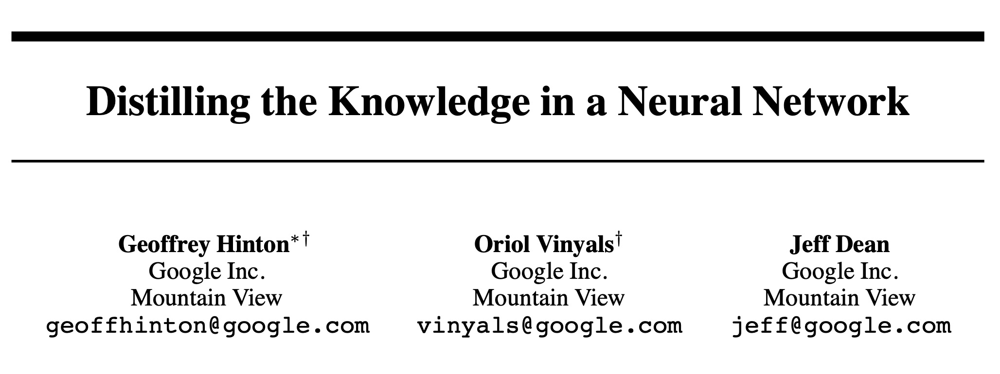
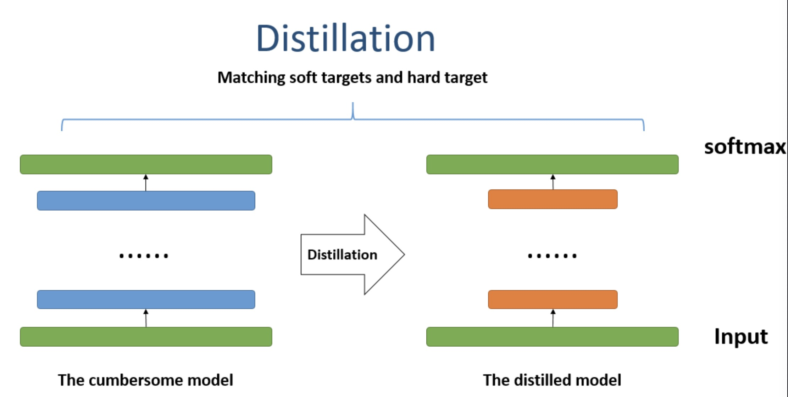
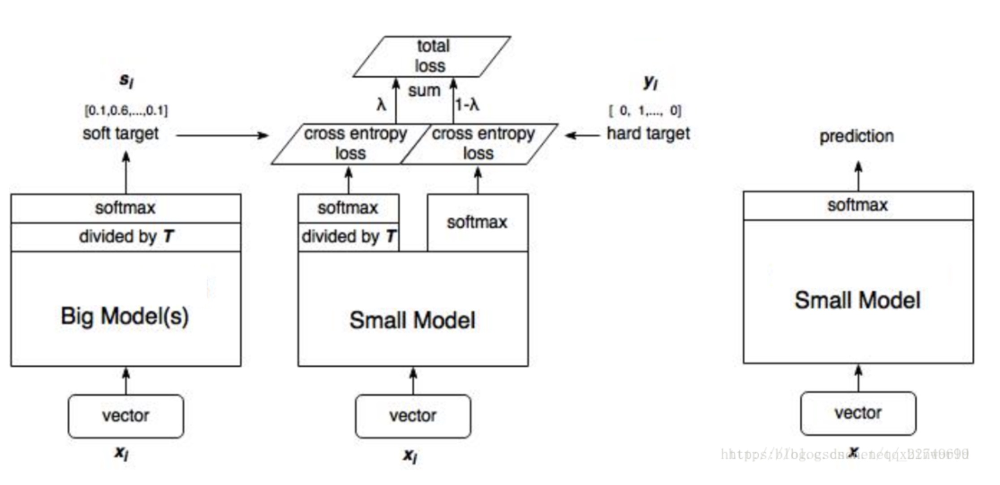

Distilling the knowledge in a neural network

# 1. Motivation

论文作者比较大名鼎鼎了。

Motivation一部分来自模型压缩[2]，一部分源自作者认为大部分机器学习采用ensemble方法或者学习一个很大的模型来取得比较好的结果，但会给实际应用预测带来很大的压力，而且实际上模型之间也是有信息冗余的。

希望有办法可以学习到一个小的模型，尽可能保留ensemble的或者大的模型的效果。

# 2. Knowledge distilling

想法其实很简单，要学习(distill，被大模型蒸馏出来)的小模型，同时学习两个loss，一个是正常的与label的差异；另一个是大模型的输出的softmax结果，即soft target。

作者经过一系列的分析与实验，说明大模型的softmax或者logits值，在错误的label上非零的数值，仍然具有很高的信息量。

因此，soft target学习可以当成一种正则化；让小模型学出来的logits或者softmax结果趋近于大模型的softmax，学到的是更具体的信息分布，而不仅仅是label。

在计算softmax过程中，用到了temperature $T$来控制softmax的平滑程度；在最后测试的时候让$T=1$。这算是一个trick。

图片来自[2, 3]。

# 3. Preferences

[1] Hinton, Geoffrey, Oriol Vinyals, and Jeff Dean. "Distilling the knowledge in a neural network." arXiv preprint arXiv:1503.02531 (2015).

[2] https://onedrive.live.com/view.aspx?resid=FEFC4058BFDDF7FC!52408&ithint=file%2cpptx&authkey=!AIt84oNLkwc6O9Q

[3] https://zhuanlan.zhihu.com/p/75031938