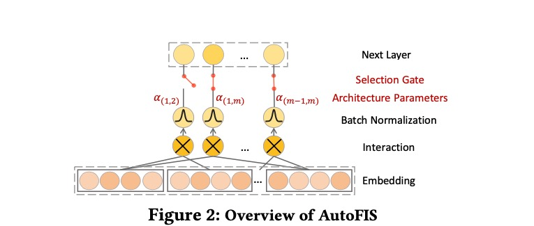

```latex

```

AutoFIS: Automatic Feature Interaction Selection in Factorization Models for Click-Through Rate Prediction


# # Proceduces: Two Stages

# ## 0. Background


Raw factorization machines based models.

+ Input layer (embedding): $E = [e_1, e_2, ..., e_m]$

+ Feature interaction layer: $[<e_1, e_2>, <e_1, e_3>, ..., <e_{m-1}, e_m>]$

$l_{fm}=<\bold{w}, \bold{x}> + \sum_{i=1}^m\sum_{j>i}^m <e_i, e_j>$

+ MLP layer: $a^{l+1}=relu(W^{(l)}a^{(l)}+b^{(l)})$
+ Output layer: $\hat{y}_{FM}=sigmoid(l_{fm})=\frac{1}{1+exp(-l_{fm})}$

DeepFM: $\hat{y}_{DeepFM}=sigmoid(l_{fm}+MLP(E))$

IPNN: $\hat{y}_{IPNN}=sigmoid(MLP([E, l_{fm}]))$


## 1. Search Stage

+ **Gate****: Use a **gate** operation.




$l_{AutoFIS}=<\bold{w}, \bold{x}> + \sum_{i=1}^m \sum{j>i}^m \alpha (i, j) <e_i, e_j>$

$\bold{\alpha}=\{\alpha_{(1, 2)}, \alpha_{(1, 3)}, ..., \alpha_{(m-1, m)}\}$ are the artitechture parameters.


+ Batch Normalization

Since $<e_i, e_j> \cdot \alpha_{(i, j)}$ represtents the conbution of interaction pair $e_i$ and $e_j$, and they are jointly learned, BN is used on $<e_i, e_j>$ to eliminate the scale issue.

+ GRDA Optimizer

Use generalized regularized dual averaging (GRDA) optimizer to learn a sparse DNN for $\bold{\alpha}$ while other parameters are learned by Adam optimizer as normal.

$\alpha_{t+1}=\arg\min_{\alpha}\{ \alpha^T (-\alpha_0 + \gamma \sum_{i=0}^t) \nabla L(\alpha_t;Z_{i+1}) + g(t, \gamma) ||\alpha||_1 + 1/2 ||\alpha||_2^2 \}$

## 2. Retrain Stage

Let $G(i, j)$ represents the gate status of feature interaction $<e_i, e_j>$, set $G(i, j)$ as 0 when $\alpha_{(i,j)}^{*}=0$; otherwise $G(i,j)$ is set to 1.

Remove the unimportant interactions, retrain the model with $\bold{\alpha}$ kept as attetion weight.

$l_{fm}^{re} = <\bold{w}, \bold{x}> + \sum_{i=1}^m \sum_{j>i}^m \alpha_{(i,j)} G(i,j) <e_i, e_j>$


# Analysis

## 1. Advantage

+ Use two stages (search and retrain) to select effective interaction pairs, which not only brings a better performance, but also leads engineers to analysis why these pairs are much more importanct.
+ Show that removing some useless interaction pairs, the performance may be **improved**.
+ May reduce the model and feature storage, and inference resources.


## 2. Disadvantage

+ Need to train models two times, which is hard for online learning.
+ May cause much more inference sources than pure FM (for the expansion of interaction pairs).