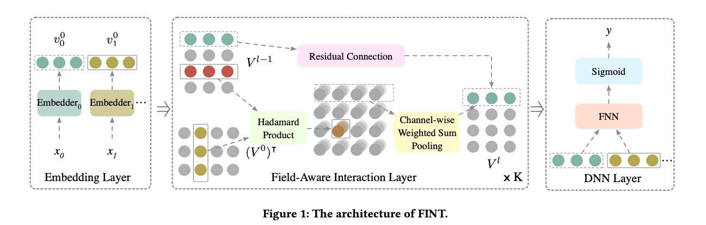
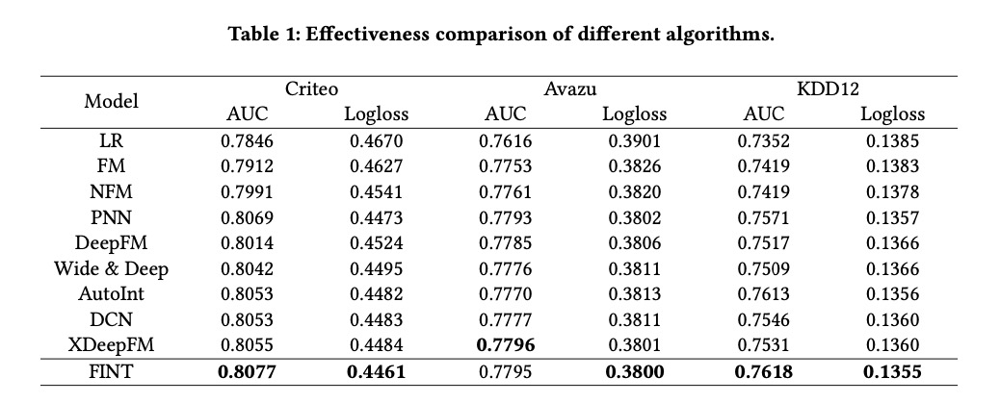

FINT: Field-aware INTeraction Neural Network For CTR Prediction

# 0. Reference

Zhao, Zhishan, et al. "FINT: Field-aware INTeraction Neural Network For CTR Prediction." arXiv preprint arXiv:2107.01999 (2021).

# 1. Motivation

一方面，高阶特征交叉被较少的模型注意到；

另一方面，高阶特征交叉可能会降低低阶特征交叉的效果。

# 2. FINT

## 2.1 Embedding layer

样本$X$的初始化向量表示为$V_0$，每一个$v_i^0$都是$D$维embedding向量。

$V^0 = [v_0^0, v_1^0, ..., v_{M-1}^0]^T$

## 2.2 Field-aware interaction layer

FINT的特色在于为每一个field维持一个特殊的交叉向量，从而可以进行更高阶的交叉。

一共堆积$K$个interaction layer，每一个layer包含两个步骤：

（1）Hadamard product

每一个layer的输入都是上一步的向量表示$V^{l-1}$，为所有的$v_i^{l-1} \in V^{l-1}$与$v_j^0 \in V^0$两两计算Hadamard product。

（2）Channel-wise weighted sum pooling

$v_i^l = \sum_{j=0}^{M-1}w_{i,j}^l \times (v_i^{l-1} \odot v_j^0) + u_i^l v_i^{l-1}$, 

$w_{ij}$是要学习的参数，$u_i^l$是数值。加上$v_i^{l-1}$是为了防止学习崩塌，加上了residual。

也就是当前每一步都是上一步的每一个向量与原始输入的每一个向量做element-wise product。

$V^l = V^{l-1} \odot (W^l \otimes V^0) + U^l \times V^{l-1}$, $\otimes$表示矩阵乘，$U^l = [u_0^l, ..., u_{M-1}^l]^T$，是residual连接的参数。

## 2.3 DNN layer

然后将所有field第$K$层的向量表示拼接，接入传统的DNN。

# 3. Experiment

论文实验显示效果可以比肩甚至超过xDeepFM。

论文的做法与DCN很像，只不过DCN是所有embedding拼接在一起，FINT是分成每一个field分别计算。