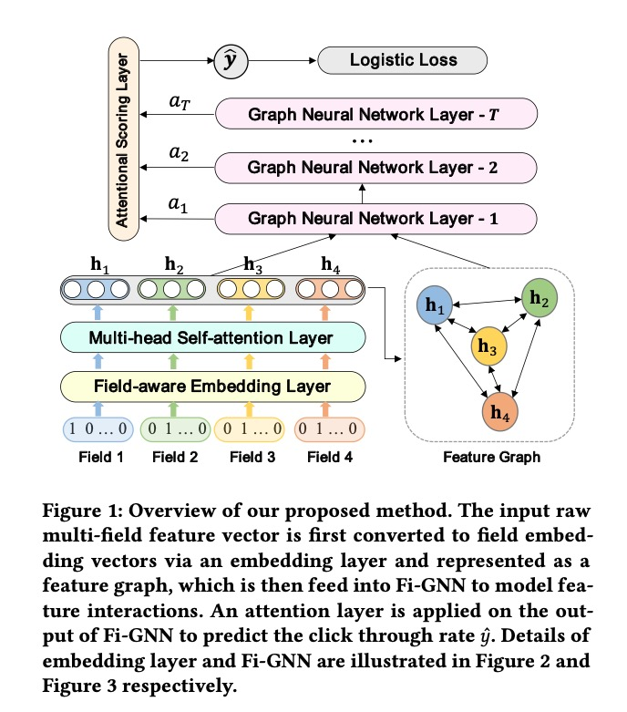
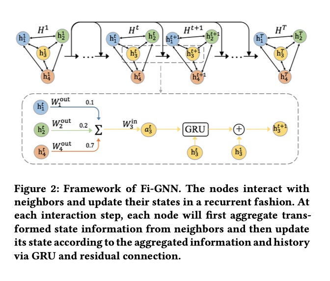

Fi-GNN: Modeling Feature Interactions via Graph Neural Networks for CTR Prediction

[1] Fi-GNN: Li Z, Cui Z, Wu S, et al. Fi-gnn: Modeling feature interactions via graph neural networks for ctr prediction[C]//Proceedings of the 28th ACM International Conference on Information and Knowledge Management. 2019: 539-548.

[2] Zeyu Cui, Zekun Li, Shu Wu, Xiaoyu Zhang, and Liang Wang. 2019. Dressing as a Whole: Outfit Compatibility Learning Based on Node-wise Graph Neural Networks. arXiv preprint arXiv:1902.08009 (2019).

## 1. Embedding layer

$E = [e_1, e_2, ..., e_m]$

$e_i \in \mathbb{R}^d$, $m$是field的个数。

## 2. Multi-head Self-attention layer

对于Head $i$，

$H_i = softmax_i(\frac{QK^T}{\sqrt{d_K}})V$

$Q = W^{Q}_i E$, $K = W^{K}_i E$, $V = W^{V}_i E$，分别表示Query、Key与Value。

得到所有field的初始化表示$H^1 \in \mathbb{R}^{m \times d'}$, $d' = \sum_{i=1}^h d_i$, $h$表示attention heads的个数。

$H^1 = ReLU(H_1 \oplus H_2 \oplus \cdots \oplus H_h)$

$\oplus$表示concat。

## 3. Feature Graph

用图$G = (N, \xi)$来表示所有的节点及相互之间的关联。每个节点对应一个field，节点之间的带权重的边表示field与field之间的交叉重要度。这是一个全连接网络，每一对节点之间都有边。

## 4. Feature Interaction Graph Neural Network

对于每一个node $n_i$, 其在时间步$t$的隐节点表示为$h_i^t$,

所有节点的向量表示为$H^t = [h_1^t, h_2^t, ..., h_m^t]$, $H^1$是初始化向量表示。

在每一个interaction step, 每个节点首先aggregate邻居节点的经过变换的信息，然后根据aggregate信息、历史状态经过GRU与residual连接来更新节点信息。

### 4.1 状态汇聚 State Aggregation

汇聚节点$n_i$的邻居节点$a_i^t$，

$a_i^t = \sum_{n_j \rightarrow n_i \in \xi} A[n_j, n_i] W_p h_j^{t-1}$

$W_p$是转换函数，$A \in \mathbb{R}^{m \times m}$是带权重的邻接矩阵。

(1) Attentional Edge Weights

$w(n_i, n_j) = \frac{ exp(LeakyReLU(W_w[e_i || e_j]))  }{\sum_k exp(LeakyReLU(W_w[e_i || e_k]))}$

$W_w \in \mathbb{R}^{2d'}$是一个权重矩阵，$||$表示concat。

$A[n_i, n_j] = w(n_i, n_j)$ if $i \ne j$, else 0.

 (2) Edge-wise Transformation

像论文[2]一样，对每个节点，使用输出矩阵$W_{out}^i$与$W_{in}^i$，这样让参数量正比于节点数量而不是边的数量。

$W_p^{n_i \rightarrow n_j} = W_{out}^i W_{in}^j$

代入$a_i^t$, 

$a_i^t = \sum_{n_j \rightarrow n_i \in \xi} A[n_j, n_i] W_{out}^j W_{in}^i h_j^{t-1} + b_p$

### 4.2 节点更新 State UPdate

(1) GRU

$h_i^t = GRU(h_i^{t-1}, a_i^t)$

(2) Residual connection

$h_i^t = GRU(h_i^{t-1}, a_i^t) + h_i^1$

## 5. Attention Scoring Layer

经过$T$个interaction步，得到节点的状态，

$H^T = [h_1^T, h_2, ^T, ..., h_m^T]$

这里每一个节点都经过了$T$次汇聚、更新，从而得到的是$T$阶的特征交叉。

+ Attention Node Weights

对于每一个节点$n_i$，分别计算预测的输出$\hat{y}_i$以及节点的权重$a_i$，

$\hat{y}_i = MLP_1(h_i^p)$

$a_i = MLP_2(h_i^p)$

加权得到最终的输出：

$\hat{y} = \sum_{i=1}^m a_i \hat{y}_i$

