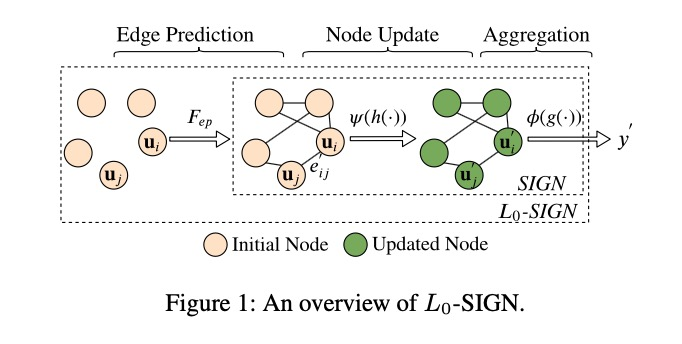

Detecting Beneficial Feature Interactions for Recommender Systems

# 0. Reference 

Su, Yixin, et al. "Detecting Beneficial Feature Interactions for Recommender Systems." Proceedings of the 34th AAAI Conference on Artificial Intelligence (AAAI). 2021.

# 1. Motivation

特征交叉（feature interactions)在推荐系统等深度学习模型中非常重要，比如 FM ([常见深度学习点击率预估模型](https://www.jianshu.com/p/4042d3386a13)) 会对所有输入的field两两交叉；有一些论文表明，存在一些特征交叉，引入它们会到引入噪声并且导致模型效果下降。

所以去除一些不必要的特征交叉是有意义的。

一般来说，有两种途径。一种是从$n(n-1)/2$对特征交叉中自上而下地去除一些不重要的组合（ [AutoFIS](https://www.jianshu.com/p/8d1127a2479f) ）。另外一种就是本文要介绍的，自下而上地发现有意义的特征组合。

处理组合问题一个很好的数据结构就是图。

# 2. L0-SIGN

对于一条样本，论文将该样本所有的特征$X$当成图的顶点，学习一个图$G(X, E)$，$E = \{ e_{ij}\}_{i,j \in X}$，$e_{ij} \in {1, 0}$。用图中有没有边来表示两个顶点之间有没有交叉，边的权重表示特征交叉的重要性。

## 2.1 L0 Edge Prediction Model

定义一个$f_{ep}$ (edge prediction)函数，对于两个顶点$i$与$j$，其用于判断是否存在边的向量表示分别为$v_i$与$v_j$，

$f_{ep}(v_i^e, v_j^e): \mathbb{R}^{2 \times b} \rightarrow \mathbb{Z}_2$。

论文的实验中给出的是，

$f_{ep}(v_i^e, v_j^e) = W_2^e ReLU ( W_1 ^e (v_i^e \odot v_j^e) + b_1^e ) + b_2^e$，$\odot$表示element-wise product。

训练过程中对$f_{ep}$加上$L_0$正则，得到$f_{ep} \in \{1, 0\}$。

## 2.2 Interaction

定义$h(u_i, u_j): \mathbb{R}^{2 \times d} \rightarrow \mathbb{R}^d$来衡量顶点$i$与$j$的交叉关系，$d$是embedding的维度, $u_i = x_i v_i$。这样可以用$h$来更新每个顶点。

论文的实验中给出一个示例，

$h(u_i, u_j) = W_2^h ReLU (W_1^h (u_i \odot u_j) + b_1^h) + b_2^h$，与$f_{ep}$形式类似，只不过$f_{ep}$得到是${1, 0}$，是数值；$h$得到的是新的向量表示。

## 2.3 Aggregation for node $i$

对于一个顶点$i$，使用线性函数$\varphi$来聚集其邻居节点。

## 2.4 Mapping vectors to scalar

对于更新之后的顶点向量表示，使用线性加权函数$g$转换成数值。

## 2.5 Aggregation for graph

使用线性汇聚函数$\phi$来汇聚整个图的所有顶点的数值，得到最终的输出：

$f_{LS}(G; w, \theta) = 
\phi(
    \{ 
        g(\varphi(\{f_{ep}(v_i^e, v_j^e)h(u_i, u_j)\}_{j \in X})) 
    \}_{i \in X}
)$

## 2.2 Loss function

$R(\theta, w) = \frac{1}{N}(L(F_{LS}(G_n; w, \theta), y_n))$

$+ \lambda_1 \sum_{i, j \in X_n} (\pi_n)_{ij}$ 

$+ \lambda_2 ||z_n||_2$

$(\pi_n)_{ij}$表示$(e_n^{'})_{ij}=1$的概率，$z_{ij}$表示$h(u_i, u_j)$的输出。

损失函数是模型的预测损失加上L1损失与L2损失，L1损失让图更稀疏。