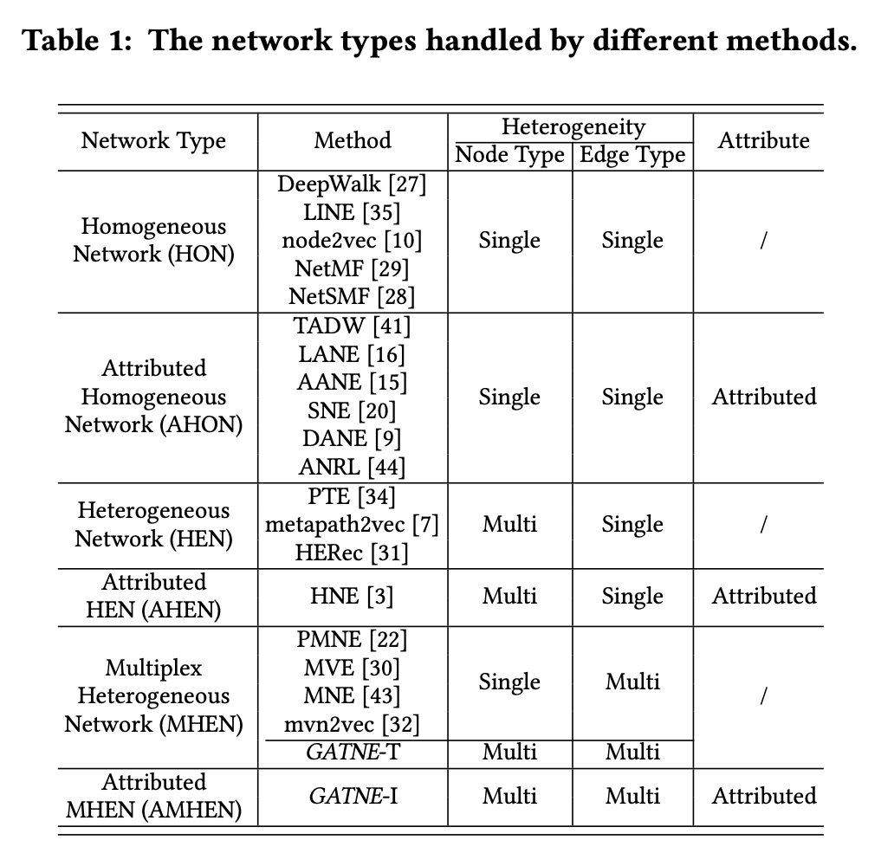
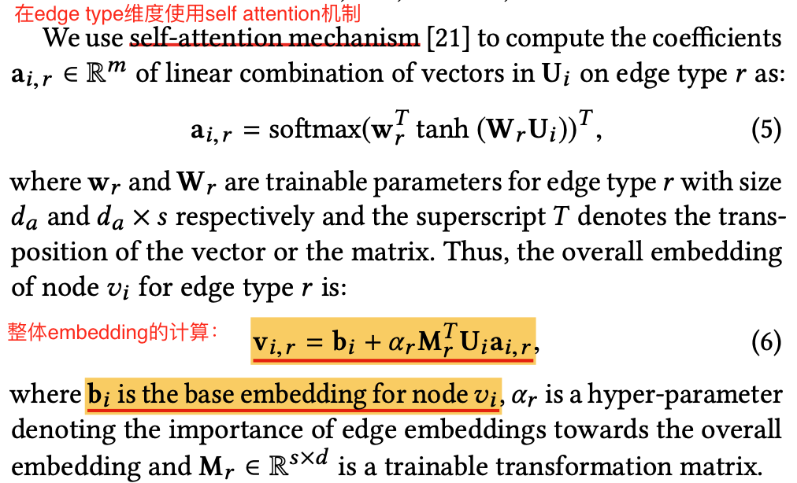
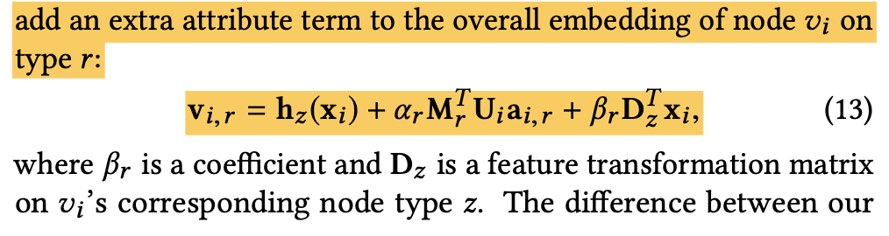
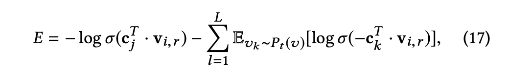
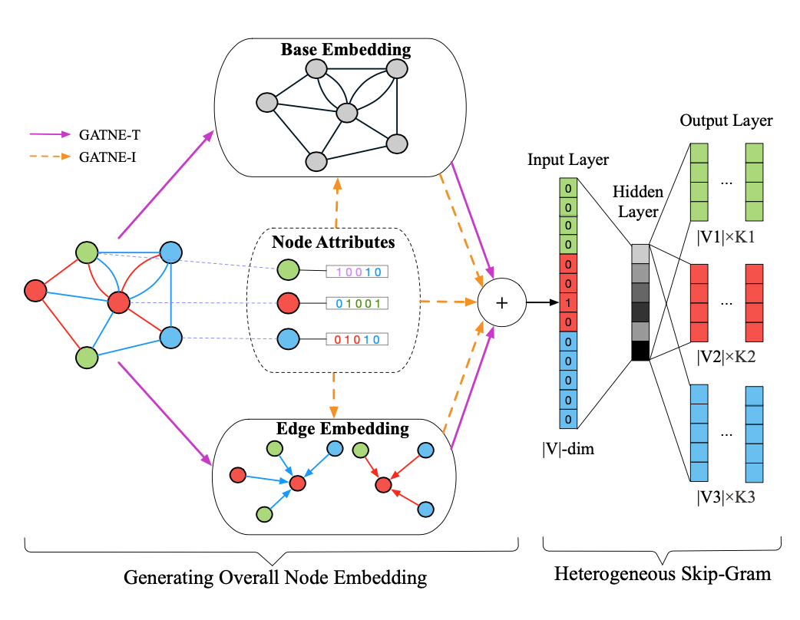
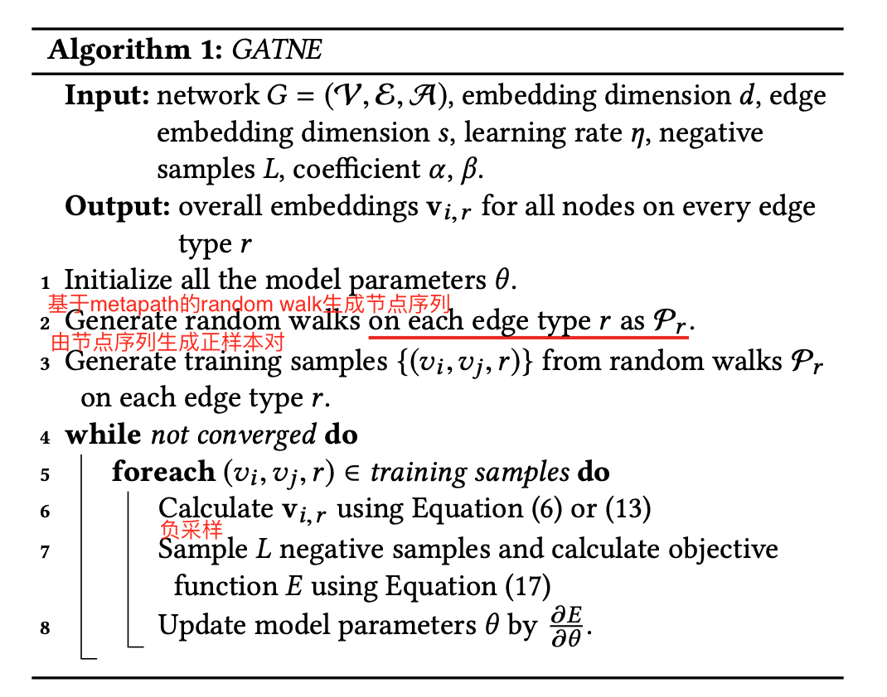
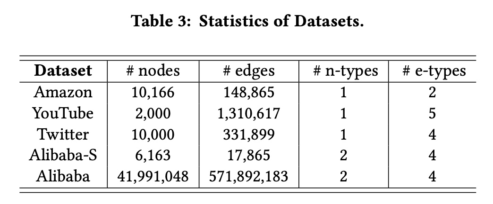
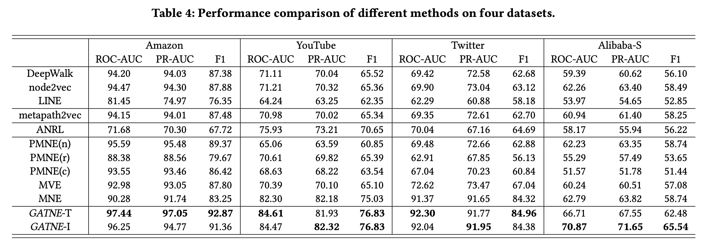
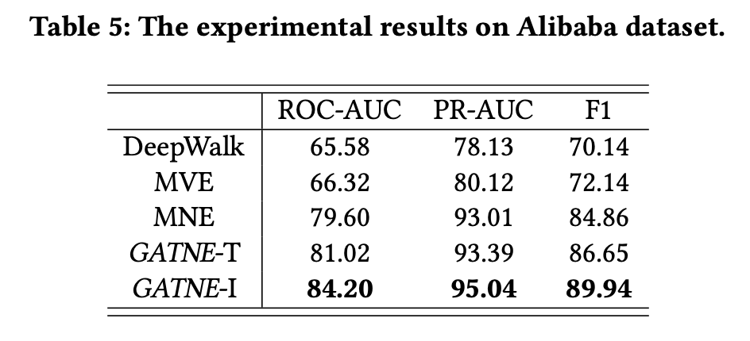

# 带属性的多路异构图的表示学习

本文介绍Alibaba达摩院在KDD19上的文章《Representation Learning for Attributed Multiplex Heteroge- neous Network》。

作者按照图中节点的类型数、边的类型数、节点是否带属性，对图进行了归类划分。针对有多种类型的节点、有多种类型边并且节点带属性的图设计了节点表示学习算法GATNE。GATNE包含两个变形，用于transductive场景的GATNE-T，也可以用于inductive场景GATNE-I。

## 1.动机

现实中的图往往比较复杂，如电商数据构成的图，包含商品和用户两种节点、节点之间有多重关系（如浏览、加购、购买等），同时节点上又包含丰富的属性数据。目前的大部分图表示学习算法主要集中在只包含相同种类节点或边的场景。这种复杂的图也带来了很多挑战：

* 多种类型的边
* 部分观测：长尾用户或商品只有很少的交互信息
* 规模化问题：十亿级的节点数和百亿或千亿的边

## 2. 对图及图表示算法的归类

* Homogeneous Network (HON，**同构图**)：图中只包含**一种节点**和**一种边**，**不**包含节点属性。

* Attributed Homogeneous Network (AHON，**带属性的同构图**)：图中只包含**一种节点**和**一种边**，**包含**节点属性。
* Heterogeneous Network (HEN，**异构图**)：图中包含**多种类型的节点**和**一种边**，**不**包含节点属性。
* Attributed HEN (AHEN，**带属性的异构图**)：图中包含**多种类型的节点**和**一种边**，**包含**节点属性。
* Multiplex Heterogeneous Network (MHEN，**多路异构图**)：图中包含**多种类型的节点**和**多种类型的边**，**不**包含节点属性。
* Attributed MHEN (AMHEN，**带属性的多路异构图**)：图中包含**多种类型的节点**和**多种类型的边**，**包含**节点属性。

用于transductive场景的GATNE-T是在解决多路异构图问题，用于inductive场景GATNE-I是在解决带属性的多路异构图问题。

## 3. GATNE

作者的目标是要为每个节点学习出不同边类型的embeding。

从大框架上来看，先使用基于metapath的random walk采样节点序列，然后使用Skip-Gram从序列中学习。与metapath2vec的整体架构相同。但metapath2vec是对包含多种类型的节点和一种边的图进行的，并且不考虑节点属性。那么作者是怎么解决考虑多种边和节点属性下的统一学习问题呢？

在transductive场景下，不考虑节点属性。作者把节点属性分解为两个部分：base embedding和edge embedding。同一个节点的不同边属性下的embeding共享base embedding，edge embedding由同类型的边链接的邻居聚合得到。在聚合邻居信息时作者使用了self-attention机制。

在inductive场景下，考虑节点属性。作者把节点属性分解为三个部分：base embedding、edge embedding和节点属性在边类型上的影响项。与transductive不同的是base embedding是节点属性的函数，edge embedding不通过随机初始化，而是变为节点属性的函数。

对于图$G(V,E,A)$。

对每个类型的边构成的图进行metapath采样：$G_r=(V,E_r,A)$，matepath为$V_1\rightarrow V_2 \rightarrow \cdots \rightarrow V_t \rightarrow \cdots V_l$。采样出来的节点序列，使用滑动窗口构建正样本对，$c_k$表示context节点的embedding，那么使用负采样的方法训练Skip-Gram的目标函数可以表示为：

算法的整体示意图：

算方整体流程：

## 4. 实验结果

alibaba数据集的规模很大：千万级的节点数、亿级的边。

实验对比结果:

## 参考资料

[1] Yukuo Cen, Xu Zou, Jianwei Zhang, Hongxia Yang, Jingren Zhou and Jie Tang. 2019. Representation Learning for Attributed Multiplex Heteroge- neous Network. In The 25th ACM SIGKDD Conference on Knowledge Discov- ery and Data Mining (KDD ’19), August 4–8, 2019, Anchorage, AK, USA. ACM, New York, NY, USA, 11 pages. https://doi.org/10.1145/3292500.3330964