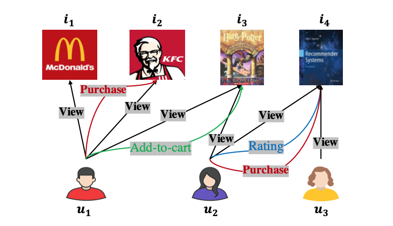
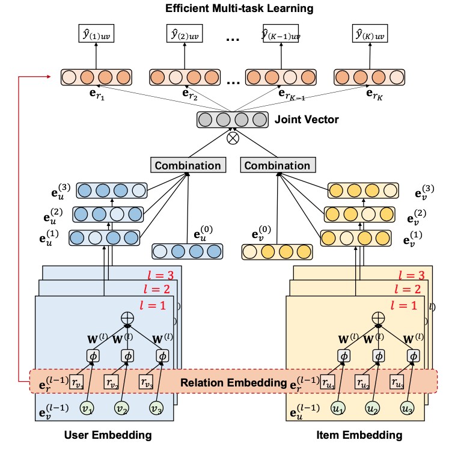
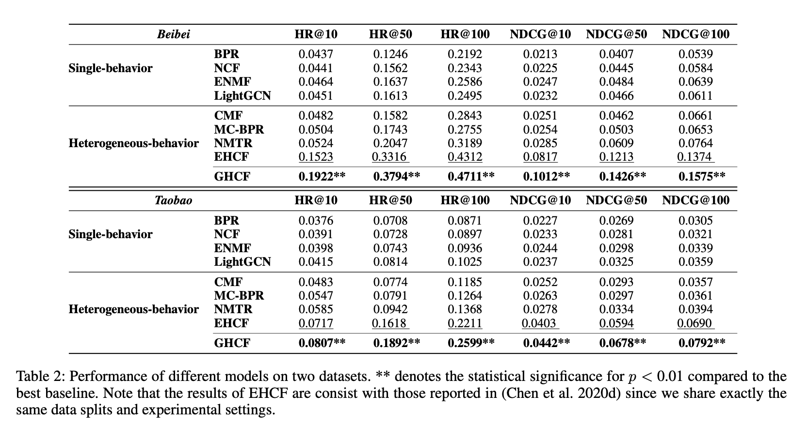
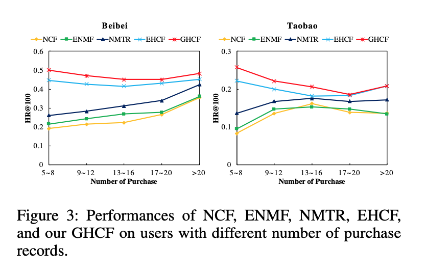
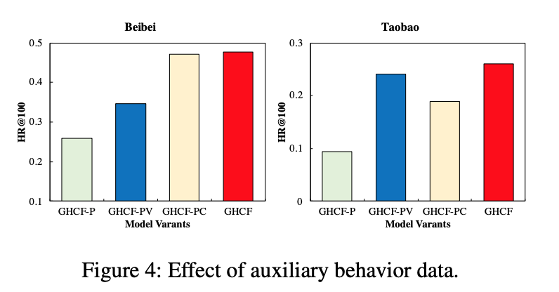
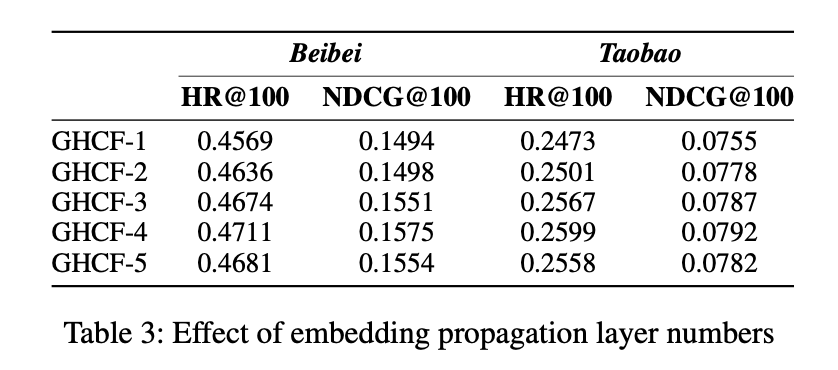
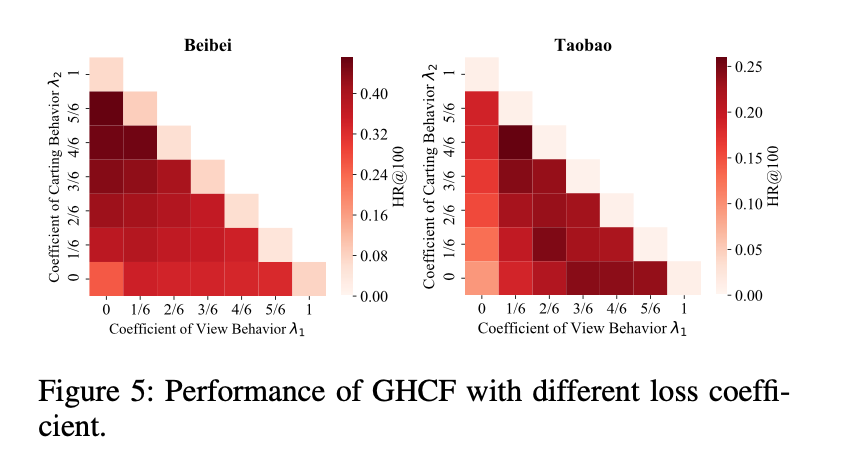

# 异构图上的推荐算法GHCF(AAAI’21)

本文介绍华为诺亚方舟实验室在AAAI'21上的一篇论文《Graph Heterogeneous Multi-Relational Recommendation》，作者提出了一种基于多关系异构图的推荐算法，显式地对user-item之间的多阶关系建模，并使用非抽样优化方法进行多目标学习，在两个公开数据集上取得了SOTA。

## 1.动机

在推荐系统中，为了给出更准确的推荐信息，一个趋势是考虑与用户偏好相关的更多信息。例如在电商系统中，点击或交易是优化目标，但还有很多其他的用户与商品之间的交互行为，如浏览、加购等。这些行为为用户偏好提供了有价值的信息。

为了使用这些交互行为信息，目前的一些推荐算法基本遵循协同过滤学习的模式，没有对用户交互的多阶信息进行显式的建模。多阶关系提供了丰富的协同信息，如图中的，$u_1$和$i_4$之间有几个3阶的异构关系，例如$u_1 \rightarrow^{view}i_3\leftarrow^{view}u_2 \rightarrow^{purchase}i_4$，那么$u_1$非常有可能对$i_4$感兴趣，因为跟$u_1$相似的$u_2$浏览、购买并评价了$i_4$。

另一方面，目前使用图卷积网络的推荐算法集中在使用同构关系的图上，缺少对多种关系的深入探索。

基于此，作者提出了Graph Heterogeneous Collaborative Filtering（GHCF），不仅利用多种行为关系，而且考虑了高阶异构关系。此外GHCF还有两点独特之处：一是，不仅对节点学习Embedding，还对关系（边）学习Embedding ；二是使用非采样优化进行模型训练。

## 2. Graph Heterogeneous Collaborative Filtering

GHCF整体的模型架构如下图所示，先使用图卷积网络对user和item学习embedding，然后进行多任务预测和学习。

**问题定义**

使用$U$和$V$分别表示用户集合和物品集合，$u$表示一个用户，$v$表示一个物品。user-item间的交互表示为$\{Y_{(1)},Y_{(2)},\cdots,Y_{(K)}\}$，其中$Y_{(k)}=[y_{(k)}]_{|U|\times|V|} \in \{0,1\}$表示用户$u$与物品$v$之间是否有行为$k$，$K$是行为类型个数。我们把想优化的目标行为记为$Y_{K}$。我们的目标是，给定一个用户$u$，我们估计$\hat{y}_{(K)uv}$。

### Embedding传播层

使用消息传递范式对用户、物品和关系建模，在做邻居聚合时考虑边的不同类型带来的影响，并对边的Embedding进行更新。通过这种方式做到了relation-aware。

**用户表示**

用户$u$在第$l$层的embedding的更新公式如下所示，与普通的GCN不同的是在消息传递函数中考虑了关系（边）。

$\mathbf{e}_{u}^{(l)}=\sigma\left(\sum_{(v, r) \in \mathcal{N}(u)} \frac{1}{\sqrt{\left|\mathcal{N}_{u}\right|\left|\mathcal{N}_{v}\right|}} \mathbf{W}^{(l)} \phi\left(\mathbf{e}_{v}^{(l-1)}, \mathbf{e}_{r}^{(l-1)}\right)\right)$

此处的$\phi$使用元素积的形式：$\phi\left(\mathbf{e}_{v}, \mathbf{e}_{r}\right)=\mathbf{e}_{v} \odot \mathbf{e}_{r}$

**物品表示**

物品采用与用户相同的方式更新embedding。

**关系表示**

作者对关系也进行了表示，并对每一层的关系进行更新，关系的embedding更新公式为：

$\mathbf{e}_{r}^{(l)}=\mathbf{W}_{r e l}^{(l)} \mathbf{e}_{r}^{(l-1)}$

### 多任务预测

因为GCN的每一层表示一度关系，所以每一层的输出可以理解为包含了当前深度关系的信息，作者先对GCN每一层的输出组合，再做预测。

把每一层的表示做平均，作为最后的表示：

$\mathbf{e}_{u}=\sum_{l=0}^{L} \frac{1}{L+1} \mathbf{e}_{u}^{(l)} ; \mathbf{e}_{v}=\sum_{l=0}^{L} \frac{1}{L+1} \mathbf{e}_{v}^{(l)} ; \mathbf{e}_{r}=\sum_{l=0}^{L} \frac{1}{L+1} \mathbf{e}_{r}^{(l)}$

对$u,v,r$的表示进行点乘并求和，作为预测结果：

$\hat{y}_{(k) u v}=\mathbf{e}_{u}^{T} \cdot \operatorname{diag}\left(\mathbf{e}_{r_{k}}\right) \cdot \mathbf{e}_{v}=\sum_{i}^{d} e_{u, i} e_{r_{k}, i} e_{v, i}$

在不考虑关系$r$的情况下，这个预测就是$u$和$v$表示的内积。上述考虑了关系的预测形式可以理解为**使用关系加权的内积**。这也是relation-aware的一个体现。

### 多任务无抽样学习

推荐算法中通常使用抽样的方式组织正负样本进行训练，作者采用了无抽样的学习方法，理由是这种最近提出来的方法在效率和效果上都比传统的基于抽样的方法要更好。我对这种学习方法了解不多，无法做展开描述，留在后续的文章中单独学习讨论。此处只给出作者采用的最终形式，突出作者对多任务的处理。

$\mathcal{L}(\Theta)=\sum_{k=1}^{K} \lambda_{k} \tilde{\mathcal{L}}_{k}(\Theta)+\mu\|\Theta\|_{2}^{2}$

其中，$\tilde{\mathcal{L}}_{k}(\Theta)$是第$k$个行为的无抽样学习的loss，$\lambda_k$是第$k$个任务的权重超参数，$\sum_{k=1}^K \lambda_k=1$。

可以看出作者使用了加权的方式把多任务的loss组合起来，并增加了$l_2$正则化来控制过拟合。

## 3.实验结果

作者在两个电商数据集Beibei和Taobao上做了对比实验。对比的方法有两类，一类是使用单个行为数据的方法，另一类是使用多种行为数据的方法。

实验表明了显式地对高阶关系进行建模、多关系数据的利用、无抽样学习对目标都是提升的。

其中ENMF\EHCF\GHCF使用了无抽样学习方法。

**利用更多类型的行为数据对数据稀疏性问题有帮助**

通过对比是否使用多行为数据的方法在不同交易频次上的表现，表明利用更多类型的行为数据对数据稀疏性问题有帮助。

**消融实验**

对GHCF进行变形，只使用交易行为、使用交易和浏览行为、使用交易和加购行为，与使用三种行为的GHCF进行对比实验，证明利用辅助行为数据的有效性。

**GCN中的层数**

作者对Embedding传播层中使用的GCN的层数的影响进行了实验，对比了[1,2,3,4,5]层GCN的效果，给出4层时充分的结论，更多层会引入噪音并导致过拟合。

**Loss中的系数超参数$\lambda_k$**

作者在[0,1/6,2/6,3/6,4/6,5/6,1]中对超参数$\lambda_k$进行了调参，发现不同的数据集上需要不同的参数配置，可能是因为各个行为数据在数据集中的占比不同造成的。

## 4. 思考

作者的创造之处如同作者自己所说的那样，对多种行为关系进行显式地建模，并使用了无抽样学习方法。

个人的一些思考：

1.Embedding传播层：

* 可以使用其他的GNN架构，如加入了Attention机制的GAT，可能会更好地学习邻居间的关系信息；
* 尽管作者提到使用了message dropout和node dropout，加入抽样策略在计算之前把计算量降低下来，应该可以加速训练过程；
* 可以使用residual connection等策略让GCN更深。作者在讨论GCN的层数时，发现当层数到5层时效果有下降，解释为引入了噪音、过拟合，更深层次的原因可能是过平滑问题和信息瓶颈问题。

2.关系（边）的表示：

* 作者对边进行了表示学习，并设计了relation-aware的模型结构，非常值得参考！
* 边的更新过程设计得比较简单，是否可以考虑边与节点以及其他边的关系信息？从而可以更好地将不同的关系在向量空间里建模。

3.多任务的组合方式：作者采用了加权和的形式，权重需要调参。是否可以采用类似ESSM的贝叶斯形式？帕累托的方法？

4.无抽样学习值得进一步关注学习。

