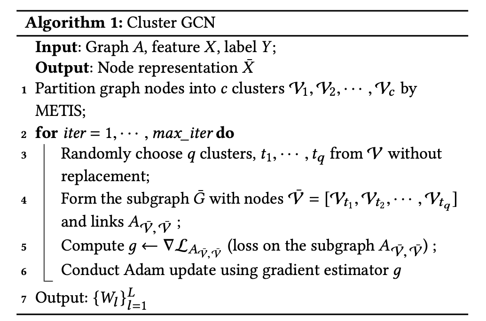
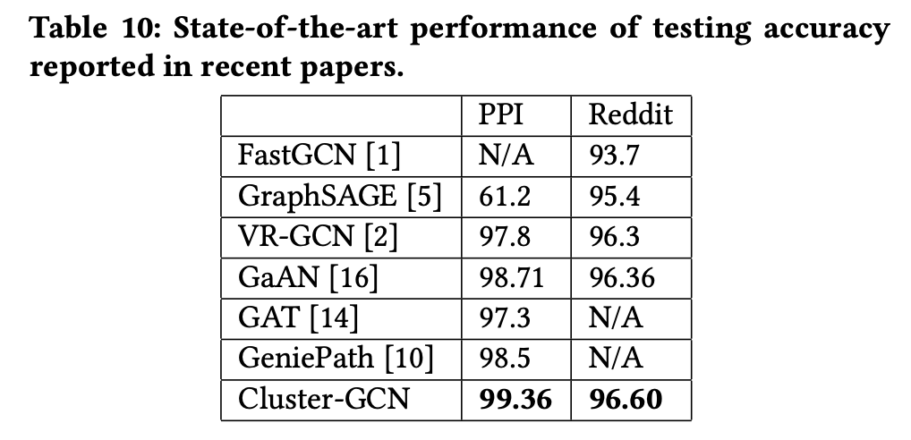
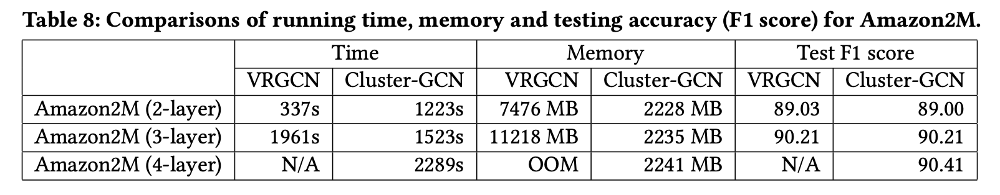

# Cluster-GCN

Cluster-GCN: An Efficient Algorithm for Training Deep and Large Graph Convolutional Networks

## 1. 动机

从2017年GCN被提出以来，GCN在许多基于图的应用里取得了成功。但由于原始的GCN在每次计算卷积时需要使用整个图的邻接矩阵和所有节点的特征，所以，在大规模的图上训练GCN很有挑战。基于SGD的算法也存在一些问题：一是计算复杂度会随着层数指数增长；二是有很高的空间复杂度（一些算法要存储所有节点的Embedding）。由于这些问题，在大规模图上训练GCN很有挑战，并且训练更深的模型也很有挑战。

Cluster-GCN提出了一种新的方法来进行GCN训练：首先，对图进行聚类，把原图划分成一些紧密连接的子图；然后，抽样一个或者一些子图作为一个batch，在抽样出来的子图上进行卷积计算。

因为每一个batch的计算只在子图上进行，有效地控制了多层GCN的计算规模。

## 2. Cluster-GCN

作者根据每个batch里选择的子图的个数不同，把算法分成了每个batch里一个子图的Vanilla Cluster-GCN和每个batch里多个子图的Stochastic Multiple Partitions Cluster-GCN。

### Vanilla Cluster-GCN

对于图$G$，把它的节点划分为$c$个群：$V = [V_1, ..., V_c]$，其中$V_t$包含在第$t$个群中的节点。根据这些群可以得到$c$个子图:

$$\bar{G}=[G_1,..., G_c]=[{V_1,E_1},\dots,{V_c,E_c}]$$

其中$E_t$只包含$V_t$中的节点之间的边。

同样，邻接矩阵会被划分为$c^2$个子矩阵（只需重新排列一下节点的位置）：

$$A = \bar{A}+\Delta= 
\begin{bmatrix}
    A_{11} & \cdots & A_{1c} \\
    \vdots & \ddots & \vdots \\
    A_{c1} & \cdots & A_{cc} \\
\end{bmatrix}$$

其中，$$\bar{A}= 
\begin{bmatrix}
    A_{11} & \cdots & 0      \\
    \vdots & \ddots & \vdots \\
    0      & \cdots & A_{cc} \\
\end{bmatrix},
\Delta= 
\begin{bmatrix}
    0      & \cdots & A_{1c} \\
    \vdots & \ddots & \vdots \\
    A_{c1} & \cdots & 0      \\
\end{bmatrix}$$

$A_{tt}$表示子图$G_t$的邻接矩阵，$A_{st}$表示节点$V_s$和节点$V_t$之间的边构成的邻接矩阵。

特征和标签数据也可以根据节点的划分进行相应的划分：$[X_1,\cdots,X_c]$和$[Y_1,\cdots,Y_c]$。

用$\bar{A}’$表示矩阵$A$的标准化后的结果，那么整个GCN的卷积过程可以形式化表示为：

$$Z^{(L)}=\begin{bmatrix}
\bar{A}'_{11} \sigma(\ bar{A}'_{11} \sigma( \cdots \sigma( \bar{A}'_{11} X_1 W^{(0)} ) W^{(1)})\cdots)W^{(L-1)} \\
\vdots \\
\bar{A}'_{cc} \sigma(\ bar{A}'_{cc} \sigma( \cdots \sigma( \bar{A}'_{cc} X_1 W^{(0)} ) W^{(1)})\cdots)W^{(L-1)}  \\
\end{bmatrix}$$

损失函数为：

$$L_{\bar{A}'} = \sum_t \frac{|V_t|}{N} L_{\bar{A}_{tt}'} \\
L_{\bar{A}'_{tt}} = \frac{1}{|V_t|} \sum_{t \in V_t} loss(y_i, z_i^{(L)})
$$

#### Stochastic Multiple Partitions 

每个batch里随机采样多个子图，并把子图间的边还原回邻接矩阵中。所以使用的是原图中包含被采样到的所有节点之间的邻接矩阵。

### 对角增强

为了让GCN的层数更深，需要考虑让模型感知到深度的增加。直观上来看，更近的邻居应该比远处的邻居贡献更大的权重。作者提出了一种对角增强的方法，给上一层的输入更大的权重。同时考虑到每个节点的邻居个数不同，需要对邻接矩阵进行标准化，最终的形式为：

$$X^{(l+1)} = \sigma((\tilde{A}+\lambda diag(\tilde{A}))X^{(l)}W^{(l)})$$

其中，$\tilde{A}=(D+I)^{-1}(A+I)$，$D$是对角矩阵，对角元素是节点的度。

### 算法



### 时间复杂度和空间复杂度分析

作者分析了GCN家族主要算法的时间和空间复杂度，Cluster-GCN都具有显著的优势，尤其是空间复杂度上：


## 3. 实验效果

作者在PPI、Reddit数据集上与很多算法进行了对比，取得了SOTA：



在网络深度方面，作者构建了一个更大的数据集Amazon2m，重点与VRGCN做了对比：



## 4. 实现细节

聚类方法：作者在实验中使用了Metis来对图进行聚类。此外还提到了Graclus。

聚类的个数和每个batch中选择的子图个数是超参数。

作者在论文里提到使用pytorch实现了算法，但开源出来的是TF的。并且作者在论文里提到，发现tf的稀疏计算比pytorch要快。

工程上的一些细节：

（1）每个batch传入邻接矩阵时使用tf.sparse_placeholder()，接受tuple(indices, values, shape)参数，在内部组装成sparseTensor。

```python
placeholders = {'support': tf.sparse_placeholder(tf.float32), ...}
...
def to_tuple(mx):
  if not sp.isspmatrix_coo(mx):
    mx = mx.tocoo()
  coords = np.vstack((mx.row, mx.col)).transpose()
  values = mx.data
  shape = mx.shape
  return corrds, values, shape

```


（2）计算loss时使用mask，对batch子图的所有节点计算预测值，最后在计算loss时使用mask把没有label的节点去掉。

```python
def masked_softmax_cross_entropy(preds, labels, mask):
  loss = tf.nn.softmax_cross_entropy_with_logits(logits=preds, labels=labels)
  mask = tf.cast(mask, dtype=tf.float32)
  mask /= tf.reduce_mean(mask)
  loss *= mask
return tf.reduce_mean(loss)
```

## 5. 一些思考

（1）为什么聚类之后再做卷积会有效？说明稀疏链接信息不太重要？

（2）在异构图上如何推广？

（3）聚类打破了远距离传输的通道，如果cluster gcn广泛有效，那么是不是说明远距离信息不太重要？另一方面，GNN中常用的增加全局链接节点的trick旨在传递全图的信息，与cluster gcn是否相悖？

（4）Metis是基于内存的聚类方法，如果图再大到放不到内存里的情况，是否有有效的聚类方法？


### 参考资料

[1] Wei-Lin Chiang, Xuanqing Liu, Si Si, Yang Li, Samy Bengio, and Cho-Jui Hsieh. 2019. Cluster-GCN: An Efficient Algorithm for Training Deep and Large Graph Convolutional Networks. In *Proceedings of the 25th ACM SIGKDD International Conference on Knowledge Discovery; Data Mining* (Anchorage, AK, USA) *(KDD '19).* Association for Computing Machinery, New York, NY, USA, 257--266.

[2] https://github.com/google-research/google-research/tree/master/cluster_gcn

