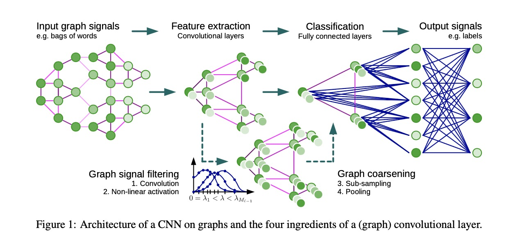
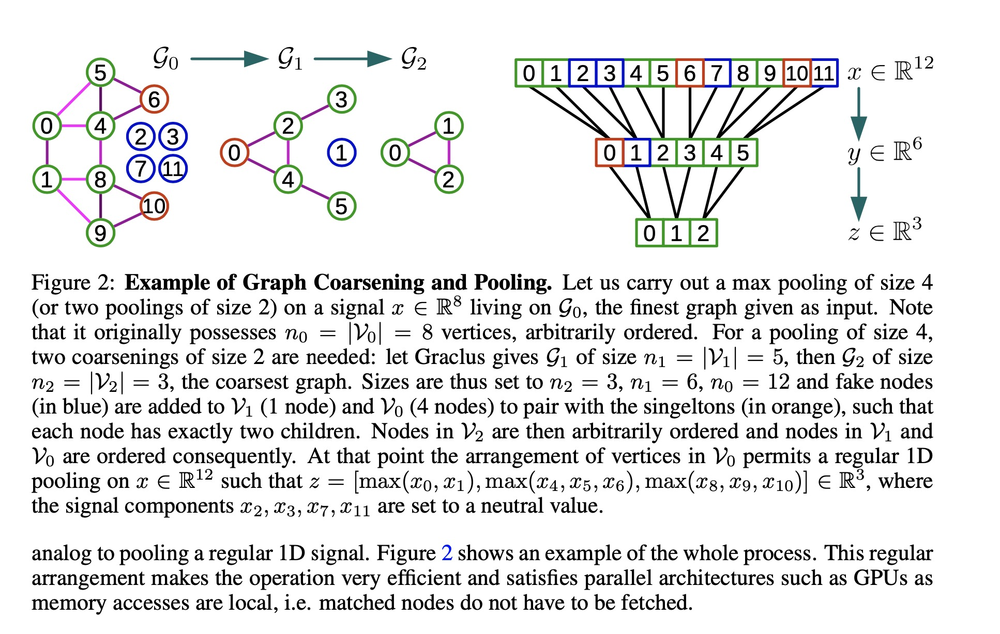
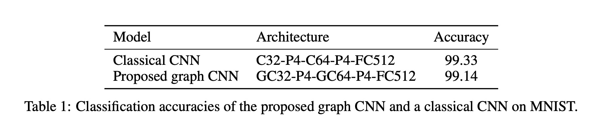

Convolutional Neural Networks on Graphs with Fast Localized Spectral Filtering

# 1. Motivation

本文是发表在2016年的NIPS上，那个时候CNN正是处于巨大的上升期。作者基于Spectral graph theory尝试将CNN用于所有通用的具有图结构的场景上去。

# 2. CNN on Graph

将CNN泛化到图上需要3个基本步骤：

（1）设计图上的局部卷积核（localized convolutional filters）。

（2）一个图相似顶点的聚集过程。

（3）一个图的池化操作。

# 3. Experiment

# 4. References

[1] Michae ̈l Defferrard, Xavier Bresson, and Pierre Vandergheynst. Convolutional neural networks on graphs with fast localized spectral filtering. In Advances in neural information processing systems (NIPS), 2016.