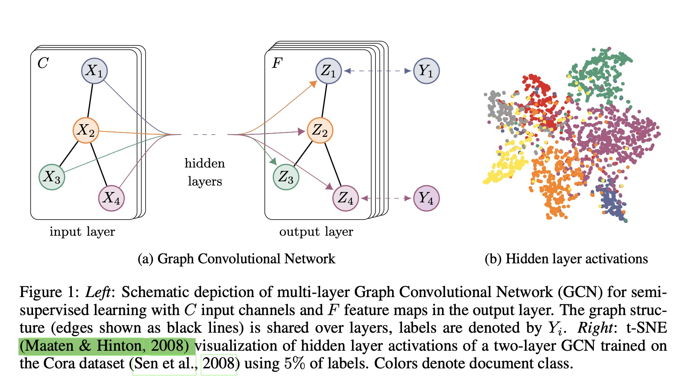
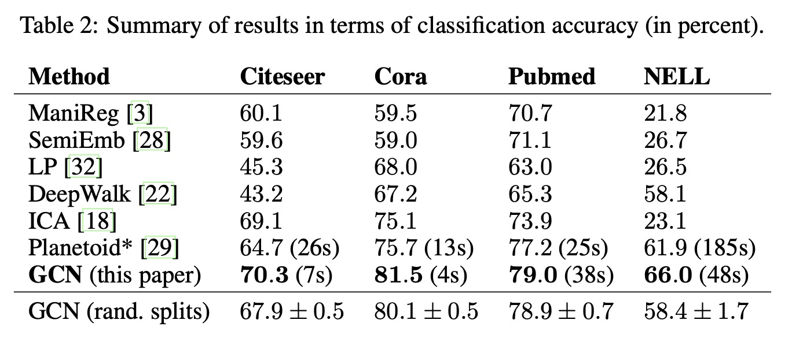
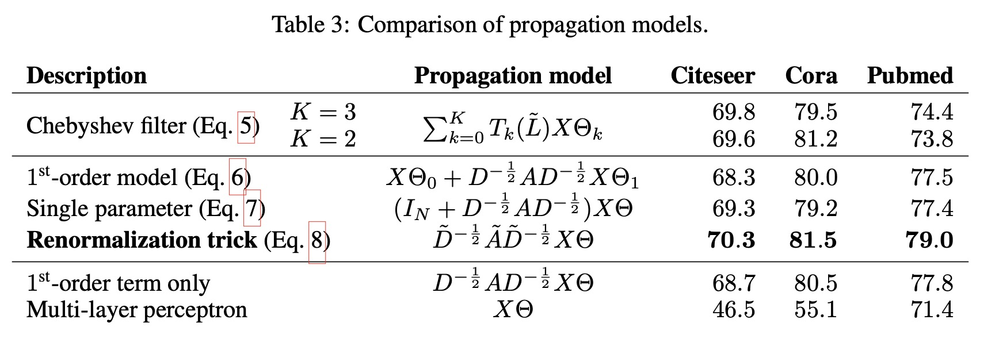

Semi-supervised classification with graph convolutional networks

# 1. Motivation

在图结构数据上使用深度学习，扩展CNN技术，捕捉图上的节点的特征与图的邻近关系（像CNN一样，捕捉局部相似性）。

# 2. Multi-layer Graph Convolutional Network (GCN)

多层图卷积神经网络，每一层的输出为:

$H^{(l+1)} = \sigma(\widetilde{D}^{-\frac{1}{2}} \widetilde{A} \widetilde{D}^{-\frac{1}{2}} H^{(l)} W^{(l)})$

$\widetilde{A} = A + I_N$是图$G=(V, E)$的邻接矩阵$A$加一个自连接矩阵$I_N$。

$\widetilde{D}_{ii} = \sum_{j} \widetilde{A}_{ij}$，$\widetilde{D}$的对角线表示图中每一个节点的连接权重之和。

# 3. Experiment

# 4. References

Kipf, Thomas N., and Max Welling. "Semi-supervised classification with graph convolutional networks." arXiv preprint arXiv:1609.02907 (2016).