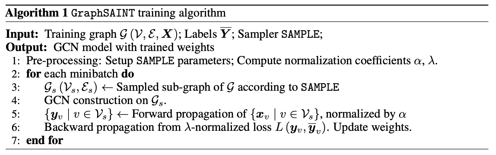
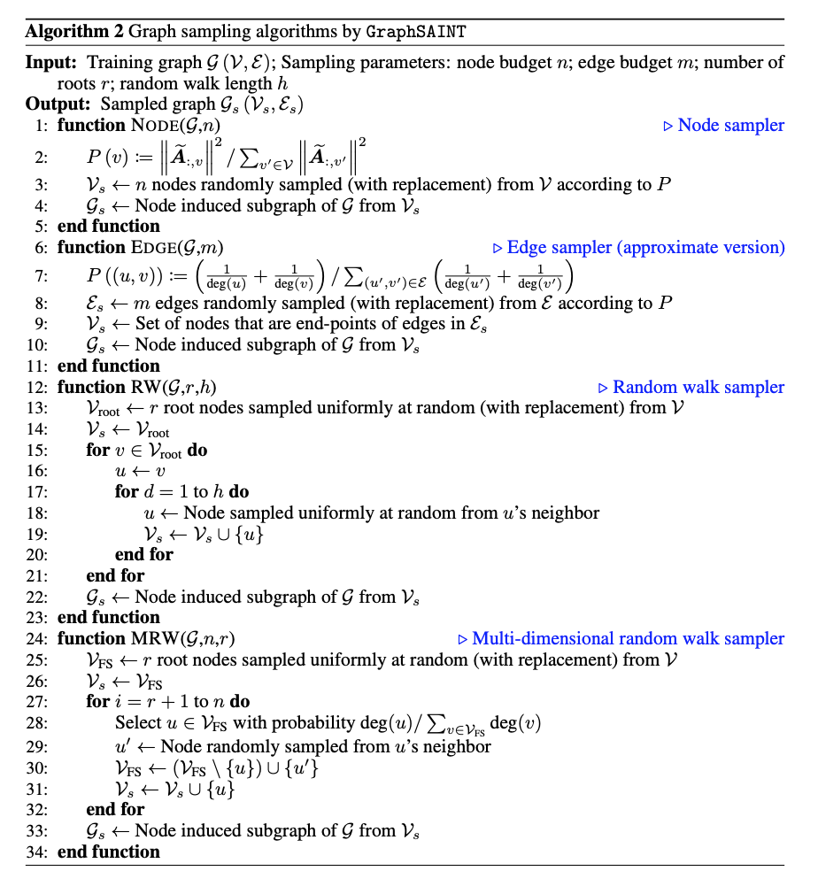
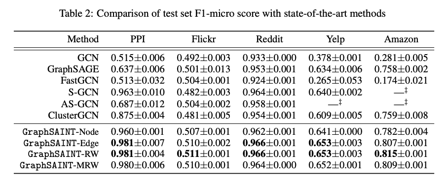
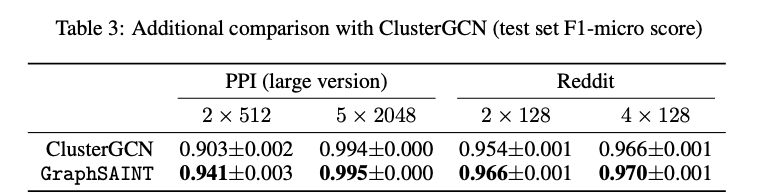
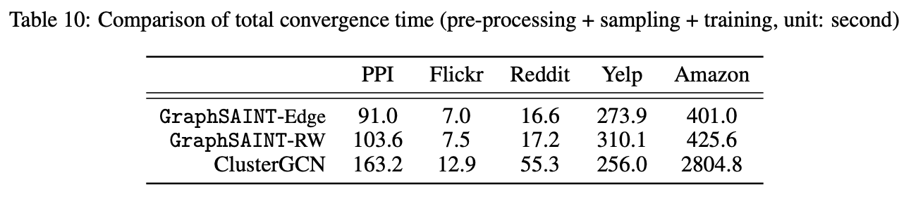
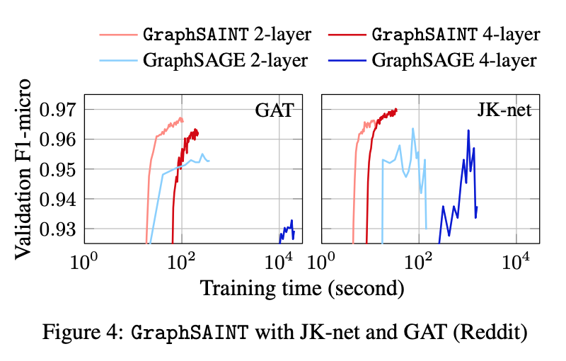

# GraphSAINT

ICLR 2020论文《GraphSAINT: GRAPH SAMPLING BASED INDUCTIVE LEARNING METHOD》

引入一种基于抽样子图的图神经网络模型，每个minibatch上的计算在抽样子图上进行，不会出现”邻居爆炸“现象，同时抽样方法在理论上有无偏性和最小方差。此外该模型把抽样和GNN解耦开来，可以基于论文提出的抽样方法，使用其他GNN模型如JK-net等。

## 1.动机

目前的大部分图神经网络模型主要集中在解决相对较小的图上浅层模型，如GraphSAGE、VRGCN、ASGCN、FastGCN等。在大图上训练深度模型仍然需要更快的方法。

影响图神经网络训练的更深的一个主要问题是”邻居爆炸"问题。GraphSAGE、VRGCN、PinSage需要限制邻居采样数量到很小的水平；FastGCN和ASGCN进一步把邻居膨胀系数限制到了1，但同时也遇到了规模化、精度和计算复杂度方面的挑战。

ClusterGCN通过先对图进行聚类，然后在小图上进行图神经网络训练的方式，加速了训练过程，不会遇到“邻居爆炸”问题，但引入了偏差。

## 2. 模型

GraphSAINT的整体框架如下：

先经过抽样器从G中抽出子图，然后在子图上构建GCN。

其中有两个关键的东西是SAMPLE抽样器和两个正则化系数$\alpha$和$\lambda$。它们一起保证了无偏性和方差最小性。

### 2.1 无偏性

考虑$l+1$层顶点$v$和$l$层的顶点$u$，如果$v$在抽样子图中，那么计算$v$的激活状态：

$$\zeta^{(l+1)}_v = \sum_{v\in V}\frac{\tilde{A}_{v,u}}{\alpha_{u,v}}(W^{(l)})^T x_u^{(l)}1_{u|v}=\sum_{v\in V}\frac{\tilde{A}_{v,u}}{\alpha_{u,v}} \tilde{x}_u^{(l)}1_{u|v}$$

其中，$1_{u|v}$表示在给定$v$的条件下，边$(v,u)$被抽到时为1，否则为0。

作者证明了：

（1）在$\alpha_{u,v}=\frac{p_{u,v}}{p_v}$时，如上定义的$\zeta^{(l+1)}_v$是无偏的。

（2）在$\lambda_v = |V|p_u$时，Loss$L_{batch}=\sum_{v\in G_s}\frac{L_v}{\lambda_v}$是无偏的。

### 2.2 方差最小抽样

理想的抽样方法应该能使所有的$\zeta_v^{(l)}$的方差都很小。

作者证明了：对边独立抽样m次，如果使用概率分布$p_e=\frac{m}{\sum_{e'}||\sum_l b_{e'}^{(l)}||} ||\sum_l b_{e}^{(l)}||$对边抽样，那么$\zeta$的每个维度上的方差和最小。其中，$b_{e}^{(l)} = \tilde{A}_{v,u}\tilde{x}_u^{(l-1)}+\tilde{A}_{u,v}\tilde{x}_v^{(l-1)}$。

因为$b_{e}^{(l)}$的计算需要依赖上一层的计算结果，增加了抽样复杂度，作者对它做了简化：$p_e \propto \tilde{A}_{v,u}+\tilde{A}_{u,v}=\frac{1}{degree(u)}+\frac{1}{degree(v)}$。

这样抽样的直观理解是：如果两个顶点之间有边，并且它们各自的度很小，那么它们之间更可能影响彼此。

### 2.3 抽样方法

作者给出了三个抽样器：

（1）Random node sampler：$P(u)\propto||\tilde{A}_{:,u}||^2$

（2）Random edge sampler：$p_e \propto \tilde{A}_{v,u}+\tilde{A}_{u,v}=\frac{1}{degree(u)}+\frac{1}{degree(v)}$

（3）Random walk based samplers：一个基于通常的random walk的采样器（随机抽取r个source顶点，每个顶点随机游走h阶邻居）；还有一个多维度的random walk的采样器。

具体采样方法如下：

## 3.实验对比

### 3.1 与目前的SOTA方法的对比

在所有数据集上超过其他方法。Random edge sampler和RW取得了较好的结果。

此外，GraphSAINT-Node和FastGCN使用的是相同的点抽样概率分布，说明提升是子图抽样带来的。

### 3.2 与ClusterGCN的对比

（1）模型效果上：在PPI和Reddit上的浅层和深层模型上都超过了ClusterGCN。

（2）考虑预处理+抽样+训练到收敛的时间，GraphSAINT整体比ClusterGCN快。由于ClusterGCN使用的聚类在大规模图上的聚类时间会显著增长，GraphSAINT的优势会更明显。

### 3.3 与SAGE在GAT和JK-net上的对比

（1）GAT-SAGE和JK-SAGE的4层模型没有超过2层模型，可能是因为深层造成的过平滑问题。

（2）使用Random edge sampler的JK-SAINT在增加模型深度时获得了较好的精度提升（0.966到0.970）。

## 4.结论

GraphSAINT是一种基于抽样子图的图神经网络训练方法。通过对minibatch上的激活输出和loss的估计偏差和方差的分析，提出了正则化和抽样方法来提高训练的效果。因为每个batch的训练都是在子图上完成的，克服了“邻居爆炸”的问题。与目前的SOTA模型对比，不仅在精度上有提升，在速度上也很快。

参考资料：

[1] H. Zeng et al., *GraphSAINT*: *Graph Sampling Based Inductive Learning Method* (2020) In Proc. ICLR. 
