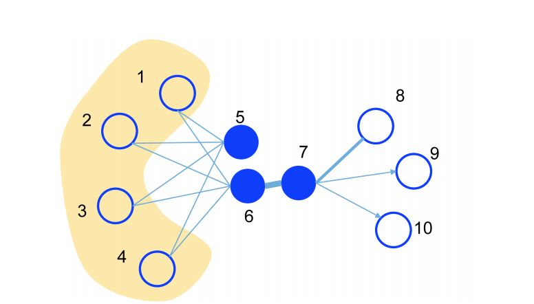

# LINE：通过图的一阶和二阶关系学习Embedding

本文介绍发表在WWW2015上的图Embedding学习模型LINE。

LINE直接对图的一阶近邻关系和二阶近邻关系进行建模。一阶近邻关系定义为两个有边相连的顶点之间的关系，其Embedding应该相近。二阶近邻关系体现在，如果两个节点之间有很多公共邻居，那么这两个节点的Embedding应该相近。与DeepWalk不同的是，LINE在建模时考虑了边上的权重，在文本实验上效果有明显提升。

## 理论建模

如下图所示，节点6和节点7之间的有边相连，并且边的权重很大（边的粗细表示边的权重），它们的Embedding应该很相似。但是由于节点5和节点6有很多共同的邻居（节点1、2、3、4），它们的Embedding也应该很相似。LINE就是要对这两种关系进行直接建模来学习节点的Embedding。

### 一阶近邻关系建模

一阶近邻关系定义为两个有边相连的顶点之间的关系，其Embedding应该相近。

$$p_1(v_i, v_j) = \frac{1}{1+exp(-u_i^Tu_j)}$$

经验估计为：

$\hat{p}_1(v_i, v_j) = \frac{w_{ij}}{\sum_{(i,j)\in E} w_{ij}}$

使用KL散度来度量两个分布之间的距离，那么目标函数可以简化为：

$O_1 = -\sum_{(i,j)\in E} w_{ij} log p_1(v_i, v_j)$

### 二阶近邻关系建模

二阶近邻关系体现在，如果两个节点之间有很多公共邻居，那么这两个节点的Embedding应该相近。

$p_2(v_j | v_i) = \frac{exp(u_j^{'T} u_i)}{\sum_{k=1}{|V|} exp(u_k^{'T} u_i)}$

V为所有节点的集合。

经验估计为：

$\hat{p}_2(v_j| v_i) = \frac{w_{ij}}{\sum_{k \in N(i)} w_{ik}}$

也同样使用KL散度度量链各个分布之间的距离，目标函数为：

$O_2 = -\sum_{(i,j)\in E} w_{ij} log p_2(v_j| v_i)$

## 实现

我第一次看完一阶和二阶的理论模型，脑子里是充满疑惑的。因为目标函数里只包含了有边相连的顶点间的关系建模，相当于只有正样本，这样直接训练模型的话，模型是有偏的。于是阅读了作者公开的C++源码和DGL的实现，终于明白了具体实现。下面是具体实现的关键点。

（1）比较明确的是一阶近邻关系和二阶近邻关系是分开训练的。

（2）一阶近邻关系的目标函数$O_1$和二阶近邻关系的目标函数$O_2$中都包含边的权重。如果在训练时，对边按照$w_{ij}$进行采样，那么具体实现时可以去掉权重部分，其结果与原始的目标函数是等价的。（因为权重为$w_{ij}$的边会出现$w_{ij}$次，计算loss时求和之后与直接乘以权重是等价的。）

（3）训练时是需要正样本和负样本的。正样本从图的所有边中按照边的权重采样；负样本从所有节点中采样，排除与中心点有边相连的点。对边进行采样时使用alias table method来降低时间复杂度。

（4）一阶近邻关系和二阶近邻关系的建模的实现方式的核心区别是：一阶关系建模时中心词和上下文词使用相同的Embedding表，二阶关系建模时中心词和上下文词使用不同的Embedding表。

（5）两个模型的Embedding经过标准化之后拼接到一起使用。

所以，在具体实现时，一阶近邻关系模型与二阶近邻关系模型只有中心词和上下文词的Embedding表上有区别，其他地方都是一样的。

## 实验分析与对比

虽然DeepWalk通过随机游走也可以建模到二阶近邻关系，但是在维基百科文本数据上词相似和文本分类任务上，LINE都要比DeepWalk效果更好。原因可能是因为DeepWalk忽略了词之间的连接权重（边的权重），连接权重对于语言网络来说是非常重要的。

在文本任务上，LINE的一阶近邻模型对词共现进行建模，二阶近邻模型可以学习到词的更多语义，二阶近邻模型的相似度很高预示着词之间的语义替代性。

参考资料：

[1] Jian Tang, Meng Qu, Mingzhe Wang, Ming Zhang, Jun Yan, and Qiaozhu Mei. Line: Large-scale information network embedding. In Proceedings of the 24th International Conference on World Wide Web, pp. 1067–1077. ACM, 2015.

[2] 作者开源的源码（C++）：https://github.com/tangjianpku/LINE

[3] DGL的实现：[https://github.com/dmlc/dgl/blob/master/examples/pytorch/ogb/line/](https://github.com/dmlc/dgl/blob/master/examples/pytorch/ogb/line/model.py)
