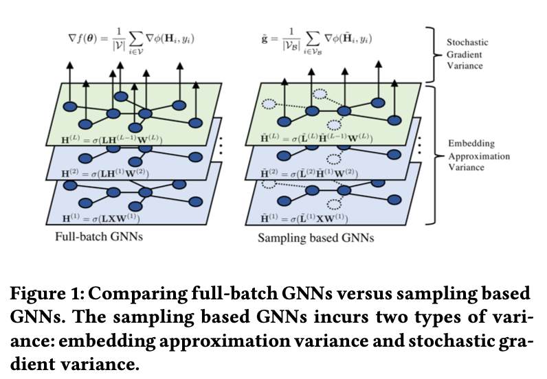
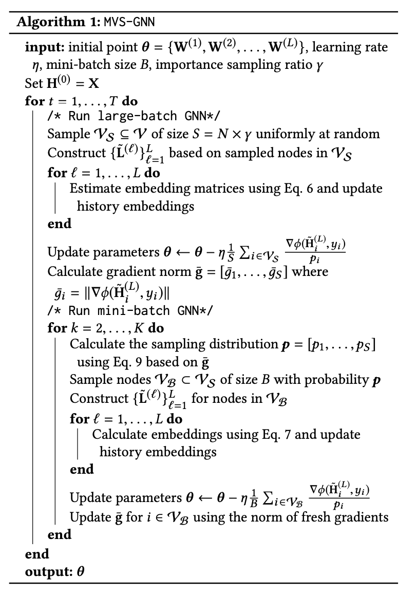
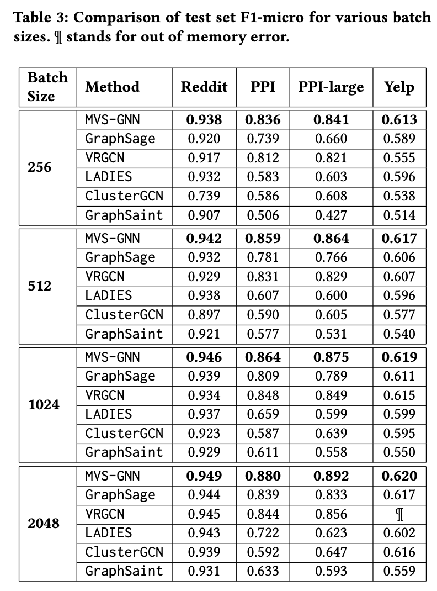
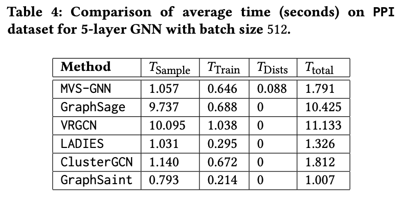

# MVS-GNN: 基于梯度的最小化方差抽样快速训练GNNs

本文介绍KDD2020的论文《Minimal Variance Sampling with Provable Guarantees for Fast Training of Graph Neural Networks》。作者提出一种基于梯度的最小化方差抽样方法来加速GNN的训练过程的GNN——MVS-GNN，并从理论和实验上证明了有效性。MVS-GNN先均匀随机抽样出一个大batch，在大batch上训练GNN，得到各个节点的梯度值；然后进行mini-batch训练过程，使用大batch上的梯度值得到抽样分布，抽样得到mini-batch，在mini-batch上进行GNN训练，并在每一层的更新中使用历史激活信息。

## 1. 动机

在大图上训练GNN时，抽样几乎成了标配。目前主要有三种抽样方式：node-wise抽样，如GraphSAGE、VRGCN；layer-wise抽样，如FastGCN、LADIES；subgraph抽样，如之前介绍过的ClusterGCN、GraphSAINT。作者观察到这些基于出样的算法都只考虑了图结构信息，没有使用到训练过程中的动态信息如梯度。这会导致高方差。作者通过对基于抽样的GNN模型的loss和梯度方差的分析，发现可以利用梯度信息来降低估计方差。

## 2. 方差分析

假设我们有图$G(V,\Epsilon)，N = |V|，A$为邻接矩阵，$\mathbf{L}$为标准化的拉普拉斯矩阵，每个节点的特征和标签为$(x_i,y_i)$，$X=[x_1,\cdots,x_N]，y=[y_1,\cdots,y_N]$。$H^{(l)}=\sigma(\mathbf{L}H^{(l-1)}W^{(l)}) \in \mathbb{R}^{N\times F}$为第$l$层的节点embeddings，$F$为embeding size。$\theta={W^{(1)},\cdots,W^{(L)}}$表示GNN各层权重矩阵的集合。那么GNN的loss为：

$Loss(\theta)=\frac{1}{N}\sum_{i\in V} \phi(H_i^{(L)},y_i)$

其中，$H^{(L)}=\sigma(\mathbf{L}\sigma(\cdots\sigma(\mathbf{L}XW^{(1)})\cdots)W^{(L)})$。

基于mini-batch$V_B$的梯度：

$g = \frac{1}{B}\sum_{i\in V_B}\nabla\phi(H_i^{(L)},y_i)$

这个梯度是full batch梯度的无偏估计。但是计算该梯度需要使用每个节点的全部邻居。基于抽样的方法在每一层只抽样了节点的部分邻居节点，构建稀疏拉普拉斯矩阵得到embeding的估计$\tilde{H}^{(l)}$。

### 方差分解

基于抽样的GNN可以看做是multi-level composite stochastic optimization problem：

$\min f(\theta)=\mathbb{E}_{\omega_L}[f_{\omega_L}^{(L)}(\mathbb{E}_{\omega_{L-1}}[f_{\omega_{L-1}}^{(L-1)}(\cdots \mathbb{E}_{\omega_1}[f_{\omega_1}^{(1)}(\theta)] \cdots)])]$

随机变量$\omega_l$表示第$l$层因为抽样引入的随机性。

对于随机采样路径$(\omega_1,\cdots,\omega_L)$，$\nabla f(\theta)$的一个无偏估计为：

$g=\nabla f_{\omega_1}^{(1)}(\theta) \cdot \nabla f_{\omega_2}^{(2)}(F^{(1)}(\theta)) \cdots \nabla f_{\omega_L}^{(L)}(F^{(L-1)}(\theta))$

其中，$F^{(l)}=f^{(l)}\circ f^{(l-1)}\circ\cdots \circ f^{(1)}(\theta)$。

实际上我们不知道$F^{(l)}$，只能得到有偏估计量：

$\tilde{g}=\nabla f_{\omega_1}^{(1)}(\theta) \cdot \nabla f_{\omega_2}^{(2)}(f_{\omega_1}^{(1)}(\theta)) \cdots \nabla f_{\omega_L}^{(L)}(f_{\omega_{L-1}}^{(L-1)}(\theta)\circ\cdots\circ f_{\omega_1}^{(1)}(\theta))$

作者经过推导把梯度的方差分解为两部分：

$\mathbb{E}[||\tilde{g}-\nabla f(\theta)||^2]=\mathbb{E}[||\tilde{g}-g||^2]+\mathbb{E}[||g-\nabla f(\theta)||^2]$

第一项为Embedding approximation variance，第二项为Stochastic gradient variance。

作者进一步通过一个引理证明了第一项的上界与$f$的梯度有关，进一步推理出通过利用梯度信息可以降低第一项的方差。

## 3. MVS-GNN

### 算法总体流程

MVS-GNN先均匀随机抽样出一个大batch，在大batch上训练GNN，得到各个节点的梯度值；然后进行mini-batch训练过程，使用大batch上的梯度值得到抽样分布，抽样得到mini-batch，在mini-batch上进行GNN训练，并在每一层的更新中使用历史激活信息。

其中:

Eq.6为：$\tilde{H}_i^{(l)}=\sigma(\sum_{j\in V} \tilde{L}_{i,j}^{(l)} \tilde{H}_i^{(l-1)} W^{(l)} )，\bar{H}_i^{(l)}=\tilde{H}_i^{(l)}$

Eq.7为：$\tilde{H}_i^{(l)}=\sigma(\sum_{j\in V_{l-1}} \tilde{L}_{i,j}^{(l)} \tilde{H}_i^{(l-1)} W^{(l)} + \sum_{j\in V\V_{l-1}} L_{i,j}^{(l)} \bar{H}_i^{(l-1)} W^{(l)} )，\bar{H}_i^{(l)}=\tilde{H}_i^{(l)}$

Eq.9为：

### 利用历史激活信息降低Embedding approximation variance

这里的方法与VRGCN比较相似，$||(H_i^{(l-1)}-\bar{H}_i^{(l-1)})W^{(l)}||_2$一般比$||H_i^{(l-1)}W^{(l)}||_2$小。

### 利用基于梯度的重要性抽样降低Stochastic gradient variance

在large-batch GNN中计算并记录了标准化后的梯度信息，作者证明了利用Eq.9产生的Stochastic gradient variance比均匀分布时的方差小。

## 4. 实验

在不同batch size上与GraphSAGE、VRGCN、LADIES、ClusterGCN、GraphSAINT的对比：

在训练时间上的对比：

## 参考资料

[1] Weilin Cong, Rana Forsati, Mahmut Kandemir, and Mehrdad Mahdavi. 2020. Minimal Variance Sampling with Provable Guarantees for Fast Training of Graph Neural Networks. In Proceedings of the 26th ACM SIGKDD Conference on Knowledge Discovery and Data Mining (KDD ’20), August 23–27, 2020, Virtual Event, CA, USA. ACM, New York, NY, USA, 11 pages. https://doi.org/ 10.1145/3394486.3403192

