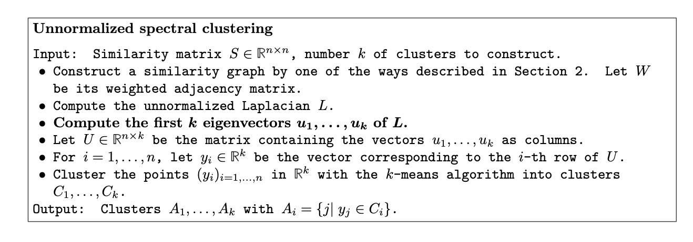

A Tutorial on Spectral Clustering

# 1. Motivation

对点进行聚类，考虑从图的视角出发，把每个点当成图中的一个点；聚类就是为了让类的内部点之间比较相近，类之间距离较远；可以从图的相似度角度来进行建模。

# 2. Similarity graphs

## 2.1 Graph notation

用$G = (V, E)$表示一个无向图。$W = (w_{ij})_{i,j=1,...,n}$是图的**权重**邻接矩阵，$w_{ij}$表示节点$v_i$与$v_j$没有交点。

节点$v_i \in V$的度定义为，

$d_i = \sum_{j=1}^n w_{ij}$。

度矩阵(degree matrix)$D$是对角线为$d_1, d_2, ..., d_n$，其它位置为0的矩阵。

$\bar{A}$表示$V - A$，即$V$中不包含$A$的顶点集合。

$W(A, B):=\sum_{i \in A, j \in B} w_{ij}$

用$|A|$表示$A$中顶点的个数，

$vol(A):=\sum_{i \in A}d_i$，表示$A$中顶点的度之和。

+ connected graph

如果$A \subset V$中的任意两个顶点可以连接（直接连接或者通过在$A$中的点形成路径间接连接），则称$A$是连接的。

+ connected component

如果$A$是connected，并且$A$与$\bar{A}$之间没有连接，则称$A$是connected component。

+ partition graph

如果非空集合$A_1, A_2, ..., A_k$满足$A_i \cap A_j = \empty$，并且$A_1 \cup A_2 ... \cup A_k = V$，则称该集合组成了图的一个partition。

## 2.2 Different similarity graphs

+ $\epsilon$-neighborhood graph

把所有距离小于$\epsilon$的点连起来，所以是一个无权重的图(unweighed graph)。

+ $k$-nearest neighbor graph

把一个点与其的$k$近邻连接起来（有向图）；或者互相是$k$近邻的点连接起来（互相$k$近邻）。

+ fully connected graph

把所有的点用权重$s_{ij}$连接起来。

# 3. Graph Laplacians

## 3.1 The unnormalized graph Laplacian

Unnormalized graph Laplacian matrix定义为：

$L = D - W$

### 3.1.1 Proposition 1 (Properties of $L$) 矩阵$L$满足以下几个性质：

1. $\forall f \in \mathbb{R}^n$， 有 

$f'Lf = \frac{1}{2} \sum_{i,j=1}^n w_{ij} (f_i - f_j)^2$

2. $L$是对称并且半正定的。

3. $L$的最小的特征值（eigenvalue）是0，对应的特征向量（eigenvector）是1常量$\mathbb{1}$。

4. $L$有$n$个非负，实数特征值$0 = \lambda_1 \le \lambda_2 \le ... \lambda_n$。

### 3.1.2 Proposition 2 (Number of connected components and the spectrum of $L$)

假设$G$是非负权重的无向图。$L$的$k$个特征值0对应着图里的$k$个connected components $A_1, ..., A_k$。特征值0的特征空间（eigenspace)被indicated vectors $\mathbb{1}_{A_1}, \mathbb{1}_{A_2}, ..., \mathbb{1}_{A_k}$。

# 4. Spectral Clustering Algorithms

对$L$计算前$k$个特征向量$u_1, ..., u_k$（对应特征值从小到大的前$k$个）。

将$u_k$组成一个矩阵$U \in \mathbb{R}^{n \times k}$。

将$U$的第$i$行$y_i \in \mathbb{R}^k$当成一个点，对$n$个点使用k-means算法聚类，得到最终的聚类结果。

# 5. Preferences 

[1] Von Luxburg, Ulrike. "A tutorial on spectral clustering." Statistics and computing 17.4 (2007): 395-416.