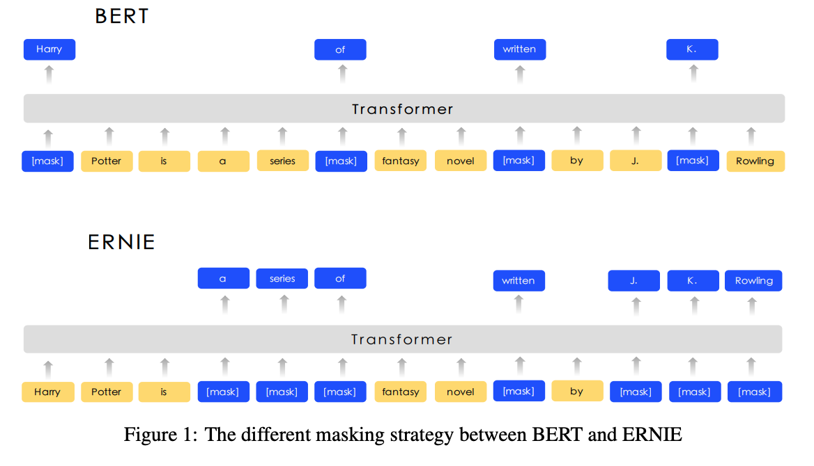
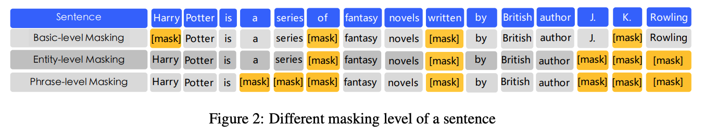
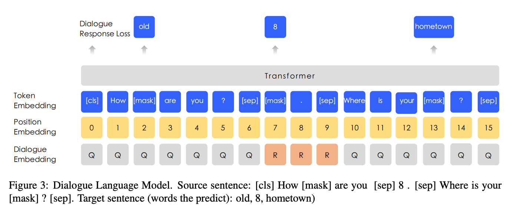
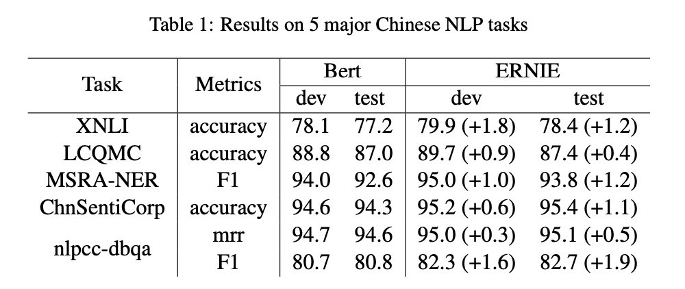
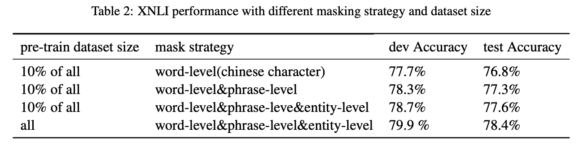
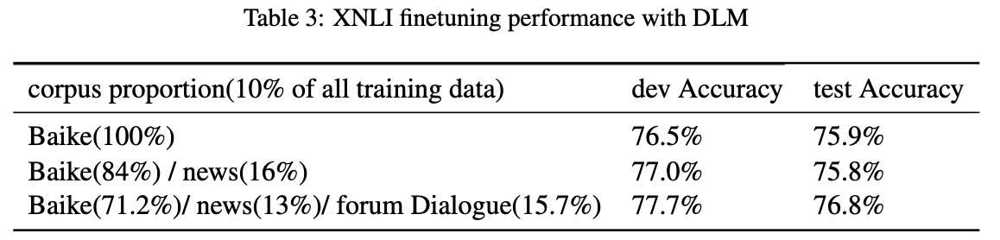
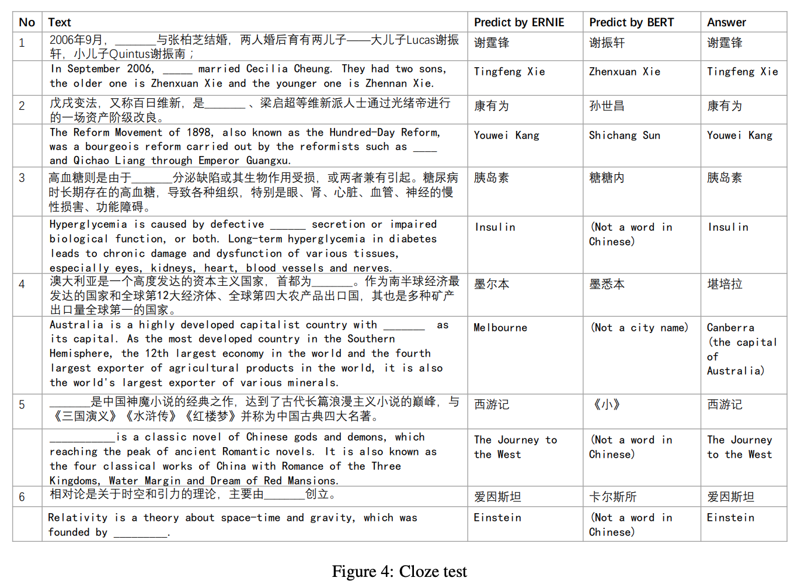

# [论文阅读笔记]ERNIE

ERNIE是Baidu于2019年的论文《ERNIE: Enhanced Representation through Knowledge Integration》提出的自然语言预训练模型，在中文任务上超越BERT取得了SOTA。后续又提出了持续学习框架ERNIE2.0，以及领域模型，详情可以访问[ERNIE](https://github.com/PaddlePaddle/ERNIE)了解。本文主要介绍最初提出的ERNIE，也可以称为ERNIE1.0。

## 1.动机

大部分自然语言的表示学习模型通过上下文预测mask的词来学习自然语言的表示，但都没有考虑先验知识，如phrase和entity。例如在句子“Harry Potter is a series of fantasy novels written by J. K. Rowling.”中，Harry Potter是小说名，J. K. Rowling是作者名。预测Harry Potter中的某个词很容易，不需要使用很长的上下文信息。但如果对Harry Potter整体进行预测时，如果不考虑J. K. Rowling和Harry Potter的关系很难预测正确。从直观上来看，如果模型能学习更多的先验知识，将有利于模型学习到更可靠的语言表示。

基于此，作者提出了先验知识增强的语言表示学习模型ERNIE：引入phrase-level的mask策略和entity-level的mask策略。此外，作者使用丰富的中文语料进行训练，包括中文维基百科、百度百科、百度新闻、百度贴吧的语料。

## 2.ERNIE

ERNIE是在BERT的基础上进行的改进，模型结构与BERT相同，都是使用了多层Transformer-encoder，其核心区别就在于输入的mask策略上。

### 2.1 输入的mask策略

Bert的mask策略是word-level的，对应到中文里是中文的字级别的mask，作者把这种mask策略叫作**Basic-level Masking**。ERNIE除了使用Basic-level Masking之外，还是用了Phrase-level Masking和Entity-level Masking。

**Phrase-level Masking**

Phrase即是短语、词组，有多个字构成。从句子中随机挑选几个短语，整体作mask。

**Entity-level Masking**

Entity是命名实体，如人名、地名、组织名、产品名等。从句子中随机挑选几个命名实体，整体作mask。

### 2.2 多轮对话数据

除了输入的mask策略上的不同，ERNIE使用了贴吧里的对话数据，在输入中会包含多轮对话内容，即多个句子的情况。而Bert的输入只有两个句子。

此外，ERNIE利用对话数据构造了一个**新任务**：随机替换到对话中的query或者response，让模型预测对话是不是伪造的。

### 2.3 训练数据

预料包括：

* 中文维基百科：21M个句子；
* 百度百科：51M个句子；
* 百度新闻：47M个句子；
* 百度贴吧：54M个句子。

数据预处理：

* 中文繁体转简体
* 英文大写转小写

## 3.实验

### 3.1 与Bert的对比

在5个中文NLP任务上全面超越中文Bert-base，在多个任务上准确率提高了1%的绝对量。

### 3.2 消融实验：mask策略和多轮对话数据和任务的有效性

使用10%的训练数据验证了phase和entity-level mask策略的有效性，并证明了更多训练预料带来的效果提升。

贴吧数据带来的提升效果：

### 3.3 完形填空上的实验

与Bert对比在中文完形填空上的实验效果，ERNIE因为有上下文先验知识的学习，取得了更好的效果。

## 4.总结

总结一下，ERNIE是在BERT的基础上，一方面改进了输入的mask方式，融入了词组和实体的先验信息；另一方面使用了多种中文预料，加入了多轮对话数据，并增加了判断对话是否是伪造的任务。

## 参考资料

[1] [ERNIE github](https://github.com/PaddlePaddle/ERNIE)

[2] Sun, Y.; Wang, S.; Li, Y.; Feng, S.; Chen, X.; Zhang, H.; Tian, X.; Zhu, D.; Tian, H.; and Wu, H. 2019. Ernie: Enhanced representation through knowledge integration. arXiv preprint arXiv:1904.09223.

