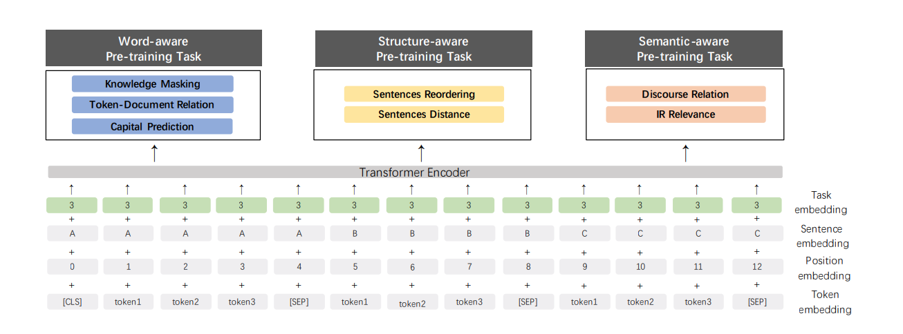

# ERNIE 2.0: A Continual Pre-training Framework for Language Understanding

ERNIE1.0在BERT的基础上，增加了词组粒度和实体粒度的mask策略，引入了多轮对话任务和多轮对话数据，从而可以学习到更多的自然语言先验知识，在多个中文任务上取得了SOTA。ERNIE2.0不是对ERNIE1.0在模型和数据上的简单改进，而是提出了一种基于持续学习的自然语言预训练框架。这里的持续预训练学习每次在之前任务的基础上增加一个新的任务，训练时轮流训练目前的所有任务。区别于多任务学习的同时学习所有任务，持续预训练学习不需要等待所有任务的预处理都完成就可以开始训练，从而效率不低于多任务学习；和传统持续学习的一次学习一个任务相比，持续预训练学习避免了学习任务而忘记旧任务的缺点。

为了好理解ERNIE2.0，我们先从模型架构（模型、任务、输入）的角度来看，再从持续预训练学习的角度来看。因为模型架构是在BERT的基础上的改进，比较容易理解，同时，理解了模型之后再把持续预训练学习当做训练方式来看会更容易。

## 模型架构

整体的模型架构就是输入sequence的embedding传入transformer encoder，上层接各种预训练任务。整体架构与BERT相似。下面从对比的角度来看，主要说明与BERT的不同之处。

**输入**

* 比BERT多了Task embedding，用来标识这是哪一个预训练任务的输入，每个预训练任务使用一个id embedding。
* 输入可能会有多个sentence，用[sep]隔开。如ERNIE 1.0中的多轮对话任务中，会有多个句子，表示多轮对话。
* 其他地方与BERT的输入相同。

**Encoder：**与BERT相同，都是Transformer encoder。

**任务**

任务侧是与BERT区别最大的地方，ERNIE2.0只保留了BERT的word-masking任务，用Sentences Reordering任务替代了NSP任务，还从word角度、结构角度、语义角度增加了其他任务：

* Word-aware任务
  - Knowledge Masking：phrase和named entity整体masking，预测phrase和named entity。
  - Token-Document Relation：预测单签token是否是原文章中多次出现的词。
  - Capital Prediction：预测word是否是大写。大写单词往往有某种特殊的语义信息，如对NER任务更优优势。
* Structure-aware任务
  - Sentences Reordering：对一段文字，随机划分成m段，随机排列随机顺序，预测排列顺序。这个任务可以让模型学习到句子间的关系，类似于BERT中的NSP任务，但比NSP任务更难。
  - Sentences Distance：3分类问题，0表示两个句子在同一个文章中是相邻的句子；1表示两个句子在同一个文章中，但不是相邻的句子；2表示两个句子来自不同的文章。
* Semantic-aware任务
  - Discourse Relation：篇章关系，预测两个句子的语义或修辞关系。（注：先使用一些自动的方法构造句子关系的数据集，比如转折、递进、时序先后等，然后用这些数据预测两个句子之间的关系）
  - IR Relevance：信息检索相关性任务，预测query和title之间的关系，3分类问题，0表示强相关，用户在输入query之后点击了该title；1表示弱相关，用户输入了query之后，title曝光了但没有被点击；2表示query和title完全不相关。

## 持续预训练学习

持续学习（Continual Learning）的目标是以序列的方式训练多任务模型，使得模型学习新任务的同时能保持对之前已学习任务的记忆。

ERNIE2.0使用的持续学习方式见下图的左侧所示，先学习第一个任务，然后使用第一个任务的参数作为第二个任务学习的初始化，在学习第二个任务的时候，同时学习两个任务，每个任务迭代N轮，以此类推。

Multi-task Learning是同时学习多个任务，需要等待所有任务的预处理全部完成才能开始训练。

传统的持续学习是每次学习一个任务，会导致学习新任务时忘记旧任务的情况。

## 实验结果

不同学习方式的对比实验结果

作者控制每种训练方法对每个任务的迭代步数相同，发现持续预训练学习比多任务学习效果要好。说明了持续预训练学习学习效率更高。

中文任务上与BERT和ERNIE1.0的对比实验结果

ERNIE2.0-BASE效果好于BERT-BASE和ERNIE1.0-BASE。从实验里还能看出，在9个任务中，ERNIE1.0-BASE在6个任务上略好于BERT-BASE，在3个任务上比BERT-BASE略差。

## 参考资料

[1] Y. Sun, S. Wang, Y. Li, S. Feng, H. Tian, H. Wu, H. Wang. Ernie2.0: a continual pre-training framework for language understanding. Proceedings of AAAI (2020), pp. 3660-3670

[2] [第四集 - 最全预训练模型解析（一）ERNIE2.0与ELECTRA](https://zhuanlan.zhihu.com/p/165973677)