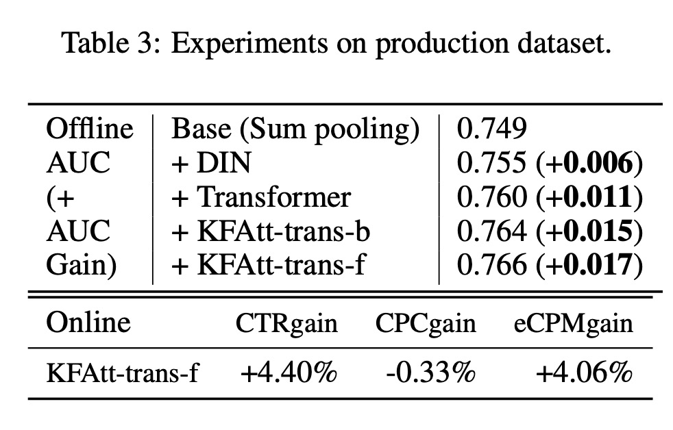

Kalman Filtering Attention for User Behavior Modeling in CTR Prediction

# 1. Motivation

在搜索中，attention机制大行其道。但是传统的attention包含两个缺陷：（1）基于用户的行为(user behaviors)去做attention，但是用户的新需求可能不在用户所有的历史行为中；（2）对于重复query，使用attention计算会产生对高频query的bias。

# 2. Kalman Filtering Attention

## 2.1 Kalman Filtering Attention for user behavior modeling

作者选择Kalman Filtering，因为卡尔曼滤波是在控制理论里被广泛使用，基于一个传感器系列来估计未知变量的模型。

在搜索场景，$v_q$是需要预估的未知变量，表示给定query $q$，用户的兴趣。

用户兴趣可以建模为：

$\hat{v}_q = User-Behavior(q, k_{1:T}, v_{1:T})$

$v_{1:T}$是$T$个历史点击的item，以及每个item对应的query 关键词$k_{1:T}$。

假设$v_q$服从高斯分布$N(\mu_q, \sigma^2_q I)$，$\mu_q$是这个query下用户的平均兴趣，$\sigma_q$代表的是query下所有用户的兴趣方差，是一个与query有关的内在属性。

Kalman Filtering依然假设高斯分布，

$v_t|v_q \sim N(v_q, \sigma_t^2 I), t \in \{1, ..., T\}$

使用MAP，

$\hat{v}_q = \arg\max_{q} = \arg\max_{v_q} p(v_q) \prod_{t=1}^T p(v_t|v_q) = \arg\max_{v_q} \varphi(v_q | \mu_q, \sigma_q^2 I) \prod_{t=1}^T \varphi(v_t | v_q, \sigma_t^2 I)$

$\varphi$表示高斯分布PDF。

高斯分布yyds，永远有closed form solution。

$\hat{v}_q(q, k_{1:T}, v_{1:T}) = \frac{\frac{1}{\sigma_q^2}\mu_q + \sum_{t=1}^T \frac{1}{\sigma_t^2} v_t}{ \frac{1}{\sigma_q^2} + \sum_{t=1}^T \frac{1}{\sigma_t^2 }   }$

$\mu_q$与$\sigma_q$可以通过MLP来学习。

## 2.2 Kalman Filtering Attention with Frequency Capping

考虑重复query，$M \le T$是去重复之后的query数量。对于搜索$k_m$，有$n_m$个点击 $[v_{m,1}, ..., v_{m, n_m}]$，$\sum_{m=1}^M n_m = T$

$v_{m, t}$的observational error可以分成两个：

（1）system error $\sigma_m$，衡量measured variable $v_q$与sensor $k_m$之间的距离；

（2）random error $\sigma'$，$k_m$下每一个点击的随机error。 

仍然是各种服从高斯分布，

$v_m | v_q \sim N(v_q, \sigma_m^2 I), m \in \{1, ..., M\}$

$v_{m, t} | v_m \sim N(v_m, {\sigma_m'}^2I), t \in \{1, ..., n_m\}$

同样使用MAP来估计，

$\hat{v}_q = \arg\max_{v_q}p(v_q) \prod_{m=1}^M \left[ p(v_m | v_q) \prod_{t=1}^{n_m} p(v_{m,t} | v_m) \right]$

$= \arg\max_{v_q} = \varphi(v_q | \mu_q, \sigma_q^2 I) \prod_{m=1}^M \left[ \varphi(v_m|v_q, \sigma_m^2 I) \prod_{t=1}^{n_m} \varphi(v_{m, t}|v_m, {\sigma_m'}^2 I) \right]$

同样，有解析解，

$\hat{v}_q (q, (k_m, v_{m, 1:n_m})_{m=1:M}) = \frac{\frac{1}{\sigma_q^2} \mu_q + \sum_{m=1}^M \frac{1}{\sigma_m^2 + \sigma_m'^2/n_m } \overline{v}_m}{ \frac{1}{\sigma_q^2} + \sum_{m=1}^M \frac{1}{\sigma_m^2 + \sigma_m'^2/n_m}}$

$\overline{v}_m = \frac{1}{n_m} \sum_{t=1}^{n_m} v_{m, t}$

## 2.3 Kalman Filtering Attention in Real Online System
### 2.3.1 Encoder: Within Session Interest Extractor

为了考虑序列的顺序，给$k_{1:T}$、$v_{1:T}$加上一个position embedding。

为了捕捉序列之间的关系，使用Multi-Head Self-Attention。

在实际中，只对一个session中的序列使用，所以序列长度不会太长。

Self-attention： 

$MultiHead(K_s, K_s, V_s) = Concat(head_1, ..., head_h)W^O$

$head_i = Attention(K_sW_i^Q, K_sW_i^K, V_sW_i^V) = Softmax(K_sW_i^Q {W_i^K}^T K_s^T / \sqrt{d_k})V_sW_i^V$

self-attention后面接一个FC层，得到session interest $H_s \in \mathbb{R}^{T_s \times d_{model}}$

### 2.3.2 Decoder: Query-specific Interest Aggregator

$\hat{v}_q = Concat(head_1, ..., head_h)W^O$

$head_i = KFAtt(q^TW_i^Q, KW_i^K, HW_i^V)$

$K$与$H$是收集所有session的结果。

使用Kalman Filtering的解析解公式求解KFAtt。

系统误差$1/\sigma_t^2$或者$1/\sigma_m^2$可以用公式$exp(q^T W_i^Q {W_i^K}^T k)$来计算，$\mu_q$与$1/\sigma_q^2$通过$q$输入2层MLP计算得到。

# 3. Experiment

作者表示已经该模型已经在京东搜索上线，取得了CTR与eCPM的提升，CPC略有下降。

# 4. Preferences
[1] Kalman Filtering Attention for User Behavior Modeling in CTR Prediction