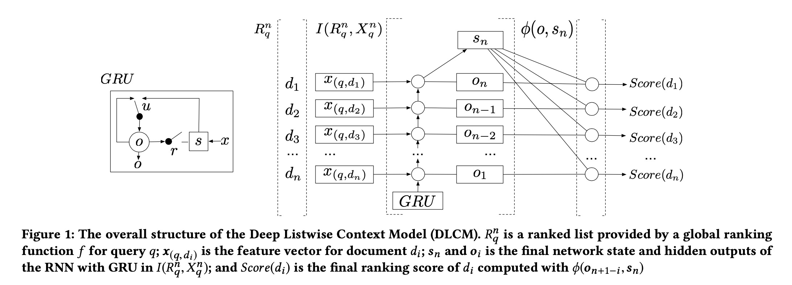
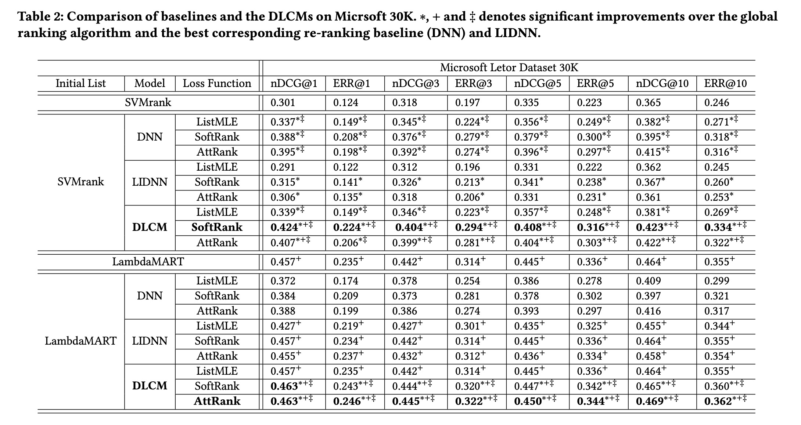

Learning a Deep Listwise Context Model for Ranking Refinement

# 1. Motivation

信息检索中，不同的query的相关文档的分布可能是不一样的。

受到排名top的文档（local ranking context）能提供query的特性的重要信息的启发，论文提出从排名top的文档的内在特征分布中学习一个深度listwise模型，用以调整排序模型给出的排序结果，即重排序（re-rank)。

其实motivation就是，在信息检索中，不能只用query信息与document做match，要考虑context(上下文)。

# 2. Related work

+ 传统信息检索
  
给定一个特定的query $q$，$x_{(q, d)}$是$q$与文档$d$的向量表示，目的是为了学习一个全局排序函数$f$。

损失函数是，

$L = \sum_{q \in Q} l(\{y(q, d), f(x_{(q, d)}) | d \in D\})$

+ 考虑local ranking context

学习一个local context model $I(R_q, X_q)$，$R_q = \{ d$ sorted by $f(x_{(q, d)}) \}$, $X_q = \{ x_{(q, d)} | d \in R_q \}$，即对排序结果进行学习，并重新排序。

新的损失函数是，

$L = \sum_{q \in Q} l(\{y(q, d), \phi(x_{(q, d)}, I(R_q, X_q)) ) | d \in D\})$

# 3. DLCM

## 3.1 Input document representations

这只是本文的特殊处理，对于应用本文的listwise思想没有太大用处。

首先得到query下每个document的向量表示$x_{q, d_i}$，然后进行两个dnn，

$z_i^{(0)} = x(q, d_i)$

$z_i^{(l)} = elu(W_z^{(l-1)} z_i^{(l-1)} + b_z^{(l-1)}), l=1,2$

然后concat $x_{(q, d_i)}$与$z_i^{(2)}$得到新的向量表示$x'_{(q, d_i)}$

## 3.2 Encoding the Listwise Local Context

使用一个GRU来建模local rank context，将排序得到document的新的向量表示$x'_{q, d_i}$，按照顺序从低到高（$x_n$到$x_1$）依次输入GRU，得到每个document在GRU的输出状态序列$o_1, o_2, ..., o_n$以及最后一个（排序最高）的item在GRU的隐藏状态$s_n$。

## 3.3 Re-ranking with the Local Context

基于一个local rank function $\phi$对$s_n$与输出状态序列$o_1, o_2, ..., o_n$，作者进行一次attention一样的依次计算，得到每个document的rank score。

对于$d_i$, 

$\phi(o_{n+1-i}, s_n) =V_{\phi} (o_{n+1-i} tanh(W_{\phi} s_n + b_{\phi}))$

## 3.4 Loss function

+ ListMLE
+ Attention Rank

# 4. Experiment

# References

[1] Qingyao Ai, Keping Bi, Jiafeng Guo, and W Bruce Croft. 2018. Learning a Deep Listwise Context Model for Ranking Refinement. arXiv preprint arXiv:1804.05936 (2018).