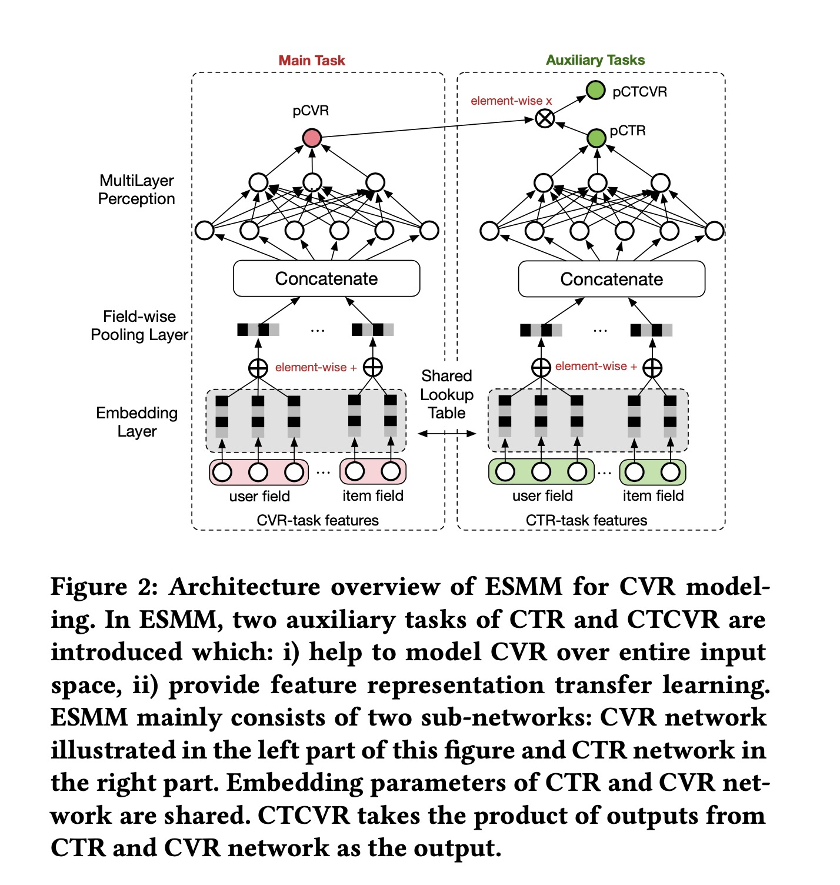
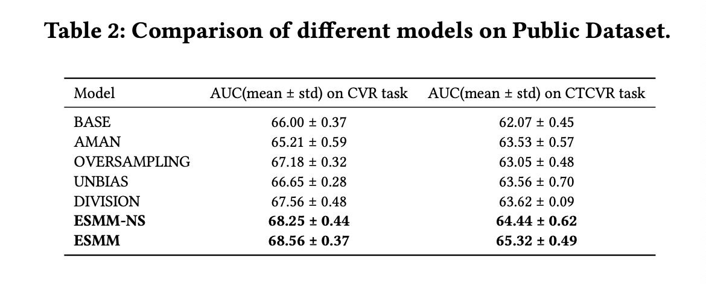

Entire Space Multi-Task Model: An Effective Approach for Estimating Post-Click Conversion Rate

# 0. Preference
Ma, Xiao, et al. "Entire space multi-task model: An effective approach for estimating post-click conversion rate." The 41st International ACM SIGIR Conference on Research & Development in Information Retrieval. 2018.

# 1. Motivation
电商领域CVR预估面临两个问题：

(1) Sample selection bias
传统的CVR模型都是学习从click(点击)到conversion(转化)，但实际上使用的时候要对所有的impression(曝光)物品都去计算，这样就导致了训练与预测的样本选择偏差。

(2) Data sparsity 
这个很好理解，CVR模型的样本量相比于整个平台的用户与物品是很稀疏的。

本文采用：
(1)从用户行为的序列模式来学习CVR模型，比如impression->click->conversion；
（2）特征表示迁移学习策略；
来分别解决上面两个问题，提出了**E**ntire **S**pace **M**ulti-task **M**odel (ESMM)模型。

# 2. ESMM

核心问题，建模用户点击之后转化的概率：

$pCVR = p(conversion|click,impression)$

引入两个辅助任务，$pCTR$与$pCTCVR$，

## 2.1 Modeling over entire space

$\boldsymbol{x}$表示特征，$y$表示click的label，$z$表示conversion的label。

损失函数如下：

$L(\theta_{cvr}, \theta_{ctr}) = \sum_{i=1}^N l(y_i, \boldsymbol{x}_i ; \theta_{ctr})) + \sum_{i=1}^N l(y_i \& z_i), f(\boldsymbol{x}_i; \theta_{ctr}) \times f(\boldsymbol{x}_i; \theta_{cvr}))$

通过这样的损失函数，建模了用户的行为序列：从$y$与$y \& z$两部分来建模了$y \rightarrow z$。

## 2.2 Feature representation transfer

其实就是CVR部分与CTR部分共享同一个embedding table。

# 3. Experiment

实验表明，公开数据集及生产数据集上ESMM都取得了很好的效果。

总的来说，ESMM一共有两个点：
(1) 引入两个附加任务pCTR与pCTCVR，从而建模了整个用户行为链路，解决CVR任务训练与推理样本偏差问题。
(2) 多任务之间底层共享embedding table，解决其中一个任务数据稀疏的问题。
