常见深度学习点击率预估模型

# LR (Logistic Regression)

$\hat{y} = \sigma(W^TX+b)$

# FM (Factorization Machines)

Rendle, S. (2010, December). Factorization machines. In *2010 IEEE International conference on data mining* (pp. 995-1000). IEEE

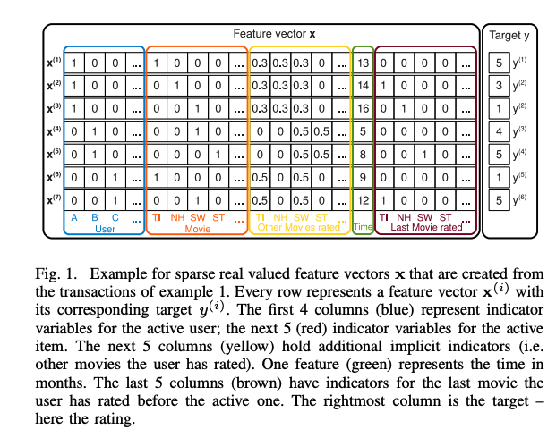

$\hat{y} = w_0 + \sum_{i=1}^n w_i x_i + \sum_{i=1}^n \sum_{j=i+1}^n <\boldsymbol{v}_i, \boldsymbol{v}_j>x_i x_j$

$\boldsymbol{v}_i$是$x_i$的向量$k$维表示。

FM的原始表达式时间复杂度是$O(kn^2)$。

对于二次项部分，

$\sum_{i=1}^n \sum_{j=i+1}^n <\boldsymbol{v}_i, \boldsymbol{v}_j>x_i x_j$

$= \frac{1}{2} \sum_{i=1}^n\sum_{j=1}^n <\boldsymbol{v}_i, \boldsymbol{v}_j>x_i x_j - \frac{1}{2} \sum_{i=1}^n <\boldsymbol{v}_i, \boldsymbol{v}_i>x_i x_i$

$= \frac{1}{2} \left( \sum_{i=1}^n\sum_{j=1}^n \sum_{f=1}^k v_{i,f}v_{j,f} x_i x_j - 
\sum_{i=1}^n \sum_{f=1}^k v_{i,f}v_{i,f} x_i x_i
\right)$

$= \frac{1}{2} \sum_{f=1}^k \left( 
    \left(  \sum_{i=1}^n v_{i,f}x_i \right) 
    \left(  \sum_{j=1}^n v_{j,f}x_j \right) 
    - \sum_{i=1}^n v_{i,f}^2 x_i^2 \right)$

$= \frac{1}{2} \sum_{f=1}^k \left( 
    \left( \sum_{i=1}^n v_{i,f} x_i \right)^2
    - \sum_{i=1}^n v_{i,f}^2 x_i^2
    \right)$

时间复杂度变为了$O(kn)$.

# Wide & Deep
Cheng, Heng-Tze, et al. "Wide & deep learning for recommender systems." Proceedings of the 1st workshop on deep learning for recommender systems. 2016.

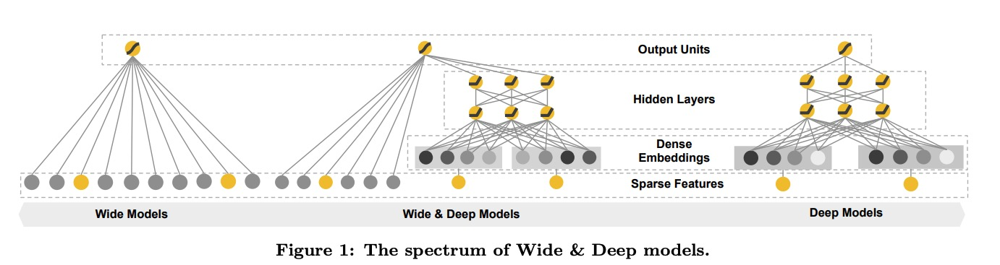

$\hat{y} = \sigma( y_{wide} + y_{dense} + b)$

wide部分是输入特征的线性加权结果，是个数值；wide部分一般处理的是数值类特征（包括原始特征以及人工交叉之后的数值特征）。

dense部分最后一层输出层不加激活函数，也是个数值；dense部分输入是特征的embedding表示。

# FNN (Factorization-machine supported Neural Networks)
 Weinan Zhang, Tianming Du, and Jun Wang. Deep learning over multi-field categorical data - - A case study on user response prediction. In ECIR, 2016.

 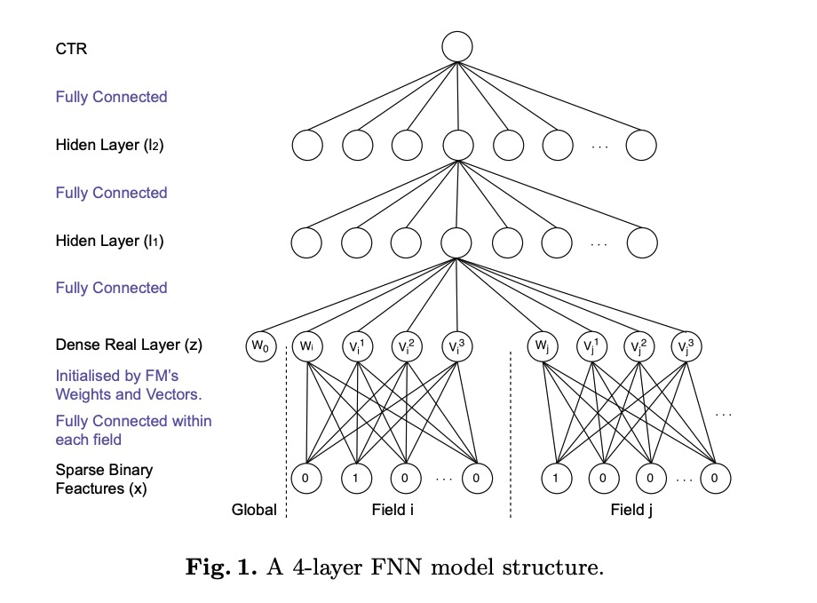

假设一共有$n$个field，embedding维度为$K$。

FNN的最后几层都是普通的输出层与隐层，对于最后一个普通的隐层$l_1$, 

$l_1 = tanh(W_1 \boldsymbol{z} + \boldsymbol{b_1})$

$\boldsymbol{z} = (w_0, \boldsymbol{z_1}, ..., \boldsymbol{z}_n)$, $\boldsymbol{z}_i \in \mathbb{R}^{K+1}$

$\boldsymbol{z}_i = \boldsymbol{W}_0^i \cdot \boldsymbol{x}[start_i: end_i] = (w_i, v_i^1, v_i^2, ..., v_i^K)$, $\boldsymbol{W}_0^i \in \mathbb{R^{(K+1) \times (end_i - start_i + 1)}}$

其中$w_i$与$v_i$初始化来自FM，

$y_{FM} = \sigma(w_0 + \sum_{i=1}^N w_i x_i + \sum_{i=1}^N \sum_{j=i+1}^N <\boldsymbol{v}_i, \boldsymbol{v}_j> x_i x_j)$

也就是说，FNN是先用FM进行预训练，得到每一个field的embedding向量表示$\boldsymbol{v}_i$以及一阶参数$w_i$，用这些参数组成相应field新的向量表示，接入后续的DNN。

# PNN (Product-based Neural Networks)
Yanru Qu, Han Cai, Kan Ren, Weinan Zhang, Yong Yu, Ying Wen, and Jun Wang. Product-
based neural networks for user response prediction. CoRR, abs/1611.00144, 2016.

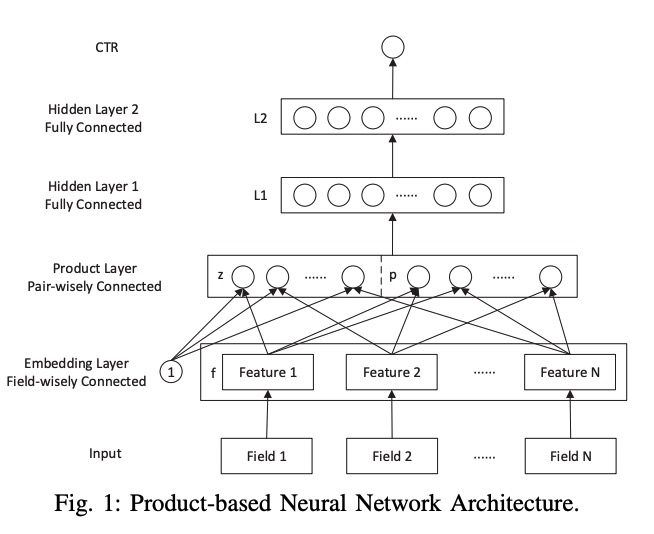

PNN的输出层与后面几个隐层都是普通的DNN，主要贡献在于有一个Product层。

输入层对每一个field先做embedding，Product层由两个信号构成，一个是线性信号$\boldsymbol{l}_z$，一个是二阶信号$\boldsymbol{l}_p$。最后一个隐层$\boldsymbol{l}_1$可以表示为：

$\boldsymbol{l}_1 = relu(\boldsymbol{l}_z + \boldsymbol{l}_p + \boldsymbol{b}_1)$

$\boldsymbol{l}_z = (l_z^1, l_z^2, ..., l_z^{D_1})$，$D_1$表示隐层$\boldsymbol{l}_1$的输入维度，$l_z^n = \boldsymbol{W}_z^n \odot \boldsymbol{z}$, $\odot$在论文里被定义为先计算element-wise product再求和，即两个向量或者矩阵对应下标的乘积之和，是一个数值。

$\boldsymbol{l}_p = (l_p^1, l_p^2, ..., l_p^{D_1})$, $l_p^n = \boldsymbol{W}_p^n \odot \boldsymbol{p}$

$\boldsymbol{z} = (\boldsymbol{z}_1, \boldsymbol{z}_2, ..., \boldsymbol{z}_N) \triangleq (\boldsymbol{f}_1, \boldsymbol{f}_2, ..., \boldsymbol{f}_N)$, $\boldsymbol{f}_i$是field $i$的embedding表示。

$\boldsymbol{p} = \{\boldsymbol{p}_{i,j}\}$, $\boldsymbol{p}_{i,j}=g(\boldsymbol{f}_i, \boldsymbol{f}_j)$是二阶的特征交叉。

其实就是，先对每一个field做embedding，然后把embedding经element-wise product得到数值concat到一起；然后把像FM一样，对embedding做两两交叉，把结果经element-wise product得到数值也concat到一起。

## IPNN (Inper Product-based Neural Networks)

PNN的$\boldsymbol{p}$部分是field的embedding做两两交叉，根据向量交叉方式不同，PNN有两个不同的形式IPNN与OPNN。

IPNN指向量交叉采用内积形式, 

$g(\boldsymbol{f}_i, \boldsymbol{f}_j) = <\boldsymbol{f}_i, \boldsymbol{f}_j>$

## OPNN (Outer Product-based Neural Networks)

OPNN指向量交叉采用外积形式,

$g(\boldsymbol{f}_i, \boldsymbol{f}_j) = \boldsymbol{f}_i \boldsymbol{f}_j ^ T$

# DeepFM
H. Guo, R. Tang, Y. Ye, Z. Li, and X. He. Deepfm: a factorization- machine based neural network for ctr prediction. In IJCAI, 2017.

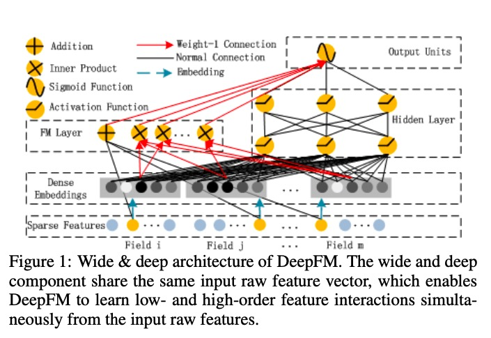

$\hat{y} = \sigma(y_{FM} + y_{DNN})$

$y_{FM} = <w, x> + \sum_{i=1}^d \sum_{j=i+1}^d <V_i, V_j> x_i \cdot x_j$

DeepFM可以理解为将Wide&Deep模型的Wide部分替换为FM，从而可以对每一个wide特征增加了稀疏表示以及特征之间的两两交叉，相比Wide&Deep模型极大增强了表达能力，在工业界使用非常广泛。

# DeepCrossing
Y. Shan, T. R. Hoens, J. Jiao, H. Wang, D. Yu, and J. Mao. Deep crossing: Web-scale modeling without manually crafted combinatorial features. In KDD, 2016.

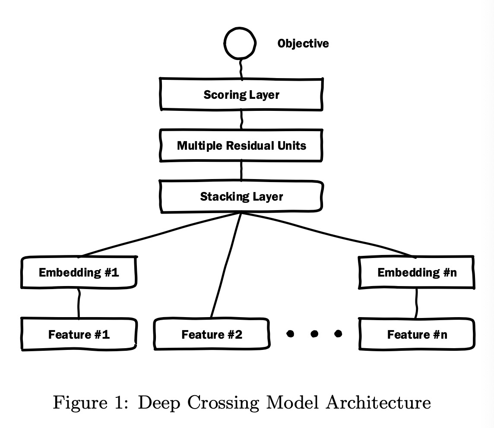

想法很直接：将residual从cv引入推荐系统。

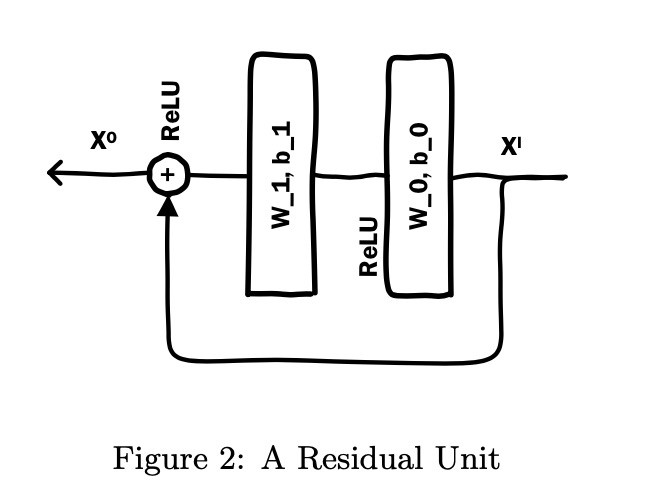

# DCN (Deep & Cross Network)
Wang R, Fu B, Fu G, et al. Deep & cross network for ad click predictions[M]//Proceedings of the ADKDD'17. 2017: 1-7.

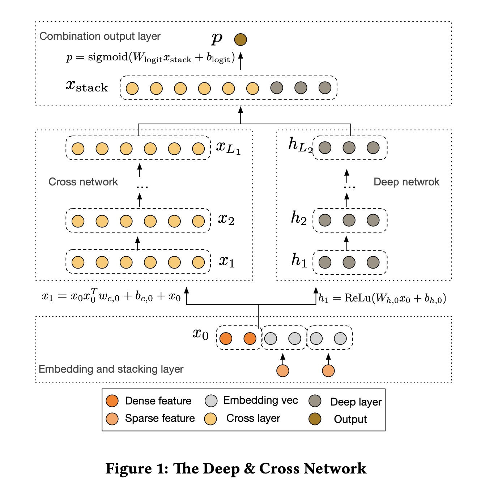

顾名思义，一部分是正常的Deep网络，另一部分是Cross网络，最后将两个网络的输出合并，得到输出结果。论文真正的创新点在Cross网络的设计。

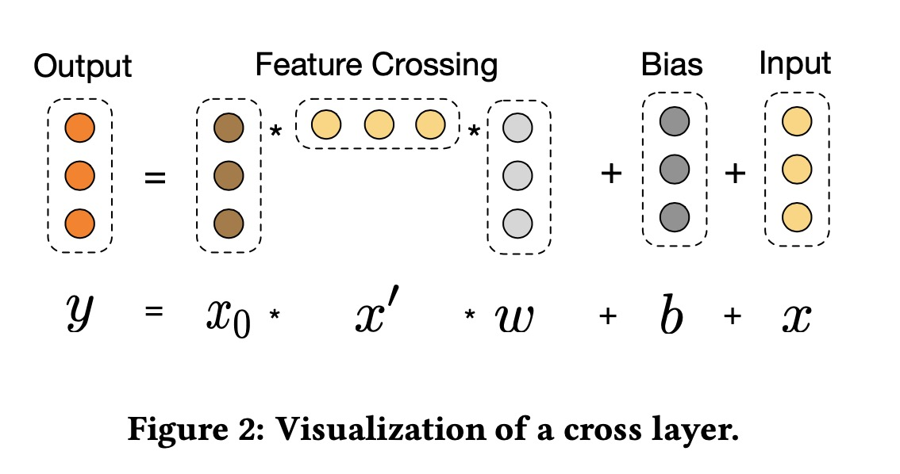

假设$\boldsymbol{x}_i$是第$i$个Cross层的输出，

$\boldsymbol{x}_{l+1} = \boldsymbol{x}_0 \boldsymbol{x}_l^T \boldsymbol{w}_l + \boldsymbol{b}_l + \boldsymbol{x}_l = f(\boldsymbol{x}_l, \boldsymbol{w}_l, \boldsymbol{b}_l) + \boldsymbol{x}_l$

每一个Cross层都与整个网络的输入$\boldsymbol{x}_0$做一次交叉，再加上当前层的输入$\boldsymbol{x}_l$（起到residual的作用）。这样每加一个Cross层，就相当于加了一阶交叉。

# NFM 
X. He and T.-S. Chua. Neural factorization machines for sparse predictive analytics. In SIGIR, 2017.

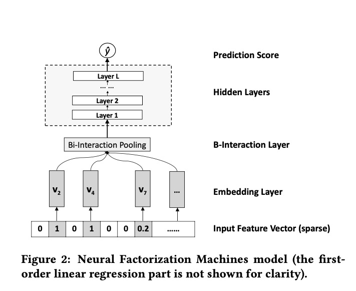

FM：

$\hat{y} = w_0 + \sum_{i=1}^n w_i x_i + \sum_{i=1}^n \sum_{j=i+1}^n <\boldsymbol{v}_i, \boldsymbol{v}_j>x_i x_j$

NFM：
$\hat{y} = w_0 + \sum_{i=1}^n w_i x_i + f(\boldsymbol{x})$

$f_{BI}(V_{\boldsymbol{x}}) = \sum_{i=1}^n\sum_{j=i+1}^n x_i \boldsymbol{v}_i \odot x_j \boldsymbol{v}_j$

与PNN$\odot$定义成得到数值（对element-wise product求和）不同，这里的$\odot$ element-wise product得到的是一个向量。

与FM的区别：
FM是embedding两两交叉，直接向量内积计算得到一个数值。

NFM是两两交叉element-wise product，得到相同维度的embedding，后续再接DNN。

# AFM
Xiao J, Ye H, He X, et al. Attentional factorization machines: Learning the weight of feature interactions via attention networks[J]. arXiv preprint arXiv:1708.04617, 2017.

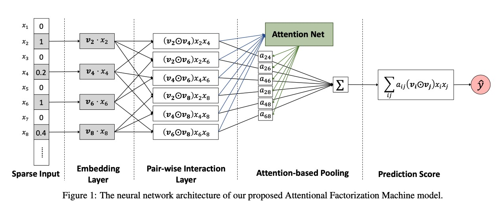

$f_{Att}(f_{PI}(\xi)) = \sum_{(i,j) \in R_x} a_{ij}(\boldsymbol{v}_i \odot \boldsymbol{v}_j)x_i x_j$

$\xi = \{ \boldsymbol{v}_i x_i\}_{i \in X}$, $R_x = \{(i, j)_{i\in X, j \in X, j > i}\}$

$a(i,j)$是attention score，

$a_{i,j}' = \boldsymbol{h}^T ReLU(\boldsymbol{W}(\boldsymbol{v}_i \odot \boldsymbol{v}_j )x_i x_j + \boldsymbol{b})$

$a(i, j) = \frac{exp(a_{ij}')}{\sum_{i,j\in R_x}exp(a_{ij}')}$

AFM与NFM类似，对field的embedding，先两两交叉element-wise product，得到$n(n-1)/2$对相同维度的向量（需要乘以特征原始值$x_ix_j$）。

然后对些向量计算一次attention weights，最后再与所有向量本身加权求和。

综合起来，AFM表示为，

$\hat{y}_{AFM}(\boldsymbol{x}) = w_0 + \sum_{i=1}^n w_i x_i + \boldsymbol{p}^T \sum_{i=1}^n \sum_{j=i+1}^n a_{ij} (\boldsymbol{v}_i \odot \boldsymbol{v}_j)x_i x_j$

# xDeepFM
Lian, Jianxun, et al. "xdeepfm: Combining explicit and implicit feature interactions for recommender systems." Proceedings of the 24th ACM SIGKDD International Conference on Knowledge Discovery & Data Mining. 2018.

论文从DCN的基础上改进，并且指出DCN虽然号称学习到了高阶交叉，但其实只是一种特殊形式的高阶交叉；每一个隐层是输入层$\boldsymbol{x}_0$的数值倍数（不是线性的），从而DCN学习到的是有限的高阶。

xDeepFM的核心是CIN （Compressed Interaction Network）。

$\boldsymbol{X}_k$表示CIN第$k$层的输出，$H_k$表示第$k$层的embedding特征向量的个数，$H_0=m$，等于field的个数，embedding的维度为D。

$\boldsymbol{X}_{h, *}^k = \sum_{i=1}^{H_{k-1}} \sum_{j=1}^m \boldsymbol{W}_{ij}^{k, h} (\boldsymbol{X}_{i, *}^{k-1} \circ X_{j, *}^0)$ 

+ 外积：输入层$\boldsymbol{X}_0$的每一个向量（embedding维度）都与$\boldsymbol{X}_k$的每一个向量两两外积，最终得到一个维度为$(H_k, m, D)$的tensor。

+ 压缩：将外积tensor$(H_k, m, D)$沿着embedding维度（D)，像CNN的每个feature map一样，计算$H_{k+1}$组卷积，每一组都将$(H_k, m)$压缩成1个数值。

+ CIN输出：对每一个隐层先沿着embedding维度做sum pooling，得到$K$个维度为$H_k$的向量；然后将这$K$个向量concat计算最后的输出。

CIN既像RNN(每一个隐层$\boldsymbol{X}_k$都依赖于上一个隐层的输出$\boldsymbol{X}_{k-1}$以及一个附加的输入$\boldsymbol{X}_0$)，也像CNN（压缩）。

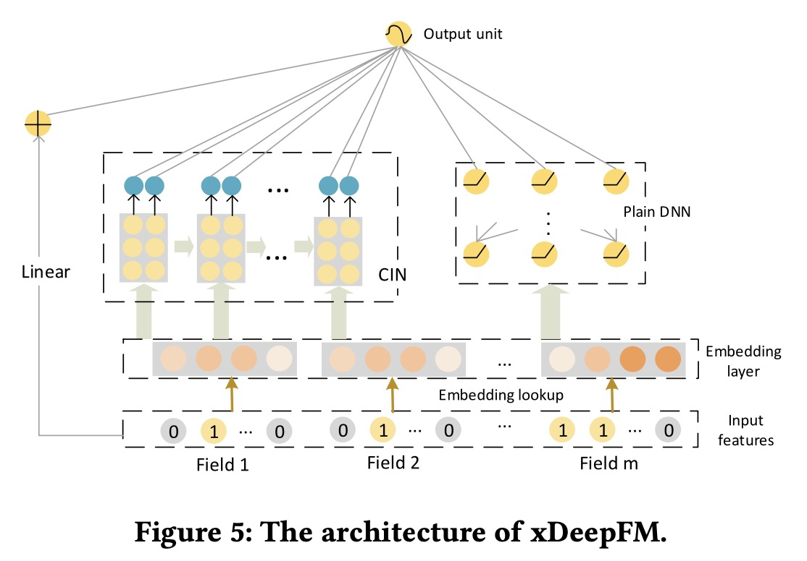

# AutoInt
Song W, Shi C, Xiao Z, et al. Autoint: Automatic feature interaction learning via self-attentive neural networks[C]//Proceedings of the 28th ACM International Conference on Information and Knowledge Management. 2019: 1161-1170.

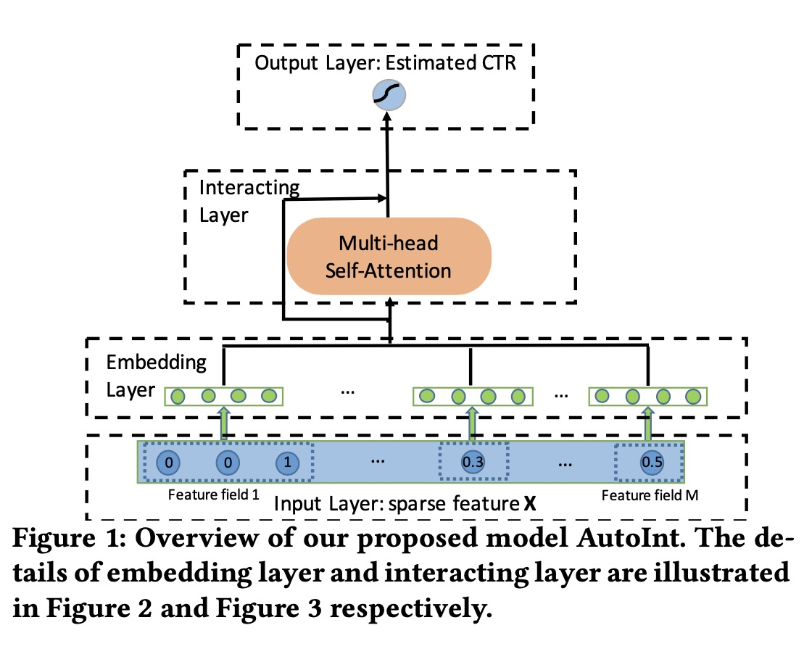

创新点：将Multi-Head Self-Attention从NLP引入推荐系统。

首先，得到每一个输入field的embedding表示$e_i$，对于head $h$，field $m$与$k$的交叉关系表示为，

$\alpha_{m,k}^{(h)} = \frac{
    exp(\varphi^{(h)} (\boldsymbol{e}_m \boldsymbol{e}_k )) }
    {\sum_{l=1}^M exp(\varphi^{(h)} (\boldsymbol{e}_m \boldsymbol{e}_l ))}$ 

$\varphi^{(h)} (\boldsymbol{e}_m \boldsymbol{e}_k ) = <W^{(h)}_{Query} \boldsymbol{e}_m, W^{(h)}_{Key} \boldsymbol{e}_k>$

然后field $m$的新的向量表示更新为，

$\widetilde{\boldsymbol{e}}_m = \sum_{k=1}^M \alpha_{m,k}^{(h)} (W^{(h)}_{Value} \boldsymbol{e}_k)$

AutoInt在工业界的推荐系统中效果非常好，应用广泛。