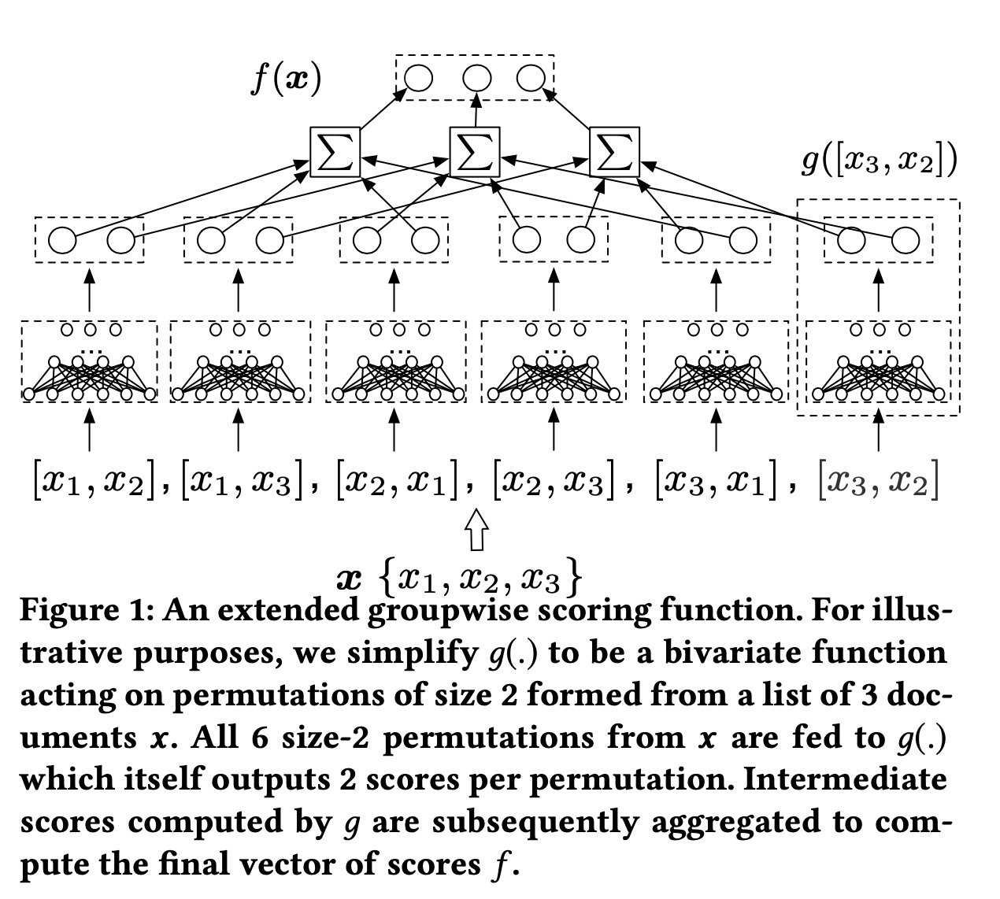
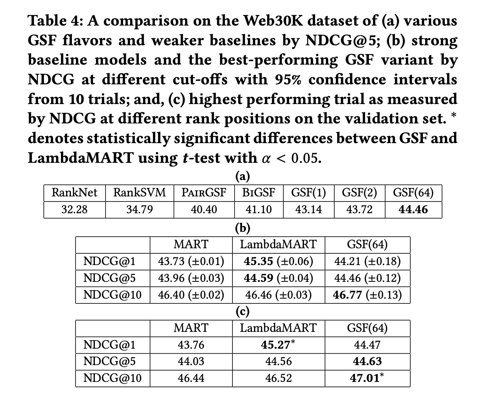

Learning Groupwise Multivariate Scoring Functions Using Deep Neural Networks

# 1. Motivation

基于模型的listwise方法，基本出发点都是一样的，传统的排序模型是单一的全局rank function，没有考虑item list之间的交叉关系。

本文提出的是一个多元函数，其实就是输入一个item list，输出每个item的相对score，直接用这个score排序即可。本文提出的模型不仅仅用在重排序上，也可以直接用到排序上去。

# 2. GSF

## 2.1 DNN

整个模型如图所示。

给定$m$个document, concat所有的输入，

$h_0 = concat(x_1^{embed}, x_1^{dense}, ..., x_m^{embed}, x_m^{dense})$

后面接入多层dnn，

$h_k = \sigma(w_k^T h_{k-1}+b_k)$

然后得到一个softmax输出，作为每个item的排序score。

## 2.2 Extension to Arbitrarily Long Lists

对于document个数$n$超出模型训练长度$m$的情况，如图所示，首先枚举$(n, m)$种组合情况，也就是论文所说的group。

然后将所有的group输入embedding+dnn，每一个group得到一个组合内部的softmax得分。

所有group中相应的document得分相加，得到每个document最终的得分。

## 2.3 Efficient Training and Inference

理论上的枚举组合时间与模型的复杂度太高，作者采用**蒙特卡洛采样**的方式来近似计算。

对$n$个document随机shuffle得到一个新的排列，然后以group size为$m$进行滑窗计算即可。

# 3. Experiment

作者对比了如LambdaMART这样基于树的listwise的最有效方法之一（只比较dense特征效果等）；还开源了tf-ranking这样一个代码库。

# 4. References

[1] Ai, Qingyao, et al. "Learning groupwise scoring functions using deep neural networks." (2019).