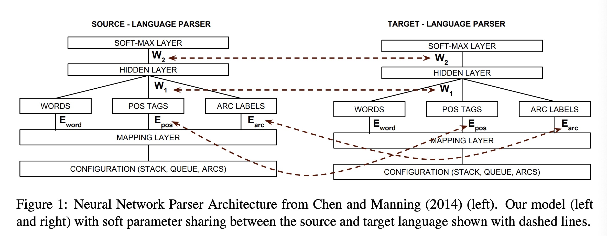
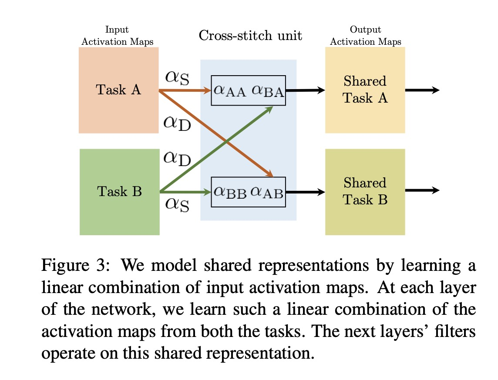
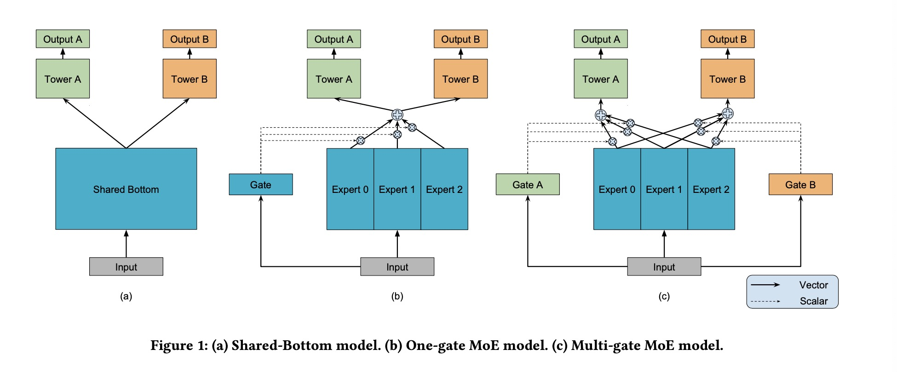
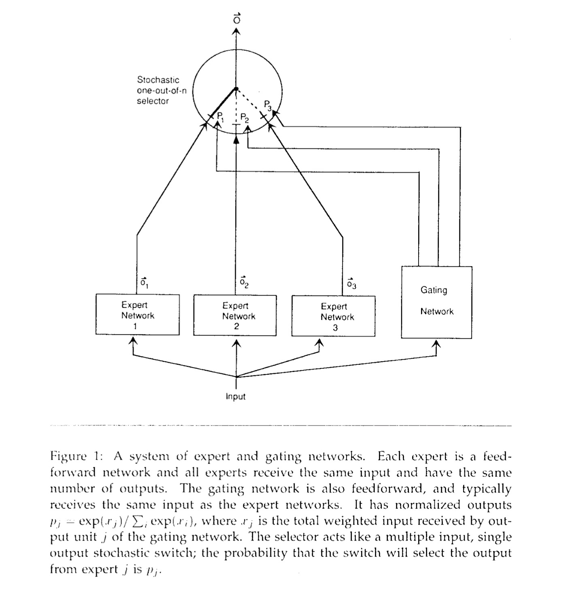
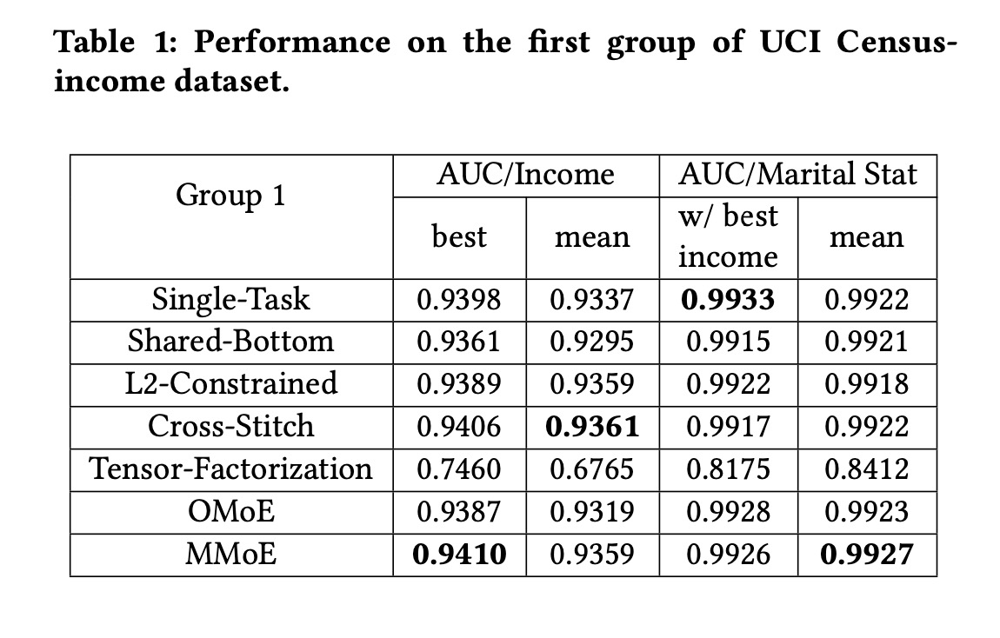
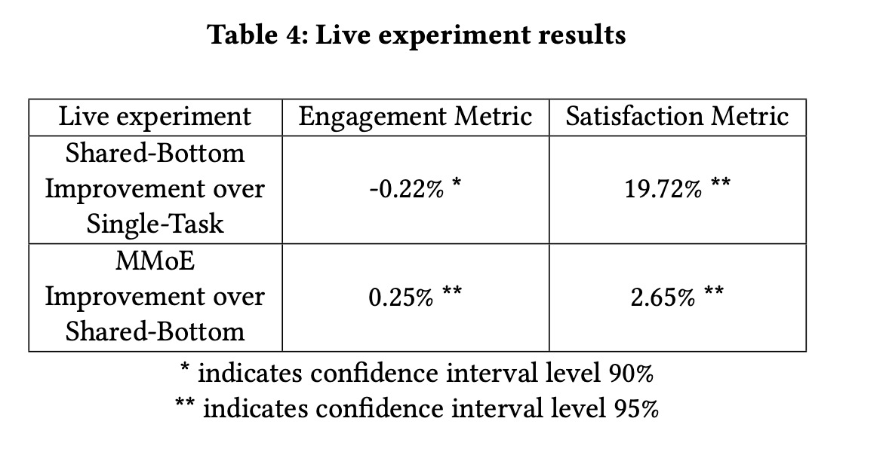

Modeling Task Relationships in Multi-task Learning with Multi-gate Mixture-of-Experts

# 1. Motivation

多任务学习是一个常见的场景，比如在视频推荐中，希望同时提升用户观看时长、收藏、分享、转发等目标的效果。

正则化与迁移学习等可以帮助提升多任务学习的效果；但是多任务学习并不总是比所有的单任务效果都好，数据分布、不同任务之间的关联关系都影响多任务学习的效果。

多任务学习的效果对于任务之间的关系是**敏感**的；一般来说，任务之间相关性越高，学习效果越好。

# 2. Related work
# 2.1 L2-Constrained 

Long Duong [4]等人为跨语言问题提出的让两个任务通过L2约束软共享参数的方法。

对于两个任务$k \in \{1, 2\}$, 

$\hat{y}_k = f(x;\theta_k)$

优化目标是，

$\mathbb{E}(L(y_1, f(x; \theta_1))) + \mathbb{E}(L(y_2, f(x; \theta_2))) + \alpha ||\theta_1 - \theta_2||_2^2$

$\alpha$是一个超参。模型用$\alpha$来建模了两个任务之间的关联程度。

# 2.2 Cross-Stitch

Ishan Misra [5]等人提出Cross-Stitch方式来对CNN里的每个activation map通过线性加权(矩阵乘法)得到新的activation map。从MMoE论文的实验结果来看，这个方法效果很好。

# 2.3 Tensor-Factorization

Yongxin Yang [6]等人将不同任务之间的权重看成一个tensor，基于tensor分解（Tucker decomposition)来学习不同任务之间的参数共享。

输入隐藏层的大小$m$, 输出隐藏层的大小$n$, 任务个数$k$； 权重$W$是：

$W=\sum_{i_1}^{r_1} \sum_{i_2}^{r_2} \sum_{i_3}^{r_3} S(i_1, i_2, i_3) \cdot U_1(: , i_1) \circ U_2(:, i_2) \circ U_3(:, i_3)$

$W$的维度是$m \times n \times k$, $S$的维度是$r_1 \times r_2 \times r_3$, $U_1$的维度是$m \times r_1$, $U_2$的维度是$n \times r_2$, $U_3$的维度是$k \times r_3$。

$r_1$, $r_2$, $r_3$是超参。

也就是说，对于$k$个任务，每一层学习一个隐层权重($m \times n$)，再基于张量分解学习一个权重$W$ ($m \times n \times k$)，将这个权重应用到每一个参数上去，实现所有$K$个任务在每一层都有信息共享。

# 3. MMOE

## 3.1 Shared-Bottom model

Rich Caruana [2] 在1998年提出的多任务学习模型，现在看起来非常直观，多个任务共享底层的网络（embedding或者embedding + MLP)，如[ESMM](https://www.jianshu.com/p/0cdf96c2db89)。

对于输入$x$, 底层输出$f(x)$，每一个任务$k$有一个自己的tower网络$h^k$，从而每个任务的输出是：

$y_k = h^k(f(x))$

## 3.2 MoE (Mixture-of-Experts)
Robert A Jacobs [3]等人在1991年提出MoE (Mixture of Experts)模型，论文的合作者惊现两位大神Michael Jordan与Geoffrey E Hitton。

MoE模型包含$n$个expert $f_i$，最终的输出是对所有expert的输出的加权求和；征求不同专家的意见，根据专家的权威性加权得到最终的决策。

$y = \sum_{i=1}^n g(x)_i f_i(x)$

$\sum_{i=1}^n g(x)_i = 1$, $g(x)_i$是第$i$个gate网络的输出，gate网络输出的是分配到每个expert的概率，也就是每个expert的权重。

MoE只有一个gate网络，从而也可以叫做OMoE (One gate Mixture of Experts)，从而引入本文提出的模型。

## 3.3 MMoe (Multi-gate Mixture-of-Experts)
从Shared-bottom模型与MoE发展而来，论文提出多个gate网络的混合专家模型：
（1）可以**显式**地捕捉不同任务之间的异同关系；
（2）与基于Shared-bottom的多任务模型相比，并不显著增加模型参数量。

与MoE只有一个gate网络相比，MMoE为每一个任务$k$学习一个gate网络$g^k$，任务$k$的输出是,

$y_k = h^k(f^k(x))$，

$f^k(x) = \sum_{i=1}^n g^k(x)_i f_i(x)$。

gate网络的实现是简单的线性变换加上softmax激活。

$g^k(x) = softmax(W_{gk}x)$

就是说，学习不同的expert；为每个任务学习一个gate网络，每个网络都为expert分配不同的权重；对expert相应地加权求和得到每个任务的输入，再经过tower网络得到该任务最终输出。

gate网络起到选择（分配权重）专家的作用。

# 4. Experiment

论文在公开数据与线上都做了实验，实验非常详尽有说服力，值得学习。

MoE为每个专家学习不同的权重，但是对于所有任务的tower网络输入是相同的，像是一个ensemble模型（一个MLP vs 多个MLP加权)；而MMoE每个任务的tower输入是不同的。

因为MMoE为每个任务的tower网络学习不同的输入，既让每个任务之间能共享信息（expert），也学到了差异（对expert不同的加权）；并且为每个任务只增加了一个gate网络，整体上并没有显著增加模型参数，是一个很好的多任务学习的模型框架。

# 5. Preference
[1] Ma, Jiaqi, et al. "Modeling task relationships in multi-task learning with multi-gate mixture-of-experts." Proceedings of the 24th ACM SIGKDD International Conference on Knowledge Discovery & Data Mining. 2018.

[2] Rich Caruana. 1998. Multitask learning. In Learning to learn. Springer, 95–133.

[3] Robert A Jacobs, Michael I Jordan, Steven J Nowlan, and Geoffrey E Hinton. 1991.
Adaptive mixtures of local experts. Neural computation 3, 1 (1991), 79–87.

[4] Long Duong, Trevor Cohn, Steven Bird, and Paul Cook. 2015. Low Resource Dependency Parsing: Cross-lingual Parameter Sharing in a Neural Network Parser.. In ACL (2). 845–850.

[5] Ishan Misra, Abhinav Shrivastava, Abhinav Gupta, and Martial Hebert. 2016.
Cross-stitch networks for multi-task learning. In Proceedings of the IEEE Confer-
ence on Computer Vision and Pattern Recognition. 3994–4003.

[6] Yongxin Yang and Timothy Hospedales. 2016. Deep multi-task representation
learning: A tensor factorisation approach. arXiv preprint arXiv:1605.06391 (2016).