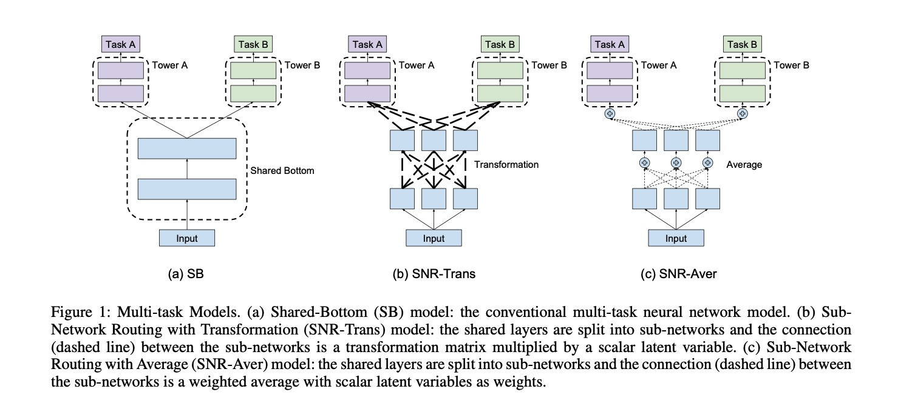
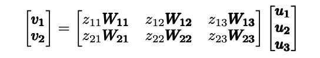
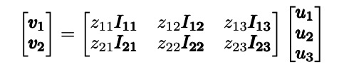
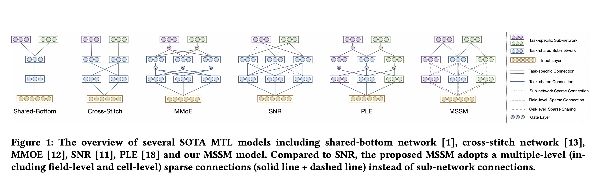
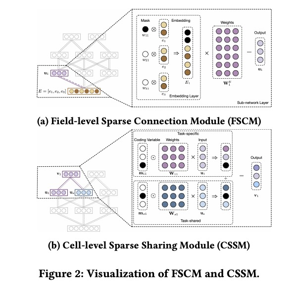
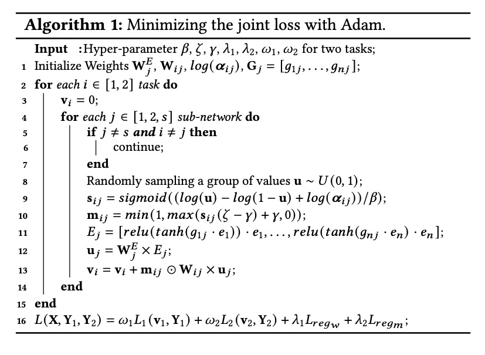
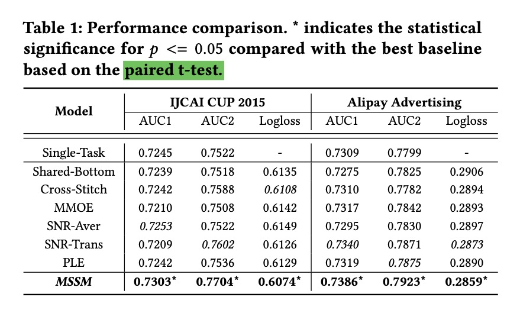
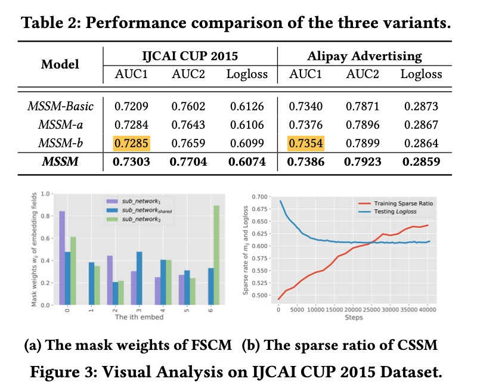

MSSM: A Multiple-level Sparse Sharing Model for Efficient Multi-Task Learning

# 1. Motivation

在很多MTL甚至是SOTA模型里，往往将所有的输入feature都输入给所有的task，本文注意到可能有一些feature本身对某些task是无助甚至有害的，因此从特征输入层面就做一层筛选。

这是非常有意义的，将输入给不同task的**路由**从网络结构延展到特征输入层面。

# 2. Related work

## 2.1 [MMoE, Cross-Stitch Network](https://www.jianshu.com/p/3f59537f5af3)

## 2.2 [PLE, Sluice Network](https://www.jianshu.com/p/809debd39640)

## 2.3 Sub-Network Routing（SNR）

Jiaqi Ma 等人 [2]提出了SNR方式来进行子网络选择，本质上都是通过矩阵变换（matrix transformation）结合稀疏mask（L0 Norm）来实现。

(1) SNR-Trans

(2) SNR-Aver

# 3. Multiple-level Sparse Sharing Model (MSSM)

过往的大多数MTL最大的问题在于：所有的任务都被强迫共享相同的隐空间。说的直白点，就是没有针对每个task在**特征层面进行筛选**，有些特征对task是无助或者起到相反作用的。

另外一点，因为本文要提出稀疏网络表示，作者认为，没有学习稀疏网络的模型在计算与存储上不够有效。

## 3.0 问题定义

本文要解决的问题是，给定$K$个任务，寻找一个特征共享机制来提升效果，该机制决定哪些特征是所有任务共享的，哪些特征是任务独占(task-specific)的。

模型用到了两种**稀疏连接**（sparse connection)，一种是特征层面（field-level)，一种是隐层连接层面（cell-level)。

## 3.1 Field-level Sparse Connection Module (FSCM)

特征层面（field-level）的稀疏连接只作用于输入层，因为是用来为每个任务**选择**特征的。方式是为每一个field增加一个稀疏的掩码（sparse mask)。

假设一共有$n$个field，每个field的embeding是$e_i$。

为每个task计算独占或者共享特征。

首先改造task $j$特征的输入$E_j$，拼接输入field的embedding的mask结果。

$E_j = [w_{1j} \cdot e_1, ..., w_{nj} \cdot e_n]$

$w_{ij}$是sparse mask，代表第$i$个特征对于第$j$个任务的重要性，

$w_{ij} = relu(tanh(g_{ij} \cdot e_i))$

$g_{ij}$是一个可学习的权重。

得到task$j$的输出特征$u_j$，

$u_j = E_j \bold{W}_j^E$

$w_{ij}$是通过relu来得到稀疏解的。

## 3.2 Cell-level Sparse Sharing Module (CSSM)

作者认为，大部分MTL模型（包括采用了子网络+稀疏连接），对于所有的任务是共享子网络的，实际上与特征需要选择类似，子网络也应该进行选择而不是共享。注意，这里并没有包括PLE，因为PLE在最后一层CGC其实显式地区分了子网络，并不是所有任务共享。

CSSM的核心思想是对转换矩阵（transformation matrix）以及编码变量向量（coding variable vector）做Hadamard-product。

假设有两个task-specific子网络$u_1$、$u_2$，以及共享子网络$u_s$，相应的输出$v_1$、$v_2$以及$v_s$是这样计算的，

$\begin{bmatrix} v_1 \\ v_2 \\ v_s \end{bmatrix} =
\begin{bmatrix} 
m_{11} \odot W_{11} & m_{12} \odot W_{12} & m_{1s} \odot W_{1s} \\
m_{21} \odot W_{21} & m_{22} \odot W_{22} & m_{2s} \odot W_{2s} \\
m_{s1} \odot W_{s1} & m_{s2} \odot W_{s2} & m_{ss} \odot W_{ss} \end{bmatrix}
\begin{bmatrix} u_1 \\ u_2 \\ u_s \end{bmatrix}$

与SNR类似，用到了L0正则化方法的近似实现 [3]。

## 3.3 Joint loss optimization

$L(X, Y_{1:K}) = \sum_{k=1}^K w_k L_k(X, Y_k) + \lambda_0 L_{reg_m} + \lambda_2 L_{reg_w}$

$\lambda_0$是L0正则的惩罚项系数，$w_k$是每个loss的权重，$\lambda_2$是L2正则系数。

## 3.4 Algorithm

# 4. Experiment

作者只在公开赛数据集上做了对比实验，没有在线实验，不确定该方法在实际上有没有用。

PLE实验显示显著优于Cross-Stitch这种静态线性权重的task关联，该论文的实验显示这两个算法效果几乎一样。

从消融实验上看，去除特征选择效果（MSSM-a）不如去除cell选择(MSSM-b)；不过特征选择还是有作用的。

本文提出的**特征选择**的想法具有启发意义；在子网络层面的稀疏选择或许可以考虑结合PLE。

因为没有在线实验，所以不确定本文这种方法在工业界的效果；有点奇怪蚂蚁集团的论文，没有写在线实验。

# 5. References

[1] Ding, Ke, et al. "MSSM: A Multiple-level Sparse Sharing Model for Efficient Multi-Task Learning." Proceedings of the 44th International ACM SIGIR Conference on Research and Development in Information Retrieval. 2021.

[2] Jiaqi Ma, Zhe Zhao, Jilin Chen, Ang Li, Lichan Hong, and Ed H Chi. 2019. Snr: Sub-network routing for flexible parameter sharing in multi-task learning. In Proceedings of the AAAI Conference on Artificial Intelligence, Vol. 33. 216–223.

[3] Louizos, C.; Welling, M.; and Kingma, D. P. 2017. Learn- ing sparse neural networks through l 0 regularization. arXiv preprint arXiv:1712.01312.