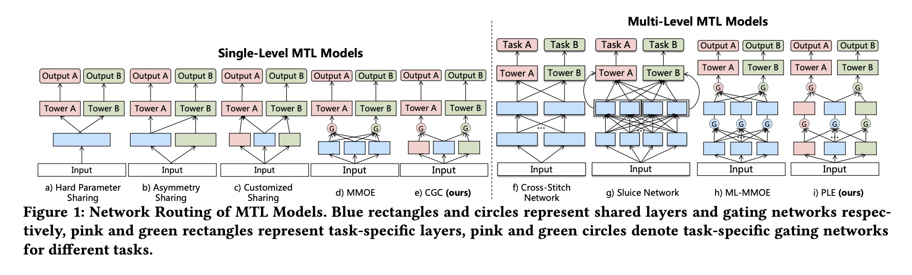
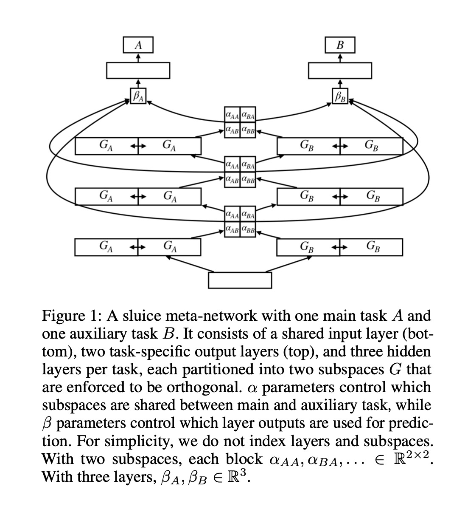
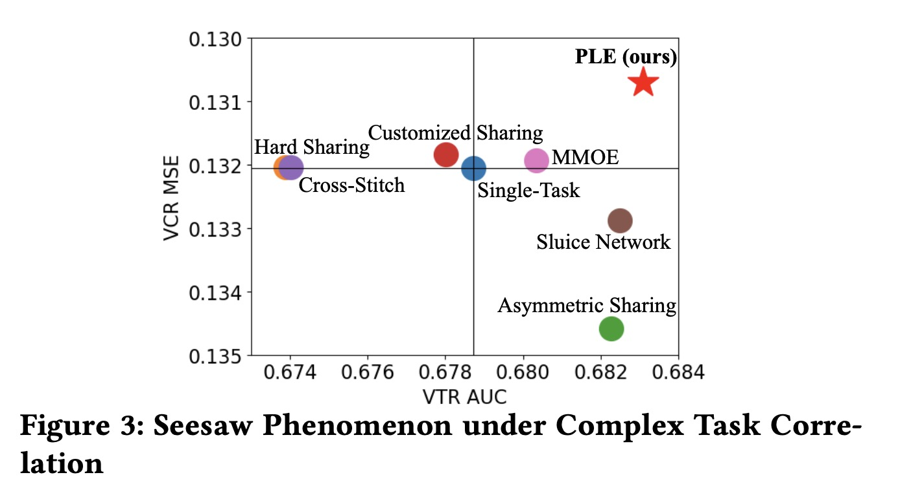
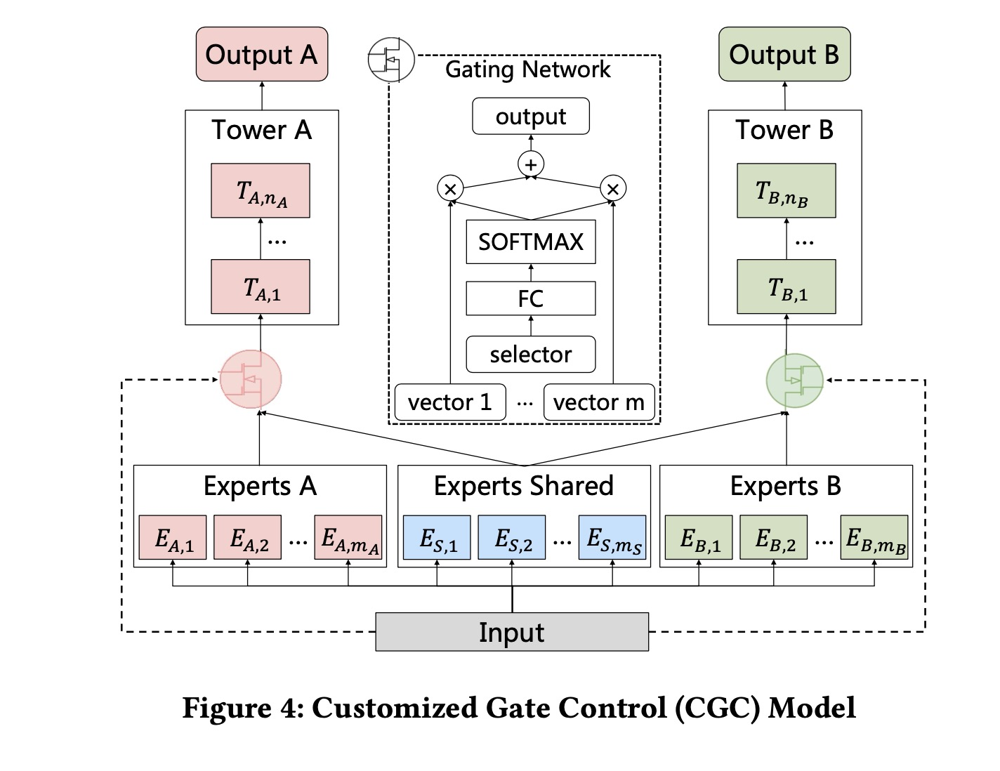
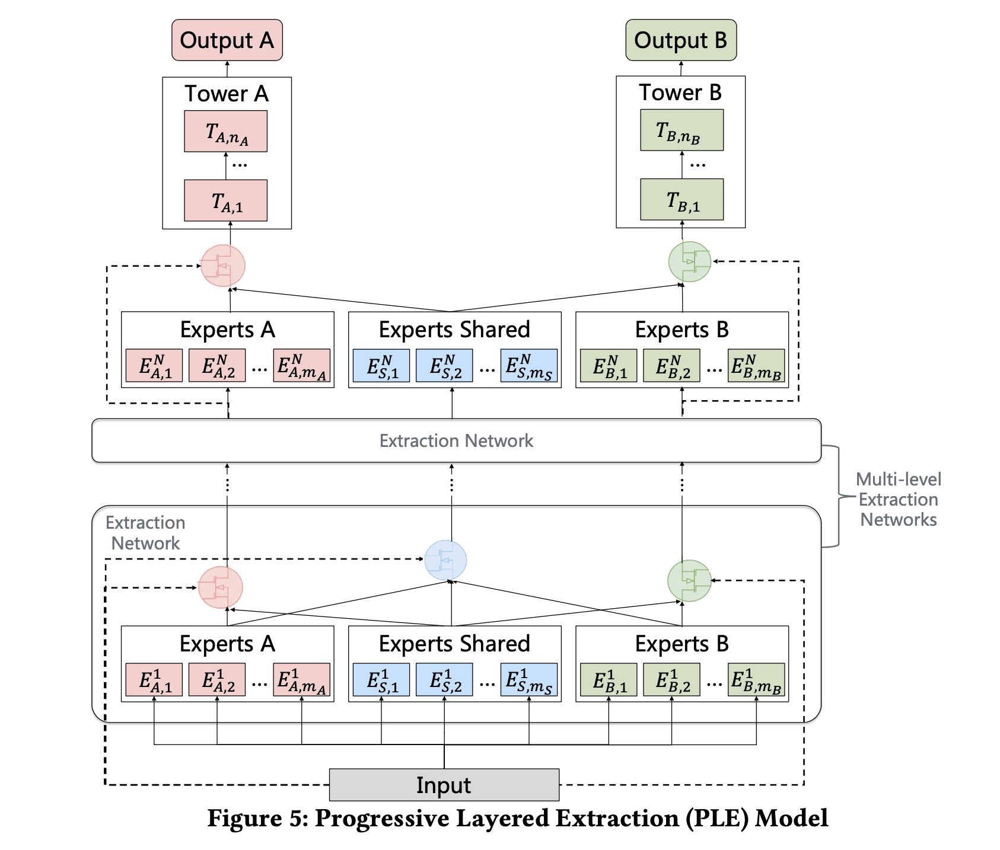
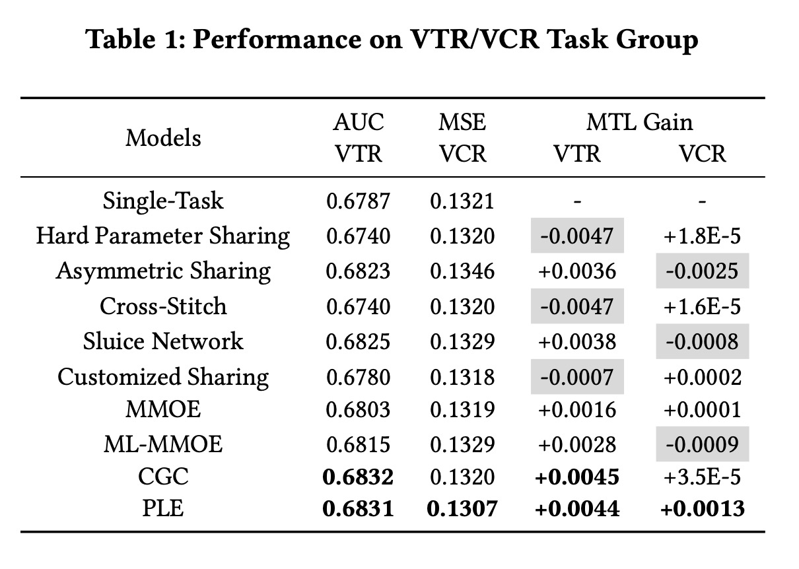
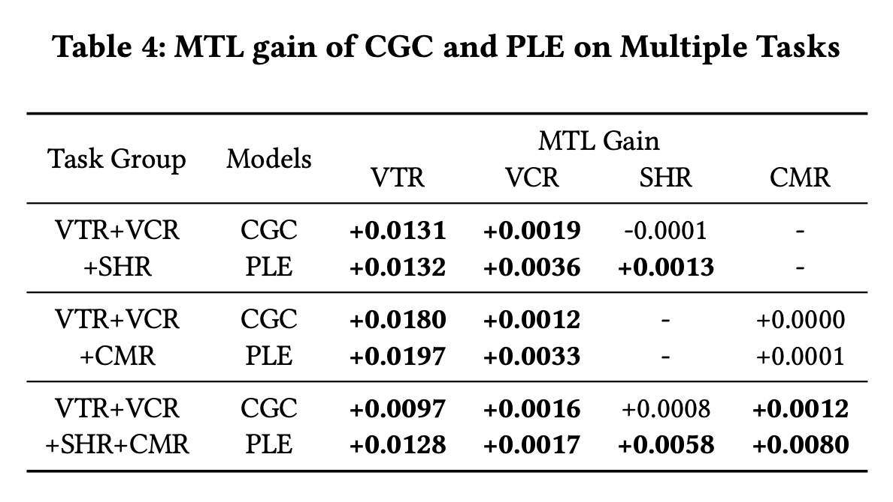

Progressive Layered Extraction (PLE): A Novel Multi-Task Learning (MTL) Model for Personalized Recommendations

# 1. Motivation

论文作者发现：在很多多任务学习模型中，存在一个seesaw现象，即一个任务效果的提升，往往伴随着其它一些任务效果的下降。

因此，多任务学习中需要同时优化两个方向：（1）表示学习，包括特征的embedding表示、底层共享网络、gate网络、tower网络等；（2）路由学习，即每个任务是由输入特征经过什么样的连接路由来学习得到最终的输出。路由学习可能比较拗口，在本文里最终表现为不是所有的expert（不管是直接参与还是经过gate加权参与等）都是每一个task的输入，而是存在task-common的expert以及task-specific的expert。

更直白一点，如果某个专家擅长的领域与当前任务差异很大，更好的办法是在该领域并不去征求这个专家的意见；而不是对该专家的意见加权（尽管权重可能学出来很小）。

本文的创新点在于：
(1) **显式**区分task-common expert以及task-specific expert; 
(2) 采用progressive separation routing，即“逐步分隔路由“方式。

# 2. Related work

## 2.1 [Hard Parameter Sharing, Cross-Stitch Network, MMoE](https://www.jianshu.com/p/3f59537f5af3)

## 2.2 Sluice Network

Sebastian [18] 等人提出了Sluice Network(水闸网络)。

在网络中有两个闸门，$\alpha$与$\beta$。每一个任务的expert网络分成两个部分，由$\alpha$来控制这两个子网络参与共享的程度；由$\beta$来控制对每一层的子空间进行加权求和。

Sluice Network与Cross-Stitch Network有点像，都用了矩阵乘法来对expert进行线性融合，都是静态的权重（与输入无关），直观上效果可能不好。不过从MMoE的论文与本文实验来看，这两个MTL模型效果有时候表现还可以。

## 2.3 Asymmetric Sharing

论文的Figure 1.b)显示了不对称共享，任务A只接受一个expert的输出，而任务B同时接受两个expert的输出。

## 2.4 Customized Sharing
论文的Figure 1.c)显示了定制共享，蓝色表示任务共享的expert，每个任务有独享的expert。

## 2.5 Seesaw Phenomenon

作者对在两个现实任务上比了不同的多任务学习模型。横坐标表示auc，越大越好；纵坐标表示MSE，越小越好；越往右上角表示模型学习效果越好。可以看出，很多模型，一个任务效果的时候，另一个任务的效果就不太好，作者称之为Seesaw Phenomenon（跷跷板现象）。

这也就是为什么作者要**显式**地区分不同的任务，减少不同任务之间的互相干扰。

# 3. Progressive layered extraction (PLE)

## 3.1 Customized Gate Control (CGC)

与MMoE唯一的区别就是，MMoE所有的expert都输入到每个task的gate网络；而CGC只选择一部分的expert，包括所有task共享的expert，以及该task独有的expert。表象上仅此而已。

任务$k$的gate网络输出是，

$g^k(x) = w^k(x) S^k(x)$

$w^k(x) = Softmax(W_g^k x)$, 

$W_g^k \in \mathbb{R}^{(m_k + m_s)\times d}$，$m_k$与$m_s$是任务$k$的expert个数与共享的expert个数，$d$是输入的向量维度。

$S^k(x) = [E^T_{(k,1)}, E^T_{(k,2)}, ..., E^T_{(k, m_k)}, E^T_{(s,1)}, E^T_{(s,2)}, ..., E^T_{(s, m_s)}]^T$，是任务$k$的gate网络的输入，包括相应的所有expert的向量表示。

gate的输入是原始输入，而不是expert的输出。

## 3.2 Progressive layered extraction (PLE)

作者提出用多层提取网络（multi-level extraction networks)来提取更高阶的信息共享。

与单纯堆积CGC不同，除了最后一层是CGC，前面的每一层都会多出一个gate网络，用于为共享expert计算gate。

任务$k$在第$j$层的的gate网络是，

$g^{k,j}(x) = w^{k,j}(g^{k,j-1}(x))S^{k,j}(x)$

$w^{k,j}$以上一层的gate网络的输出为输入，$S^{k,j}$是选择矩阵。区别于CGC，增加了共享expert的gate，并且以所有的expert作为输入（不仅仅是共享expert）。

## 3.3 Joint Loss Optimzation

传统的多任务学习的损失函数是，

$L(\theta_1, \theta_2, ..., \theta_K, \theta_s) = \sum_{k=1}^K w_k L_k(\theta_k, \theta_s)$

$\theta_k$是每个任务自己的参数，$\theta_s$是共享参数，$w_k$是每个任务的权重。

在现实世界中，每个loss的样本空间是不一样的，但是预测的时候往往是在整个样本空间同时预测，详见[ESMM](https://www.jianshu.com/p/0cdf96c2db89)。

论文采用统一的样本空间(union sample space)来训练所有任务。

每一个任务的损失函数，

$L_k(\theta_k, \theta_s) = \frac{1}{\sum_{i} \phi_k^i} \sum_i \phi_k^i loss_k (\hat{y}_k^i(\theta_k, \theta_s), y_k^i)$

$\phi_k^i \in \{0, 1\}$表示当前sample $i$是否在task $k$的样本空间。

每个loss的weight采用动态而不是静态设置，

$w_k^{(t)} = w_{k,0} \times \gamma_k^t$, 

$w_{k, 0}$是初始化权重，与$\gamma$一样都是超参。

# 4. Experiment

从离线实验也能看出，大多数MTL模型确实存在Seesaw现象，MTL Gain往往一正一负，一个task的提升需要牺牲另外一个task的效果。PLE**显式**地降低了任务之间的耦合性，从而消除了这一现象。

线上表现也很好，多个任务均有提升。

不过论文没有指出每个loss的动态权重设置以及消融实验效果。

# 5. References

[1] Tang, Hongyan, et al. "Progressive layered extraction (ple): A novel multi-task learning (mtl) model for personalized recommendations." Fourteenth ACM Conference on Recommender Systems. 2020.

[2] Sebastian Ruder12, Joachim Bingel, Isabelle Augenstein, and Anders Søgaard. 2017. Sluice networks: Learning what to share between loosely related tasks. stat 1050 (2017), 23.
