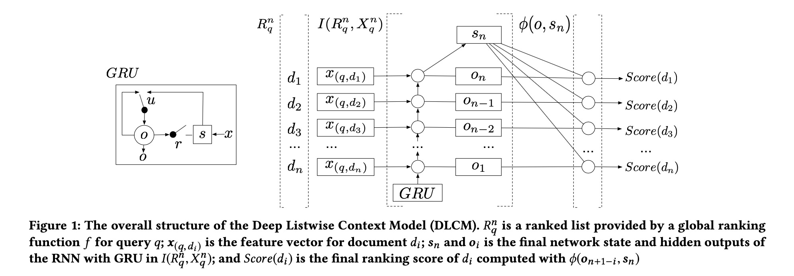
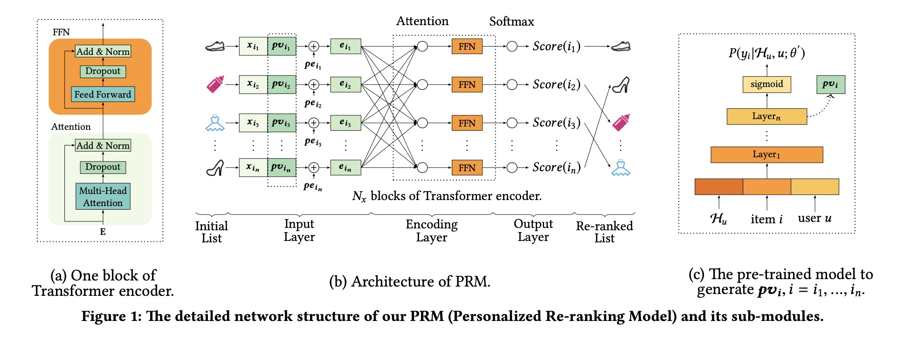
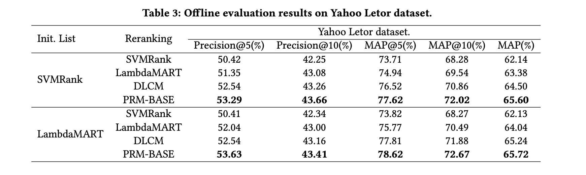
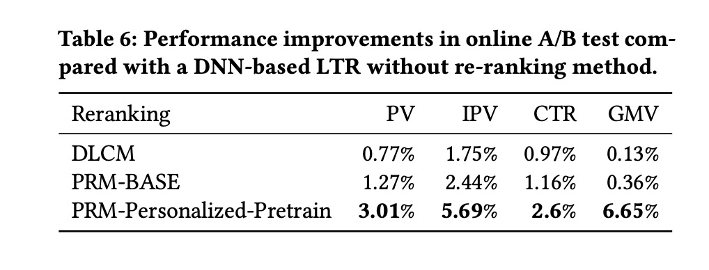

Personalized re-ranking for recommendation

# 1. Motivation

通常推荐系统的排序结果只考虑user与item的偏好关系，并没有考虑推荐列表中item之间的关系。

本文介绍的是一个**重排(re-rank)**系统，既考虑推荐列表中item之间的interaction关系，并且个性化地考虑interaction。

# 2. Related work

## 2.1 DLCM

Qingyao Ai 等人[2] 提出了基于GRU来建模排序list的局部上下文（local context）。对于排序list，通过GRU得到每一个item的隐层状态与输出状态，然后再对这两个状态建模得到最终每个item的重排score。

# 3. PRM

## 3.1 Input layer

考虑一个**排序模型**得到的list，

$S = [i_1, i_2, ..., i_n]$。$X \in \mathbb{R}^{n \times d_{feature}}$，$X$的每一行表示item $i_j$的原始特征向量。

+ Personalized Vector (PV)

论文除了考虑建模item之间的关系，还通过为每一个item加上一个个性化向量来考虑用户的个性化偏好。

从而item的中间向量表示是，

$E' = \begin{bmatrix}
x_{i_1}; pv_{i_1} \\ 
x_{i_2}; pv_{i_2} \\ 
... \\
x_{i_n}; pv_{i_n} 
\end{bmatrix}$

+ Position Embedding (PE)

这个比较好理解，为排序模型输出的每个item加上一个个性化的位置表示。

$E'' = \begin{bmatrix}
x_{i_1}; pv_{i_1} \\ 
x_{i_2}; pv_{i_2} \\ 
... \\
x_{i_n}; pv_{i_n} 
\end{bmatrix} + 
\begin{bmatrix} 
pe_{i_1} \\ pe_{i_2} \\ ... \\ pe_{i_n}
\end{bmatrix} 
$

再用一个简单的dense网络将$E''$维度转变成$E \in \mathbb{R}^{n \times d}$

## 3.2 Encoding layer

+ Multi-Head Self-Attention
有了一个新的item列表的向量表示，一个比较直接的对list进行建模的工具是Multi-Head Self-Attention。

+ Feed-Forward Network
多头自注意力模型之后跟随一个dnn层，（1）增加模型的非线性；（2）建模输入特征的不同维度关联关系。

+ Stacking the Encoding Layer

(Multi-Head Self-Attention) + FFN当成一个block，stack多层来获取更复杂、更高阶的交互关系。

## 3.3 Output layer

输出是一个Softmax层，item $i$的得分是，

$Score(i) = P(y_i | X, PV; \hat{\theta}) = softmax(F^{(N_x)}W^F + b^F), i \in S_r$, 

$F^{(N_x)}$是$N_x$个Transformer的输出，$S_r$是排序模型给出的原始排序list。

训练阶段，根据每一个item的点击情况来学习，

$L = - \sum_{r \in R} \sum_{i \in S_r} y_i log(P(y_i | X, PV; \hat{\theta}))$, 

$r$是用户的一次请求，其实就是根据一次完成的曝光列表来训练。

## 3.4 Personalized Module

PV可以通过端到端来学习，但这样缺乏个性化。论文将排序模型的Pre-trained向量当做PV。

# 4. Experiment

从离线、在线结果上看，本文提出的重排任务带来了很大的效果提升，值得一试（会给在线推理带来比较大的挑战）。

# 5. References

[1] Pei, Changhua, et al. "Personalized re-ranking for recommendation." Proceedings of the 13th ACM Conference on Recommender Systems. 2019.

[2] Qingyao Ai, Keping Bi, Jiafeng Guo, and W Bruce Croft. 2018. Learning a Deep Listwise Context Model for Ranking Refinement. arXiv preprint arXiv:1804.05936 (2018).