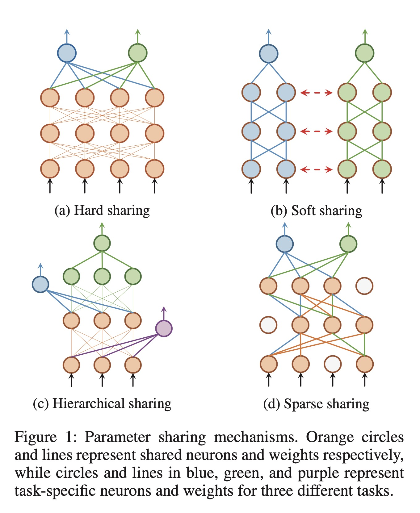
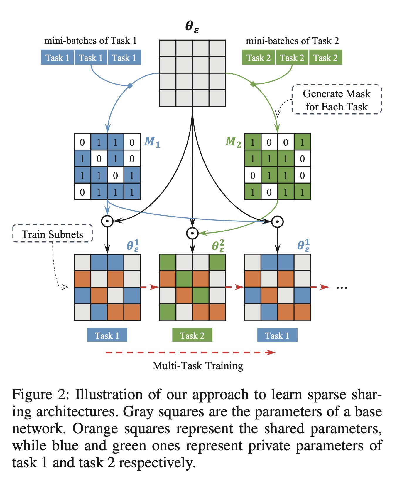
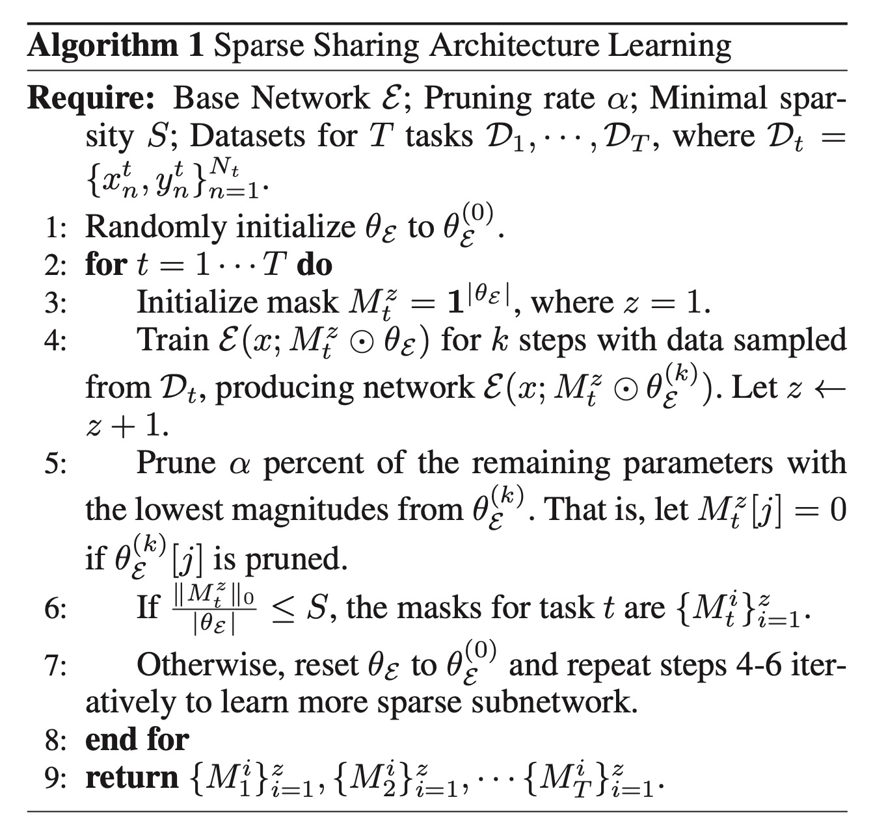
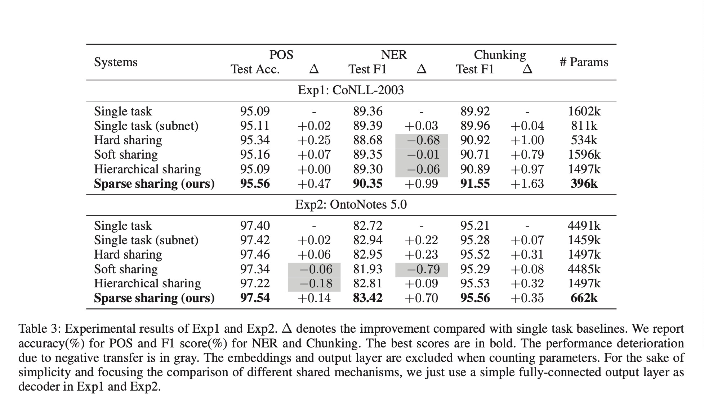

Learning Sparse Sharing Architectures for Multiple Tasks

# 1. Motivations

多任务学习的参数共享包括hard sharing, soft sharing与hierarchical sharing。本文提出了一个新的参数共享机制，sparse sharing。

Hard sharing所有任务都共享相同的参数空间，限制了模型的表达能力，并且在任务之间弱关联时表现不佳。

Soft sharing需要为每个任务单独训练一套模型，有大量冗余的参数。

Hierarchical sharing需要人工设计共享机制，不够灵活与有效。

# 2. Sparse sharing

Sparse sharing从结构上与Hard sharing相同，只不过参数是部分共享的。

为每一个任务学习一个mask矩阵，矩阵的每个元素是0或者1，与参数矩阵进行element-wise product来进行稀疏共享。

根据Frankle等人[2]提出的Iterative Magnitude Pruning（IMP）方法，迭代学习，并根据参数的magnitude进行裁剪。

# 3. Experiment

# 4. References

[1] Sun, Tianxiang, et al. "Learning sparse sharing architectures for multiple tasks." Proceedings of the AAAI Conference on Artificial Intelligence. Vol. 34. No. 05. 2020.

[2] Frankle, J.; Dziugaite, G. K.; Roy, D. M.; and Carbin, M. 2019. The lottery ticket hypothesis at scale. arXiv preprint arXiv:1903.01611.