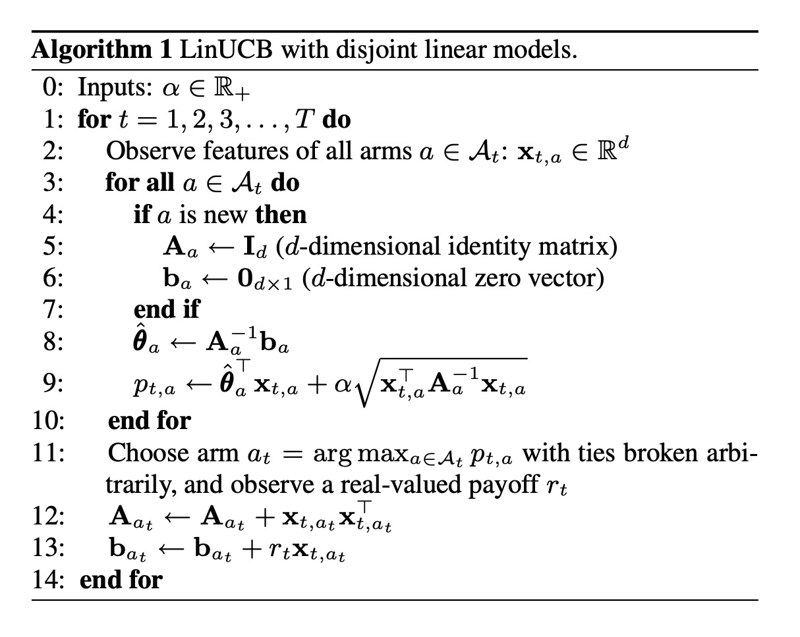
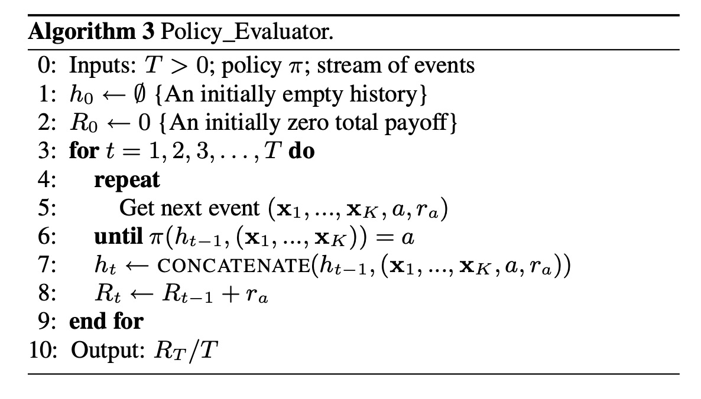
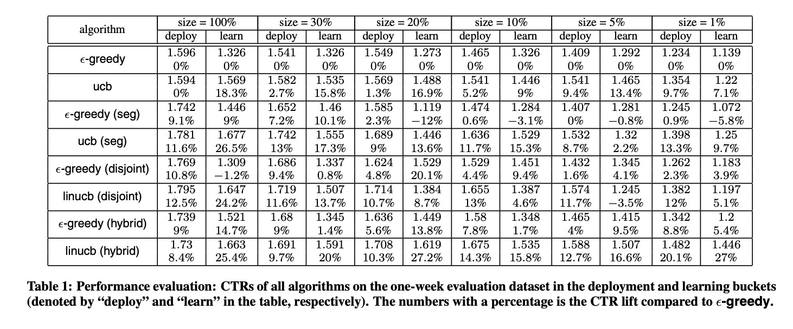

A Contextual-Bandit Approach to Personalized News Article Recommendation

# 1. Motivations
这篇文章提出的年代比较早（2010年），对于文章推荐场景，如果文章池变化很快，当时流行的协同过滤等一些静态方法可能适合。

# 2. Related work

## 2.1 多臂老虎机

强化学习是一个马尔科夫决策过程，多臂老虎机是一个简化版的强化学习。

老虎机是一种游戏机，有一个摇臂，每次摇臂，机器就会吐出不同数量的硬币（回报）。假设每个老虎机里的吐出硬币是一个固定的随机机制。多臂老虎机等价于有多个老虎机，怎样通过选择摇哪个老虎机，以及每个老虎机的回报，来最终确定应该摇哪个老虎机能获得最多回报。

多臂老虎机（Multi-armed bandit）可以用来建模推荐场景，每一个老虎机就相当于一个item，通过不断交互学习，来确定在不同的场景应该推荐哪个item。

## 2.2 Contextual bandit

多臂老虎机如果不考虑上下文场景，类似于推荐系统中的兜底策略，对于所有用户一样的策略，叫做context-free bandit。

如果考虑上下文信息，会让不同的用户推荐结果千人千面，叫做contextual bandit [2]。

典型的contextual bandit步骤包括$T$次尝试，在每一次尝试$t$中，

1. 得到context: 根据user $u_t$以及动作$a$得到context $x_{t, a}$；

2. 根据以前的历史记录，选择一个动作$a_t \in A_t$，得到回报$r_{t, a_t}$；

3. 将当前的记录$(x_{t, a_t}, a_t, r_{t, a_t})$加入历史记录里。

$T$次尝试的总回报是$\sum_{t=1}^T r_{t, a_t}$。

定义最优的$T$次尝试的期望回报为$E[\sum_{t=1}^T r_{t, a_t^{*}}]$，$a_t^{*}$是第$t$次尝试能带来最大期望回报的action （arm）。

学习的优化目标是学习一个**选择策略**，让**regret**最小，

$R(T) = E[\sum_{t=1}^T r_{t, a_t^{*}}] - E[\sum_{t=1}^T r_{t, a_t}]$

## 2.3 $\epsilon-$greedy

强化学习最大的特点在于利用(exploitation)与探索(exploration)。

$\epsilon-$greedy 是最简单也是最好理解，最方便应用的利用与探索机制。

在每一次尝试$t$中，首先估计每个arm的期望回报$\hat{\mu}_{t, a}$；然后以$1 - \epsilon$的概率贪心选择arm（比如选择最大期望回报的arm），以$\epsilon$的概率随机选择剩下的arm。

Upper confidence bound是在$\epsilon-$greedy基础上一个更好的利用-探索机制。

在每一次尝试$t$，既估算出每个arm的期望回报$\hat{\mu}_{t, a}$，也估计一个相应的置信区间$c_{t, a}$，使得 $| \hat{\mu}_{t,a} - \mu_a| < c_{t, a}$以很大的概率成立。

在选择arm的时候，不再选择最大期望回报的arm，而是选择最大UCB(upper confidence bound)的arm。

# 3. LinUCB

论文的最大贡献在于，对于contextual bandit，假设回报模型是linear的时候，可以得到UCB的解析解。

作者经过推导给出来两种线性回报函数的算法，一种是arm之间不共享参数，另外一种是arm之间有共享参数。

这里给出不共享参数(disjoint linear model)的伪码。作者说明，在计算上，是可以有一个缓存机制来加速计算的。

# 4. Experiment

强化学习（时至今日2021年）依然是一个很难评估与实验的领域。
作者提出Algorithm 3来基于历史日志使用**reject sampling**进行评估。首先假设所有的事件都是独立同分布的，然后如果某一条样本不满足当前的policy，则忽略该样本；只有当前样本满足当前的policy，才会加入历史记录里。

从实验结果上看，LinUCB有比较明显的效果提升。

# 5. References

[1] Li, Lihong, et al. "A contextual-bandit approach to personalized news article recommendation." Proceedings of the 19th international conference on World wide web. 2010.

[2] J.LangfordandT.Zhang.Theepoch-greedyalgorithmforcontextual multi-armed bandits. In Advances in Neural Information Processing Systems 20, 2008.