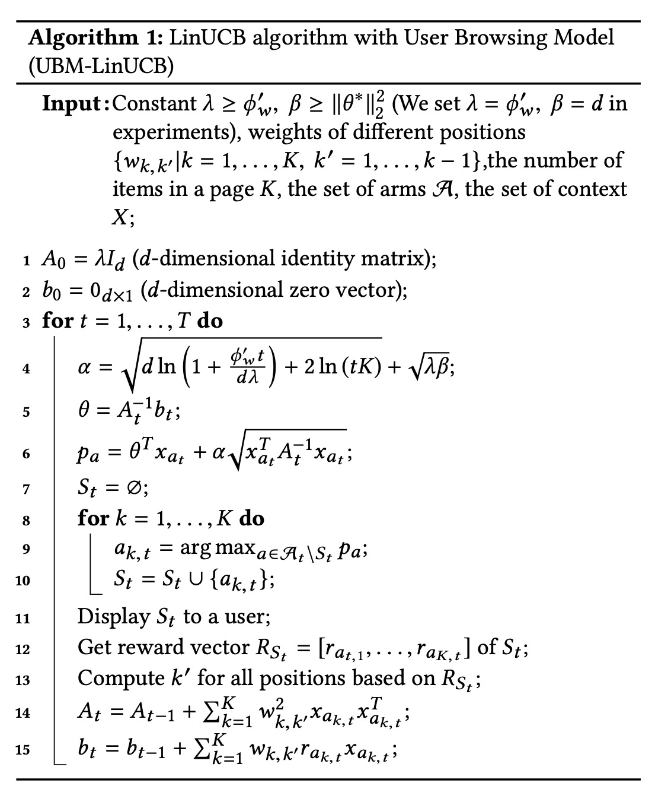
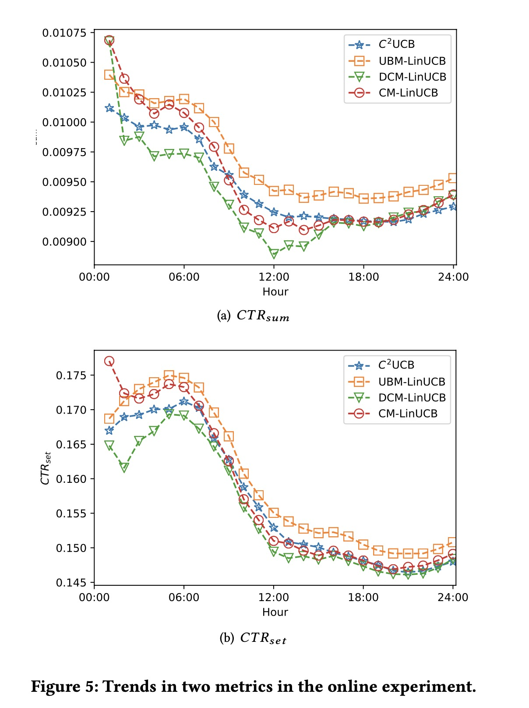

Contextual User Browsing Bandits for Large-Scale Online Mobile Recommendation

# 1. Motivation

[LinUCB](https://www.jianshu.com/p/2a0a27c2517d) 等基于bandit的算法面临一些问题：（1）LinUCB一次只能选择一个arm，而在推荐系统中，往往一次需要给出一个推荐列表，即需要选择多个arm；（2）推荐系统中往往面临着position bias与pseudo-exposure问题。

position bias: 推荐的item的ctr受位置影响，推荐位置较高的item，ctr天然就会更高。

pseudo-exposure：在推荐系统中，知道用户真实的负样本比较困难，由于曝光问题，有的item用户是没有见到，不一定是negative sample。

# 2. Related work

## 2.1 User Browsing Model（UBM）

Aleksandr Chuklin [2]等人提出了UBM，认为点击率ctr既受到user对item的喜好影响，也受到user能浏览到item的概率影响。

# 3. UBM-LinUCB

相比于LinUCB，为适配推荐场景同时推荐多个item，本文提出的bandit算法在每次尝试$t$，选择一个arm的子集合$S_t$。如果这个子集合有至少一个item被点击，则这次选择的reward $F(S_t)$设置为1，否则reward等于0。

每一个arm的点击率$r_{t,a}=w_{k, k'}\gamma(a)$

$\gamma(a)$表示item $a$的吸引力；

$w_{k, k'}$表示用户$u_t$看到item $a$的概率；$k$表示item的排名，$k'$表示上一个被点击的item的排名。

考虑线性回报模型，

$\mathbb{E}[r_{ak}] = \theta^T (w_{k, k'}x_{ak})$

$x_{ak}$是item 排名$k$的特征表示。

与LinUCB一样，使用Ridge regression，优化目标是最小化PRSS（penalized residual sum of squares）

$PRSS(\theta) = \sum_{t=1}^T \sum_{k=1}^K [r_{ak, t} - \theta^T w_{k,k'}x_{ak,t}]^2 + \sum_{j=1}^d \theta_j^2$

然后使用upper confidence bound来选择arm。

# 4. Experiment

作者列出了离线与在线实验结果，都只与bandit方法对比。

比较好奇的是，在Taobao哪个场景上线了这个方法，该方法的基线模型就是bandit算法吗。实验场景好像是4万个商品，每次基于这4万个商品进行全量的矩阵运算吗。

# 5. References

[1] He, Xu, et al. "Contextual User Browsing Bandits for Large-Scale Online Mobile Recommendation." Fourteenth ACM Conference on Recommender Systems. 2020.

[2] Aleksandr Chuklin, Ilya Markov, and Maarten de Rijke. 2015. Click models for web search. Synthesis Lectures on Information Concepts, Retrieval, and Services 7, 3 (2015), 1–115.